#################
WTF is happening?
#################

.. note::

    This version is not the current build. You can still learn how to play DF with this tutorial and you will learn enough to play the new build.

Dwarf Fortress is an extremely interesting and complex game, but one which people find exceptionally difficult to get into. Although it isn’t hard to find tutorials, many assume some basic knowledge of the interface and what the player is looking at. They also don’t take into account different tilesets and versions and the difficulty new users have in finding a good site for that first fortress.

But all that is in the past Dwarf Fortress Walkthrough! It comes with a pre-made world and save and full game download for you to play along with. And a ton of screenshots. Yes, many, many screenshots.

So grab a drink, get your thinking cap on and be prepared for some dwarfy fun! And carp. Never forget the carp…

Set Up
======

.. note::

    This tutorial uses a pre-configured install of DF, with a basic save generated for you and less extra stuff than general-purpose community packages.  It still includes graphics and UI upgrades, though!

    :DFFD:`Download the walkthrough pack here. <11168>`
    
    Later, you might prefer to move your save over to the :DFFD:`Starter Pack <7622>`, to take advantage of all the other tools and options it offers - to suit everyone up to long-time players and DF experts.

After downloading the pack, you need to unzip the folder on to your had drive. Then create a shortcut on your desktop (if you wish) leading to dwarfort.exe. While you’re at it, go into the DwarfManager folder and create a shortcut to DwarfManager.exe, we’ll need that later.

Run the Game
============
Now we’re ready to get going! Run the dwarfort.exe shortcut and you should get the screen below. Bear in mind, this game version is optimised to run in 1280 x 800 resolution, if your game doesn’t look like the screenshot, you might have to fiddle with the .ini file found in \data\init\init.txt. You can read the DFWiki entry on grid size for a bit of help.

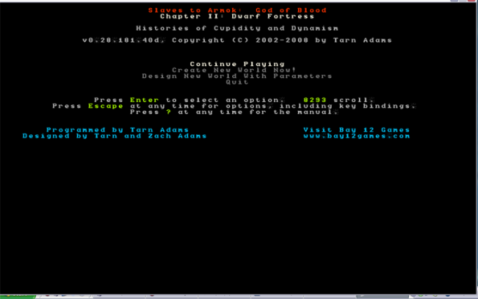

So, you’ve got the game running and enjoyed the exciting ASCII intro movie. Well done! I can tell you’ll go far! Next step is to hit “enter” on “Continue Playing”, which should be highlighted. You’ll then be presented with this screen.

.. image: images/dftutorial01.png
   :align: center

This is the save game list, which gets cluttered very quickly as seasonal saves build up. But for now all you have to do is use the down-arrow key (not the number pad arrow key) to select the region1-spr-201 save. Hit enter and the game will load.

First Look
==========
Once the game loads you will be presented with this screen. Although it’s confusing on first glance, don’t panic! It will all be made clear shortly. First thing though, hit “space” to pause the game. Space pauses DF and also backs out of any menu you’re currently in.

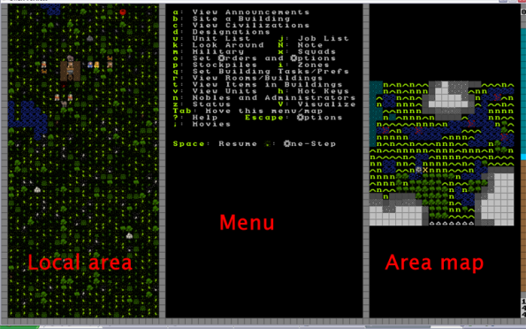

Lets talk about what you can see. First up, the screen is divided into three sections: The left shows the local view. The center shows the action menu, the right shows the area map. To make things a lot neater hit “tab”. “Tab” cycles through various menu arrangements. Stop when your view matches the one below.

.. image:: images/dftutorial03.png
   :align: center

Now we’re really cooking with gas! Soon you’ll be melting foes with magma-falls, and drowning goblins in artfully engineered traps! But before then, lets look around. Use the arrow keys to navigate around the local area. You’ll notice the we’ve got a decent amount of space to work with.

While you examine your surroundings you should be able to spot trees and the grassy areas easy enough, same with ponds and rivers and bushes. Other tiles won’t make much sense, these tend to be the slightly-arcane zones like open air spaces (pale blue tiles, or tiles with dots) and the earth (brown tiles) and slope tiles (up and down triangles). The screenshot below should help point those features out.

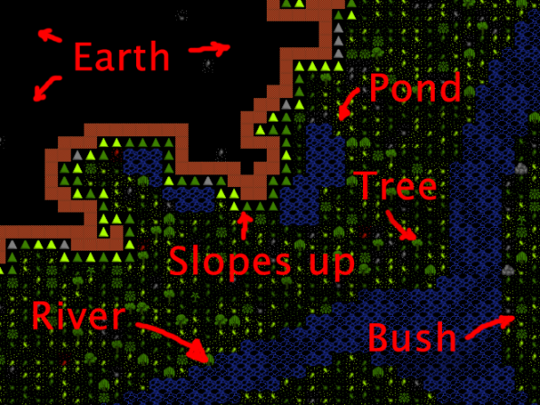

Key to understanding DF’s local view is getting your head around the fact that DF is a 3D game displayed on a 2D map. To display a variety of heights the world is sliced into dozens of Z-levels. Each Z-level is numbered.

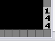

If you look on the bottom right of the window you’ll see we’re currently at level 144. To move between levels you need to hit “Shift+<” to go up, and “Shift+>” to go down. If you go up a level the map will look like image below. Try it yourself now. If you can’t get this to work, scroll down and read the comments. There’s a helpful poster there who has some tips for odd keyboard layouts.

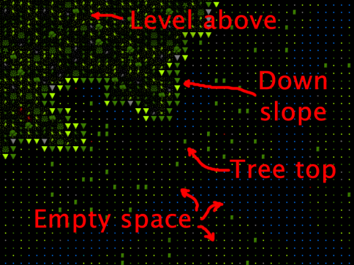

You’ll see that what was black dirt is now grass and trees. It’s like we’ve gone up a floor in a lift and we’re no longer looking at a slope, now we’re looking across a grassy plain. Below us is open space and tree tops. Make sense? Now, try going back down to 144 and then down to 143, a level below “ground” level.

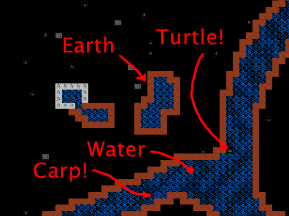

Your view should look something like this. We’re basically underground now with mostly dirt around and earth between the river and the rest of the ground. With luck you’ll note a fish and who knows what else swimming around down there. You may have noticed the river doesn’t appear to have changed much, but don’t be confused. The difference is that on this lower level we’re on the same level as the body of the river itself, at the level above, we’re actually above the river a little looking at the top of it.

Continue having a look around. If you follow the river to the west you’ll note it drops down a few levels into a chasm before flowing off the map, what a pretty waterfall! See if you can find it yourself. When you’re done looking around, return to Z-level 144 and find the dwarf caravan with our fresh immigrants. The helpful graphic below explains what you’re looking at.

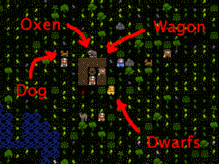

Lets get digging!
=================
So now what do we do? In Dwarf Fortress we’re usually trying to get a bustling community of dozens of dwarfs up and running, while fending off goblins, the whims of nobles and assorted other evils. To do this we need to build ourselves a mighty fortress! Preferably underground. So lets find a cliff face to dig into and get this show on the road!

If you go down and a little across from where our dwarfs are (using the arrow keys) you’ll see a nice cliff face. Lets dig an entrance into this spot and plan to eventually dig down way underground where it’s safe and cosy. First up, get the map centered around about where we want to dig (shown on the screenshot below). Once you’re ready:

* Hit the “d” key. You’ll see the menu on the right changes and in the local view a yellow X has appeared. The menu on the right should show the “mine” option highlighted. If it doesn’t, hit “d” “again, to select it.
* Move the cursor to the edge of the cliff, like this:

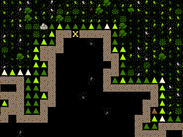

* Now hit enter and move your cursor down with the arrow keys. You’ll see that you’ve dropped a flashing “anchor”. This is going to mark out what your dwarfs will dig. Move it down 20 and across 3 and hit enter, your screen should look like this:

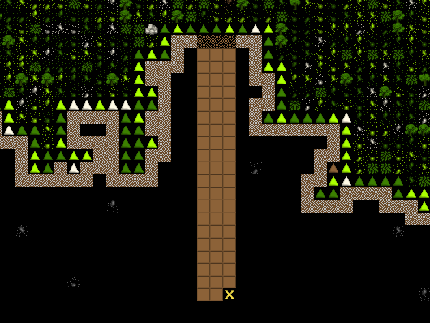

The browned out area shows where your miners are going to come along and dig. But they won’t act until you back out of the “designations” menu as the game is paused. Hit “space” and you should see the game unpause and the menu reset to its master list. Oh, when you have the “d” menu up you can actually click on the map with your mouse and select areas to mine. Some people prefer to select areas this way.

With the game unpaused you should notice three dwarfs race to the cliff face and start digging. With our entrance under way we should also think about laying out some rooms for our dwarfs to live in, who wants to spend time out under that hot yellow disk when lovely rock and earth beckon!

Right now we’re not worried about making our fortress perfect and creating the strongest entrance, we’re simply trying to scratch out a space to live! To that end we’ll need three or four rooms off this main entrance.

See if you can match the layout below by marking out areas to dig, as you’ve learnt. If you make a mistake you can hit “x” from the “designations” (“d”) menu and you’ll note that the menu on the right has “remove designation” highlighted. Now when you hit enter and select an area, any area set for digging will be cleared of that designation. Anyway, enough detail, on with the room building!

.. image:: images/dftutorial11.png
   :align: center

Look at my little dwarfs go! Aren’t they industrious! They’re quickly digging away and leaving a lot of dirt floor behind them. Good lads! Lets leave them to their work while we sort out some other important jobs.

Chopping trees, setting up piles
================================
Dirt and rocks are handy, but so is wood to make nice dwarven beds, and we’re short on it right now. To get wood, we need to chop down some trees. And we do that by designating an area of trees to be chopped. Lets get cracking and clear the trees in front of the entrance.

Designating trees to chop is like designating rocks to be dug, so lets decimate the local environment!

* Move the map around so you’re looking out front of your fortress.
* Hit “d”. Hopefully this time you’ll notice the game has automatically got “Chop down trees” selected, if it doesn’t, hit “t” and it will be highlighted.
* Move the cursor to the upper left, hit enter, and move the cursor to the bottom right, hit enter again. Any trees in that area will now be set to be cut, as indicated by them all being marked brown.

Your view now should look something like this, note all the trees highlighted in brown:

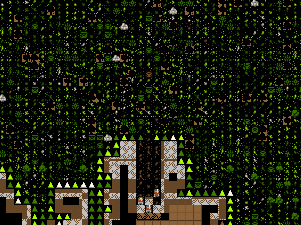

Although you’ve done well neither man nor dwarf can live on wood and dirt alone! Luckily for us there are plenty of bushes out there loaded with ripe berries. Lets set some of them to be picked:

* Hit “d” again and then “p”. One the right “Gather plants” is now selected.
* Designate about the same area as we did with the wood cutting.
* All the bushes will be highlighted now, and when you unpause you should see a plant harvesting dwarf join the woodcutter.

Now lets sit back and watch the dwarfs work for a minute! It won’t take long before our miners have cleared out our temporary living quarters and our woodcutter and plant gatherer have begun their work. Once the interior space is clear we have lots of work to do, so lets break it down into useful chunks.

Our First Farm
==============
Farming is how you will make most of your food in Dwarf Fortress, and it’s important to get farming quite quickly. If food runs out your dwarfs will starve and your game will end prematurely, and we don’t want that, right? Dwarfs usually farm underground and handily, we have a space all prepared. So follow along, and lets get some tasty mushrooms growing for our stumpys to chow down on!

* Find the bottom right room.
* Hit “b” for the build menu and then “p” for farm plot.
* Move the cursor to your farm area.
* The screen instructions tell you how you can increase the size, we need a good 6 by 6 plot, so hit “u” and “k” a few times until you’ve got a big green grid, like the one below.
* Move the grid around with the arrow keys until it’s in about the same position as the one in the screenshot. If you get the size wrong, “h” and “m” will reduce the plot.

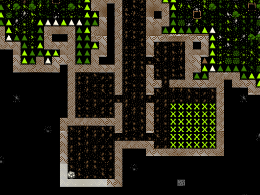

* Hit “enter” and the green area marker will change to a flashing brown field marker. When stuff flashes it indicates that dwarfs are on their way to come build the construction, in this case, a field. And lookee-here! A farmer has come to build our field for us!

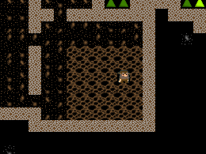

He will take a short while to build your field. When you see the dwarf run off, you know he’s done. Now it’s time to set the field to grow delicious plump helms all year round.

* Hit the “q” key. This is the key for “Set building tasks and preferences”. Again you’ll notice a cursor on the local screen and if it’s anywhere near the field, the field will be flashing. You can move that cursor around with your arrow keys, this is useful later on when you need to select different workshops and buildings.
* You’ll note that on the right the menu now shows you specific task details associated with that field, like so:

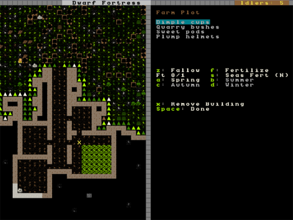

* What we want to do is set “plump helmets” as the food to be planted every season. You can see on the top right of the menu we have the various plants we could try and grow and in the middle area we have the different seasons. Right now “Dimple cups” are selected (but not highlighted, note) and the season is set on “Spring”, as it’s Spring currently. We need to change these settings.
* Now comes an important skill! Menu scrolling! Using “alt+arrow down”, scroll down through the list to “Plump helmets” and hit enter.  You should now see “Plump helmets” highlighted. By the way, if you don’t like this key configuration, hit escape when we’re done and re-bind the keys to your liking.
* Good work! But right now we’ve only set the spring planting. It’s time to set the planting for Summer, Winter and Autumn too. To do this, with the field task menu up, hit “b” for Summer and then scroll to “Plump helmets” and hit enter again. Hit “c” for Autumn, set “Plump helmets” and then “d” for Winter, repeating your selection. You may have noticed that what you can plant changes with the seasons, but don’t worry about that for now.
* Hit “space” to back out of the menu and resume the game. Your two farmer dwarfs will quickly begin planting in your new field, well done!

Now we’ve got a field down hopefully none of your dwarfs will starve, go crazy and resort to eating rats, or each other. Pretty soon you’ll have a few seeds in the ground and your farm will begin to look a bit like this:

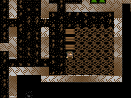

Oh, by now you may have noticed the game pausing itself now and then. This is generally because the game wants to let you know that something important has happened. You can hit space to let the game resume, or hit “a” to see the alert and find out what caused the game to pause (if you miss the alert at the bottom of the screen). Hitting “space” will take you back out of the alerts menu and resume the game.

Stockpiles
==========
While you can just leave all of your dwarfs’ stuff strewn around the countryside, it’s much more efficient to have it all inside near where it’s needed. You may have noticed your farmer dwarfs running in and out of the fortress to grab the seeds that they need (when they flash between their icon and a little red dot (the seed icon) you know they are carrying seeds).

This is where stockpiles come in. They make everything more organised. A stockpile for all our food and seeds right next door to the farm would probably be pretty handy, right? We don’t want the dwarfs running across the map to get a bite to eat or a seed to plant, so lets make a food stockpile inside!

* Find the room opposite the farm.
* Hit the “p” key (for “piles” of course), a cursor will appear.
* Hit “f” to select “food”, we want to make a food stockpile, after all.
* Move the cursor to the bottom left of the room, hit enter, move it to the top right and hit enter again. You have now set that entire space as a food stockpile, well done!
* After a few seconds your spare dwarfs will start moving food inside, you’ll see barrels and bags being hauled and pretty soon the stockpile will look something like this:

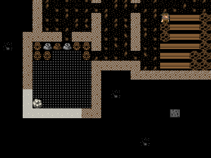

You don’t have much room inside the fortress yet, so no more piles for now. In time you’re going to want to put stockpiles everywhere to help manage your production and resource gathering. For now, well done, you’ve got food production up and running, you’ve set up a stockpile, you’ve set wood to be chopped and plants to be gathered and you know how to do some basic digging! You’ve come far!

Before reading the next instalment, how about setting some more pants to be gathered and more wood to be chopped. Then, head on to Part 2 and we’ll learn all about workshops, bedrooms, dinning rooms and stairs! It will be ever so exciting, I promise!

