.. _chapter02:

################################
Workshops, Furniture, and Stairs
################################

Lets continue on with our exciting and fascinating Dwarf Fortress
Walkthrough! In this section we’ll work on getting some workshops set
up and we’ll dig out a lot more space for our shorties.  There’s lots
to do, so lets get cracking!

Building a Workshop
===================
Workshops are a central feature of DF so lets get to grips with them
right away. Workshops are places your dwarfs work, usually turning base
materials into useful goods. The list of workshops can be a little
overwhelming (:kbd:`b` then :kbd:`w`), but don’t worry, we only need to
worry about a couple early on.

First up we need a carpenter’s workshop, this workshop allows us to
turn wood logs into furniture and other items. You should see a lot of
wood scattered around in front of the fort, where the wood cutter has
left it after felling trees. We have no wood pile for it to be moved
to, you see.

Ideally, we’d like to build the carpenter’s workshop inside, but we
haven’t dug a nice enough space for the workshop yet, so lets chuck it
outside for now:

* Move the view to the front of the fortress.
* Hit :kbd:`b` for :guilabel:`Building`, and then :kbd:`w` for
  :guilabel:`Workshops`. You can also just scroll down to
  :guilabel:`Workshops` using :kbd:`=` and hit :kbd:`Enter`.
* You will now see a list of workshops. It scrolls off the bottom of
  the page (scroll around if you like)! Hit :kbd:`c` for
  :guilabel:`Carpenters workshop`.
* The menu will vanish and the placement menu will appear. The green
  X’s mark out the workshop’s footprint. The dark green Xs are squares
  that will be impassible once the workshop is built, keep this in mind
  when building in an enclosed space, you don’t want to block the door!

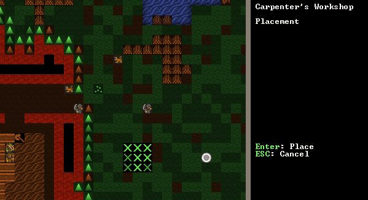

* Chose a spot in front of the fortress. Somewhere around where mine is
  marked should do. Once you’re ready to place your workshop hit
  :kbd:`Enter`.
* The menu on the right will now change to a list of items you could
  use to build the workshop with. Mostly it will be a list of wood and it
  will look something like this:

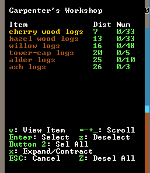

* At this point you could just hit enter and the first item on the list
  will be used to build the workshop. Instead, for fun, hit :kbd:`x` and
  :guilabel:`Expand` the view to show a list of every single item the workshop
  can be built from. Expanding the item selection is a nice way to chose
  exactly the item you want to be used. Most of the time you can ignore
  this option, but it will come in handy later on.
* Close the expanded menu with :kbd:`x` again. For your interest note
  that items are sorted by distance from the workshop’s current location.
  Usually you want to build with the closest items to save your dwarfs a
  slow walk.
* Once you’ve hit enter (selecting the building material) the workshop
  will be placed in an un-built state on the map. It will look like this:

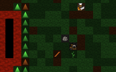

Your workshop is now about to be built. You will have to hit :kbd:`Esc` a
couple of times to un-pause the game, but as soon as you do I bet you
that a helpful wee dwarf will run over and start building it. If you’re
quick you can hit :kbd:`q` and see the status of the workshop, it
should say :guilabel:`Construction initiated.`.

A few seconds later, the workshop is built!

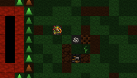

It doesn’t look like much, but it’s really useful! I promise! So lets
get turning some of this lumber into stuff our dwarfs can use. Just
don’t tell the Elves, ok? They really hate us chopping down trees.
Pointy-eared gits, a magma-steam death is too good for them!

Making beds
===========
Dwarfs don’t like sleeping in the dirt, they like nice, comfy beds -
and solid gold statues in their bedrooms, but those will come later.

Follow along with me:

* Hit :kbd:`q` and move the cursor over the carpentry workshop.
* The menu on the right now shows you the actions you can take,
  specifically, we’re interested in :kbd:`a` :guilabel:`Add new task`.
* Hit :kbd:`a` (duh)!
* Note the right menu is now a large list of stuff we can make. We’re
  after beds.
* You can scroll down to beds using :kbd:`=`, or simply hit :kbd:`b`.
* The menu now changes back to the :kbd:`q` list and you’ll see
  :guilabel:`Construct bed` listed. But we want more than one bed!
* Hit :kbd:`a` again, and then :kbd:`b`. Repeat until we’ve got five
  beds up there. We don’t need a bed for every dwarf just yet, luckily
  for us they seem happy to sleep in shifts.

Your carpentry workshop menu should now look like this:

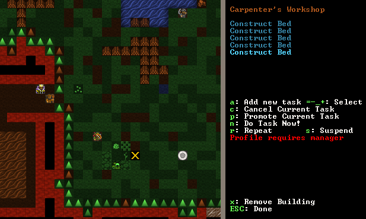

If your workshop menu looks like this, well done! Five beds are queued
up and hitting :kbd:`Esc` a couple of times will un-pause the game and set a
dwarf working, building your beds. You may have noted that there are a
lot of other workshop options available to us now we have items on the
build list. We can :kbd:`s` suspend any construction, set any item to
be :kbd:`r`, repeat built, or we can hit :kbd:`c` and cancel the
construction of the current listed item. We can also have the entire workshop
removed using :kbd:`x`. For now, lets just watch the beds get built!

Note, you won’t see the beds being put anywhere. Want to know why? The
answer is simple, and if you’re extra-special clever you may have
already worked it out: We have no furniture stockpile! Lets fix that:

* Hit :kbd:`p` from the main menu.
* hit :kbd:`u` for :guilabel:`Furniture Storage`.
* Move the X near the workshop, hit :kbd:`Enter`, and designate a pile about 5
  tiles by 5 tiles.

Here’s my pile after a few seconds of the game resumed:

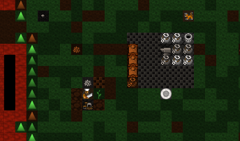

You’ll note the dwarfs have moved the constructed beds to the pile as
well as some spare barrels, our anvil and a bag. As stated above, we
don’t usually like to leave our stuff lying around outside, even in
tidy piles, but as a temporary solution it helps keep things organised
and gets the furniture moved from the workshop. If items aren’t pulled
out from under the carpenter’s feet then eventually the workshop will
get cluttered (marked with :guilabel:`[CLT]` when you :kbd:`q` over the
workshop) and a cluttered workshop works slower.

Later on we can remove piles by using :kbd:`p` and then :kbd:`x` and
selecting the whole area of the stockpile. What’s better is that
helpful dwarfs will grab those items and move them to another suitable
pile. But enough of that, lets get on with building our fortress!

Digging down, down, down!
=========================
What kind of Dwarfs would we be if we only scratched around on the top
of this mound like dirty hobbits? We want to dig down, down, down! The
easiest way of doing this is to build some stairs. Well, to be precise,
we’re going to designate some stairs using the :kbd:`d` menu. We are
going to designate some un-dug space to be stairs and then see what’s
going on a few metres down. So follow along, and lets get expanding!

* Move the map to the top side of our corridor.
* Hit :kbd:`d` and then :kbd:`j` for :guilabel:`downward stairway`.
* Move the X into the black and hit enter, move the cursor down one,
  and hit enter again.

You should see six downwards stairs marked.
You may be wondering why I have set six stairs down. The reason is that
dwarfs need space to move past each other. If the corridor, or stairs,
are only 1 wide, then they have to pause to let each other pass. This
slows movement around your fortress down terribly once you have dozens
of dwarfs running around. Six stairs will be plenty for a long time.

Hit space until the game is running and let that area get built. It
should look something like this when it’s done:

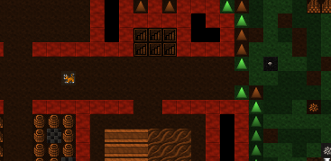

Super! A hallway and two downward staircases! At this point you may be
feeling pretty chuffed with yourself. But if you go down a level
(:kbd:`>`, you’ll recall) you’ll not see any stairs going up, or much
of anything, just these tan blobs:

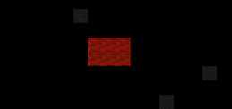

Where are our stairs going up? Where are our vast stores of mineral
wealth? Well, this is where stairs get crazy-strange. Let me explain…

To dwarves a down stair is just an exploratory stair dug down to see
what’s on the level below. It’s like knocking a hole in the floor so
you can look down on your neighbours in the flat below, hoping perhaps
to work out what the weird noises are.

To actually go down to the level below, you need to build stairs going
up from the level you’re digging to. Or in our case, we want to build
an :guilabel:`Up/Down Stairway` as we are looking to dig down a long,
long way. An Up/Down stairway pokes the proverbial holes in both
directions. It links up with a stairway above (if there’s one there)
and tries to link up with a stairway below (if there’s one there). If
there’s no stairway to link up with it will provide access to those
other levels so you can build the needed stairs.

Here's a handy side-on diagram:

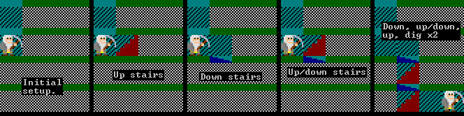

To build an up/down stairway, do this:

* Go down one level from our main area.
* At this level, below our down stairs, hit :kbd:`d`, :kbd:`i`
  to designate an :guilabel:`Up/Down Stairway`.
* Move the X over the tan blocks. Hit :kbd:`Enter`, move down one level,
  and hit :kbd:`Enter` again.
* Brown X’s now show that your up-down stairway has been designated.
* If you mess it up, :kbd:`d` and then :kbd:`x` can un-designate the
  space for you.
* Resume the game and the up/down stairs will be dug. The designation
  looks like this:

Lovely! Perfect up-down stairs. But we’re not done yet.

So far you've been selecting two corners to designate a rectangle in
two dimensions - but laying out a staircase would get pretty tedious
like that!  Luckily DF supports three-dimensional designations as well,
so lay it out in 2D, then :kbd:`>` to level 103 to finish the column.

Rock! We’ve got some rock around us! This is the sort of place a good
dwarf loves! How about we dig out some of this space? I suggest a set
of square rooms just off the staircase, with two tile wide doorways.
It's a simple layout, but enough for now. See if you can match mine.

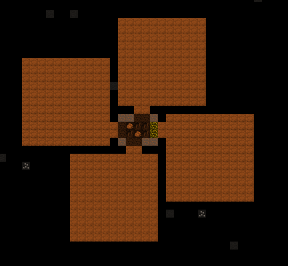

Now let your boys dig! Dig boys, dig! And make sure all your areas set
to be dug connect back to your stairs!

Along the way you may get various messages about striking various ores.
That’s good news! Metal is very handy, as you can imagine. But we’ll
worry about metal later.

What’s that on the ground?
==========================
While they’re busy digging, why not have a look at what is scattered
all over the ground. To do that, from the main menu, hit :kbd:`k` to
look around. An X will appear and you can direct it using
the arrow keys. As you move it around you’ll see what’s under the
arrow. Check my example:

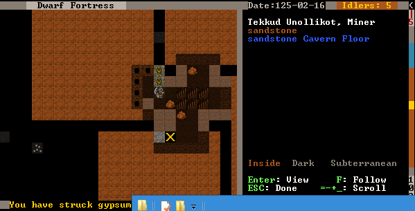

As you can see, underneath my X is a dwarf, some limestone, and a
limestone cavern floor. I can use :kbd:`=` to scroll down
through those three items, and hitting :kbd:`Enter` will display me some info
about each. Ok, except for the floor. I mean, what do you want to know?
It’s a floor!

:guilabel:`Look around` is a very handy way to see what is in a square.
Sometimes items get stacked a few deep and you’re not sure what is
what, :kbd:`k` will show you. Also, it is very handy way to find out
what the walls and ground are made of. For example, without irrigation
you won’t be able to build a farm plot inside on anything but soil,
sand, silt, clay or loam. :guilabel:`Look around` will show you what
the ground is made of.

Toy with :kbd:`k` for a while, and see what minerals are being dug up.
Then lets leave the dwarfs digging, we’ve got a very important job to do...

Chucking out the trash!
=======================
By now, believe it or not, some rubbish may be building up in your
fortress. I’ve taken a shot of some rubbish near our food pile. Have a
look at those slimy bones in with the barrels of booze:

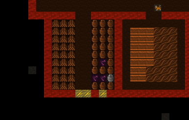

Using :kbd:`k` I can have a closer look and see exactly what this trash
is... :guilabel:`Rat remains`. Yuck!
We can’t have this left lying around our tidy fortress,
can we? Well, we could, but the end result would be a stinking cloud of
purple miasma. Miasma makes our dwarfs unhappy. While they may never
shower and probably reek to high-heaven, they really don’t like the
smell of rotting leftovers. Go figure.

So how do we get rid of the refuse? Easy! We build :kbd:`p`
:guilabel:`Stockpiles` for :kbd:`r` :guilabel:`Refuse`. But note, we
need to build this pile outside or we’ll get miasma build-up. Outside,
the wind blows the stink away.

See if you can set up a refuse pile on your own like mine. It’s just
like making any other pile, except we set :kbd:`r` for refuse as we
plot it.

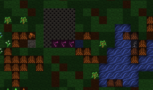

Look, some of the refuse has already been moved!
Phew, miasma criss averted!

But we still have one really, really important job to do…

Making booze!
=============
Booze is the lifeblood of dwarven society. Literally so. Dwarfs, unless
injured, will prefer to drink booze over water 100% of the time. If
there is no booze, they will drink water, and that's terrible - they work
slower, and are more prone to murderous tantrums.

So what do we do about the dwarf booze demands? Simple! We build a still!

Follow along, dear reader:

* Hit :kbd:`b` for :guilabel:`Build`.
* Hit :kbd:`w` for :guilabel:`Workshops`.
* Hit :kbd:`l` for :guilabel:`Still`, or scroll through and find the
  still yourself, and hit enter.
* Place the still in the room above the food stockpile, like this.

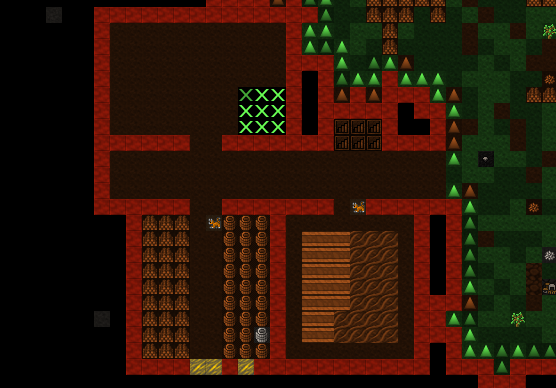

Placing it near food makes sense, as it will turn food items into
booze. The less walking for our brewer, the better. Once you’ve placed
it and selected the materials (any will do), your still should be
quickly built and look something like this:

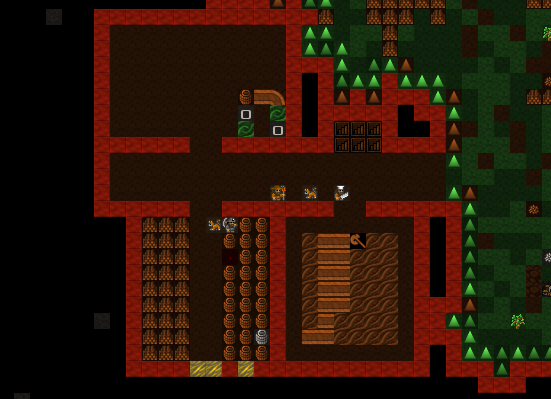

Before we brew some booze, there's one more thing we need: barrels.

* Head to the carpenter.
* Hit :kbd:`q`.
* Hit :kbd:`a`.
* Scroll down to :guilabel:`Make wooden Barrel`, or just hit :kbd:`v`.
* Fill the queue with barrels.

Now to make it start churning out the brewskies!

* Hit :kbd:`q` and move the cursor to the still.
* Hit :kbd:`a` for :guilabel:`Add new task`.
* Hit :kbd:`b` for :guilabel:`Brew drink from plant`
* Hit :kbd:`a` and :kbd:`b` another 7 or so times.

Yay! You have now queued up a lot of beer to be made.

To keep booze production at an acceptable rate, there's a couple of
options.  One is to keep checking manually, but you only have to be
late once to cause a tantrum!  The second is to set up repeating jobs
(:kbd:`q`, select job, :kbd:`r`), but then it's easy for production
of drinks and barrels to get out of sync and waste valuable materials.

The third option is a plugin called ``workflow``, which lets you set a
target amount and will suspend and unsuspend production jobs to keep you
at that level.  :kbd:`q`, select job, :kbd:`Alt`-:kbd:`w`, :kbd:`A` to
:guilabel:`Add limit`, :kbd:`R` adjust the range.  This might seem
complicated, but setting 50-100 drinks and 10-20 barrels will keep things
flowing smoothly until your population is a lot larger.

End result, happy dwarfs! An important thing to note at this point is that
brewing alcohol uses plants, but doesn’t destroy the seeds. Cooking
does destroy the seeds of any plant cooked, which can seriously
compromise your ability to grow more food! So for now, lets just stick
to making some extra booze. We should be ok for food for a while yet
with our farm running, since dwarves love raw mushrooms.

Time to head back down stairs to see how our miners are going. Let them
dig at least one room out before continuing with the next step.
Hopefully they’re not sleeping on the job (The big :guilabel:`Z`
flashing on them)!

The World of Doors!
===================
We need doors. Lots of doors. We need beds, doors, chairs, tables. We
need lots of them. If you’re starting to feel like an Ikea salesman,
don’t worry, when you see a bed menacing with spikes of cat leather,
engraved with an image of a dwarf striking down a goblin with other
dwarfs laughing, then you’ll know you’re no longer in Sweden. So how
are we going to get all of this wonderful furniture?

Well, we could build some doors and assorted other stuff in our
carpenters’ workshop. But that would use valuable wood. Much better
would be to use all that stone you can see strewn about. So how do we
do that? I’m glad you asked! We build a masons workshop. Here’s how:

* Hit :kbd:`b` for :guilabel:`Build`.
* :kbd:`w` for :guilabel:`Workshops`.
* :kbd:`m` for :guilabel:`Masons Workshop`.

Chose an area near our main stairs up, in one of our new rooms. You can
check the shot below to see where I’m going to place mine.

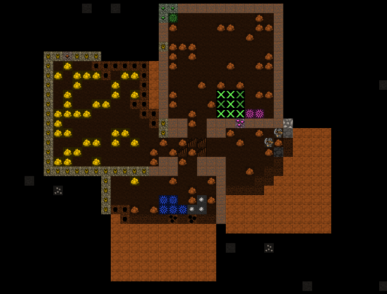

* Select some stone and get the thing built!

Once it’s up it’s time to get it producing some useful items:

* :kbd:`q` over the Mason's Workshop.
* :kbd:`a` for :guilabel:`Add new task`, then :kbd:`d` for door. Do this
  four times.
* :kbd:`a` for add task, then :kbd:`t` for table, do this twice.
* :kbd:`a` for add task, then :kbd:`c` for chair, do this twice.
  Note that in DF, a chair made from stone is called a :guilabel:`throne`.
  They're not the only thing to have different names depending on the
  material, so if in doubt check the wiki.

Wee! Look at all that lovely furniture queued up! Soon our mason will
turn up and start cutting blocks of stone into something more useful.
Unfortunately, someone is going to end up trying to haul all that
furniture up stairs to the furniture stockpile, and we can’t have that,
so lets make a big stockpile in the middle of this room.

While you’re at it, why not remove the furniture stockpile upstairs and
get all of that stuff out of the rain. Go up to the pile, hit :kbd:`p`
for pile, then :kbd:`x` and then hit :kbd:`Enter` at one corner of the
outdoors furniture stockpile, and then move the cursor to the other end
and hit :kbd:`Enter` again. Here’s my downstairs stockpile, complete with
some just-moved furniture and a mason hard at work!

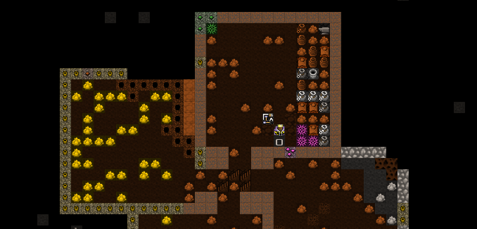

Now it’s time to get those doors and beds into use, and when the tables
and chairs are built, we’ll use those too!

Home Sweet Home
===============
You may have noticed that our dwarfs have been sleeping on the ground
when they get tired. This is really not much fun for them and we’d like
to give them a place to stay. With some beds built, lets set up a big
bedroom on the top floor so our dwarfs can get some shuteye.

* Head to the top floor, and dig out a small room at the end of the hallway.
* Hit :kbd:`b` and then :kbd:`b` again (for :guilabel:`Bed`).
* Move the cursor and place a bed in the corner (hit enter, select a
  bed and hit enter again).
* Spread the five beds around the room.
* Hit :kbd:`Esc` until we’re back at the main menu.
* Hit :kbd:`b` again, and :kbd:`d` for :guilabel:`Door`.
* Place doors across the room entrance.

Here’s my room layout. The shadowy beds and door show that the beds and
doors aren’t placed yet. The green X shows me about to
place the next door.

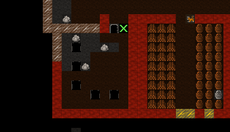

Pretty soon the room will be laid out and we’ll be ready to use it to
house our little workers. Here’s mine finished, doesn’t it look pretty?

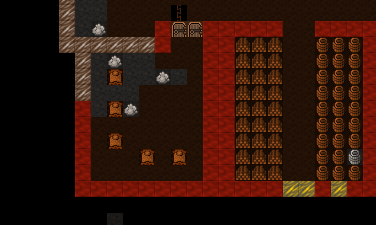

But the dwarfs won’t use it as a bedroom yet. We have to specify what
the room is to be used for first. To do this:

* Hit :kbd:`q`.
* Move the cursor near one of the beds. It will start flashing green.
* On the right, you’ll see the option :kbd:`r` :guilabel:`Make Bedroom`.
* Hit :kbd:`r`.
* You will now see a flashing blue square. Here’s mine, as selected
  from the bottom-left bed.

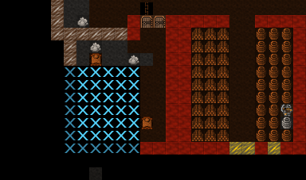

We could hit enter now and set the room at this size, but that would
leave two beds out. So we need to make the room size bigger. With the
blue square flashing…

* Hit :kbd:`=` and this will make the blue square bigger
  until it fills the whole room.

You will note that the room won't "leak" beyond the boundaries of the
walls and doors. This is why we need doors, to prevent leaky rooms!
Makes sense? Right? Ok… moving on…

* Hit :kbd:`Enter` with the room set at max size, a new menu will appear on
  the right.

This menu gives you options for the room. It will always appear when
you :kbd:`q` over the item you set a room’s use from. Note, you don’t
have to set every bed in the room as a bedroom (although the game will
let you do that). DF is smart enough to know that the room is a
bedroom, and all the beds in the room should be used.

On the new menu you want to:

* Hit :kbd:`d` for :guilabel:`Dormitory`, this will turn the
  :guilabel:`(N)` to a :guilabel:`(Y)`.

With the room set as a dormitory any dwarf without their own room will
use the beds in the dormitory to sleep in. When you have a military, a
:guilabel:`Barracks` is where dwarfs will spar and sleep when off duty.

Well done! We have a shared bedroom for our shorties to sleep in!

In `the next chapter of the walkthrough <chapter03>`, we’ll build a fine dining
room, set up some more workshops, and start to build some proper living
quarters for our dwarves. I can’t wait!

