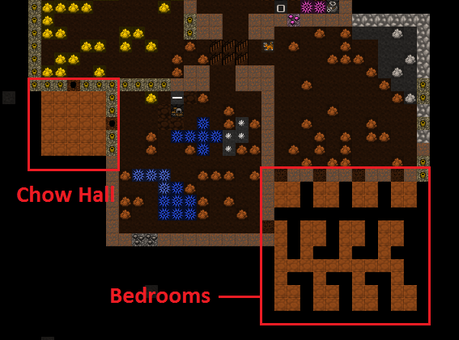
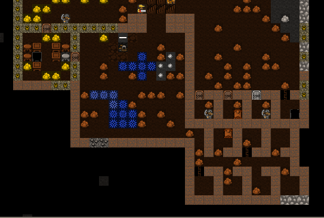
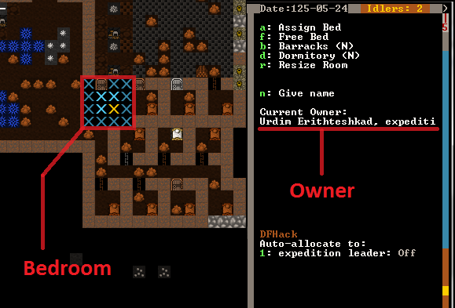
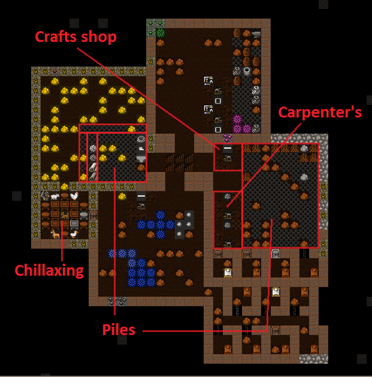

.. _chapter03:

#################
From Cave to Home
#################

In this tutorial we’ll set up some more living space for our dwarves as
well as more workshops and stockpiles. This will just be a short one as
I’m going to give you some tasks to do on your own at the end. Are you
up to the challenge?! Lets do it!

Recap time
==========
We’ve covered quite a lot so far, and if you’ve played through, and
you’re still reading, you’re well on your way to being a master of
Dwarf Fortress. Lets look at what we’ve learned:

* How to look around and work out what you’re looking at.
* How to dig out space and how to dig stairs.
* How to set up rooms and workshops.
* How to get some basic resource production and gathering going.

One thing we haven’t covered is saving your game! Perhaps an
oversight?! Simply hit :kbd:`Esc` and then select :guilabel:`Save Game`.
But don’t do it now! :guilabel:`Save Game` assumes you want to exit
and it will take you back to the main menu. Whatever you do, **don't**
choose :guilabel:`Abandon the Fortress` - that ends the game!

I should note that saves can get confusing - if you start to play with
a seasonal autsave, then save that, the names get longer and don't
always sort in a useful way.  When you come back
to DF and hit :guilabel:`Continue Game`” choosing the last save in the list
won’t necessarily result in your most recent game starting. Instead, you may
have to look in your ``<DF>/data/save/`` folder and see which folder has the
most recently modified files. Then you might rename or delete the older folders.

If you choose the wrong save, there are two options:  you can save as
usual and return to the main menu, or force-close DF with the DFHack
command ``die``.  Enter it in the ingame console (:kbd:`Ctrl`-:kbd:`P`),
but be careful - this will quit without saving or checking again!

Good luck! And lets continue…

Making our Hole our Home
========================
Lets look at making this place a little more comfortable for our
dwarves. First up, they really need a nice place to eat. Just picking at
food on the floor isn’t much fun, dwarves want a beautiful hall in which
they can quaff beer and eat cat biscuits (yes, you can make biscuits
out of cats. Ugggh). Lets help them set one up.

For now we’re going to set it up near our newly-dug space. I’m also
going to make a bunch of 2 by 2 rooms, which will serve as permanent
bedrooms for our dwarves. There's no such thing as a perfect design, so
lets just get the function right and worry about the perfect layout in
your next fortress.

This is how I set things up:

While it’s being dug, go add a bunch of beds to the carpenter’s shop,
as well as doors and tables and chairs at the masons. Report back in
when the rooms are dug and you’ve got a bunch of furniture and another
couple of tables and chairs.

…Ok, are you done? Good!

Now you need to go and place a bed in each room, a door on each
doorway, and tables and chairs in the dining room-t0-be. You should
know how to do all of this using :kbd:`b` for :guilabel:`Build`, then
:kbd:`d` for :guilabel:`Door`, :kbd:`t` for :guilabel:`Table`, and
:kbd:`c` for :guilabel:`Chair`... which in a Mason's workshop is
called a :guilabel:`Throne`.  Yep, the same object can have different
names depending on the material - another reason using the shortcuts
can be easier than scrolling.

Here are my rooms partly completed. If you look closely you can see a
slacker dwarf having a nap.

Can spot my chairs, tables, beds and doors? Pretty aren’t they!? You
may have noticed that bits of your local map are flashing. Don’t worry,
this just indicates that objects are sharing the same space with other
objects, but yes, all that stone does make things look messy. If you
have a tidy-fetish, GIVE IT UP NOW! Dwarf Fortress forts often look
messy with stone and junk strewn everywhere. You can, however, do a few
things to fix that, but we’ll worry about that some other time.
Meanwhile, we need to make ourselves a dinning room!

What’s that? Oh bugger!
=======================
Just got a message which reminded me that I’ve forgotten to do something...

    | :guilabel:`The Outpost Liason from Vushuvash has arrived.`
    | :guilabel:`A caravan from Vushuvash has arrived.`
    | :guilabel:`Their wagons have bypassed your inaccessible site.`
    | :guilabel:`The merchants need a trade depot to unload their goods.`

Damn! A trade caravan arrived but couldn’t make it to our fortress
because, 1: it is inaccessible, 2: we don’t have a trade depot. This
may have happened to you already, if so, don’t worry about it much,
we’ll get that problem fixed soon. Trade caravans come by fairly
regularly and represent other civilisations wanting to trade their
valuables for yours. They are important, and handy, but we’ll discuss
them later some time.

Oh, you may get various windows pop up from the visiting trade liaison.
Just :kbd:`Esc` back out of them for now.

Back to the eating place thing!
===============================
By now you should have the dining room furniture set up, so it’s time
to let the dwarves know it’s the official dining room of the fortress.
We do that in much the same way we set up bedrooms:

* Hit :kbd:`q` and move the cursor over any one of the tables (and for good
  fun, move it over a chair and and read what sort of rooms chairs set up).
* When over a table, hit :kbd:`r`, and again you should see a flashing blue
  box which doesn’t quite fill the room.
* Use :kbd:`=` to expand the room to fill the dining room space.
* Hit :kbd:`Enter`.
* Now hit :kbd:`h` to turn the dining room into a meeting hall as well.
  The :guilabel:`(N)` on the menu will become a :guilabel:`(Y)`.
* :kbd:`Esc` back out to resume the game. All tables and chairs in the
  entire space will now be used.

Well done! A dining room and meeting hall is now set up! Without a
meeting space immigrant dwarves get confused and don’t know where to go
when they arrive, milling about at the edge of the map. A meeting space
seems to send out invisible mind-control rays and any newly-arrived
dwarves will immediately home in on it and into your fortress. Handy!

For amusement, go back up stairs and find the wagon we arrived with. I
bet you it has a few dwarves hanging around it. Know why? Because by
default your wagon is your first meeting area!

If you press :kbd:`F1`, the map will move to the wagon - because it's
also your first hotkey location.  The :kbd:`H` hotkeys menu allows
you to scroll through the hotkeys, name each of them, and set one
to zoom to your current location - which saves time once you spread
out vertically.  Try setting :kbd:`F2` to zoom to our big underground
rooms now.

But the wagon is outside and a long way from the fort and we’d much
prefer our dwarves to be safe and sound within our walls. We should
probably remove that temptation to stand outside and get killed by
carp, elephants, monkeys, unicorns, skeletal whales, zombies, giant
eagles, deer, goblins, etc, so lets remove the wagon. Hit :kbd:`q` and move
the X over to the wagon, then hit :kbd:`x` and the wagon will be
:guilabel:`Slated for removal`. This should free up a three logs
(which the wagon is made up)
and will prompt any lazy, slacker dwarves to head back inside!

Everyone gets their own room!
=============================
Dwarves love to have their own room, much preferring it to sharing a
dormitory (which they will do  by default otherwise), and conveniently
we have set up a number of little rooms. Lets declare that they're
bedrooms, so our dwarves will come and claim one:

* Go to your empty bedrooms, hit :kbd:`q`.
* Chose a bedroom, moving the X over a bed until it’s flashing.
* Hit :kbd:`r`. The blue selection area probably fills the room.
* Hit :kbd:`Enter`.

You can assign the bedroom to a specific dwarf, but unless you want to
play favorites there's no need - if a dwarf wants a nap and doesn't
have a bedroom, they'll claim one of the unowned ones.  Once that
happens, the bedroom status will now look something like this:

If you get confused about a bedroom (or any room’s status), just hit
:kbd:`q` again and move around over each object. Of interest is the fact
that you can assign one room to have multiple uses, for example, put a
bed and table in the same room and specify that the room is both a
bedroom and a dining room, but doing so reduces the overall quality of
both rooms. Don’t bother unless you have some clever reason to.

While you’ve got your cursor up, move it over the door and look at
those options. You can lock doors and you can also make them impassable
to pets. Don’t bother with that for now, just have a look around.

Workshop fun!
=============
Lets set up more workshops. First, put another mason's workshop in with
the other one. It will be handy in the long run, I am sure. Set
up a couple of carpenter's workshops in the room next door. While
you’re at it, set up a big wood pile (:kbd:`p`, :kbd:`w`). The next thing to do
is to set up some more  piles. How about we go through and make a
:guilabel:`Finished Goods` pile? Build it using :kbd:`p`, :kbd:`g`.
Lets keep making stockpiles in those rooms. A few squares for cloth (:kbd:`h`),
leather, (:kbd:`l`), and bars/blocks (:kbd:`b`) makes sense. Where one pile
starts and another stops can get confusing, but give it your best shot.

Finally, lets also add a Craftsdwarf’s Workshop to our room. Use
:kbd:`b`, :kbd:`w`, :kbd:`r`, chose the materials and place the workshop.
These are particularly handy and profitable workshops, but more on them later!

This is how mine looks:

That’s all for now, except before I go I have some homework for
you. But don’t worry, this is the fun kind of homework. See if you can
complete these tasks before we meet again:

#. Destroy the carpenter’s workshop upstairs.
#. Designate another wide area of trees to harvest. If the seasons have
   changed to autumn by now you’ll notice all the trees a pretty gold
   colour. Admire them before you saw them down.
#. Designate a bunch of plants to be harvested.
#. Make a lot more beer and a lot more barrels, or set up ``workflow`` for
   some of the furniture you'll need later (beds, doors, tables, chairs).
#. Make some :guilabel:`bins` in the carpenters shop - around 15 should do.
   You’ll have to scroll to find them in the carpenter :kbd:`a`
   :guilabel:`Add new task` list, or use :kbd:`a`, :kbd:`n`.
   Bins are what everything that isn’t food or booze are stored in.
#. Go to the mason’s workshop and set it to build blocks on repeat
   (:kbd:`q`, :kbd:`a`, :kbd:`b`, :kbd:`r`). Do this only if you’ve already
   managed to make a LOT of bins or your Bar/Block pile will get filled
   quickly!
#. See if you can make some stone crafts. You will find them under the
   :kbd:`g` (:guilabel:`rock`) sub-menu from the :guilabel:`Add new task`
   menu on the craftsdwarf’s workshop. Make sure you have lots of bins for
   your crafts to go in though, and a big finished goods stockpile too!

Good luck! And see you soon, in `the next chapter! <chapter04>`
