######################
It almost makes sense!
######################

Welcome to Part 4 of the Dwarf Fortress Walkthrough. No nancying around, lets get right back into it! I hope you’ve diligently completed your homework. If you look below, you’ll see I have…

Extreme Home Makeover: Dwarf Edition!
=====================================

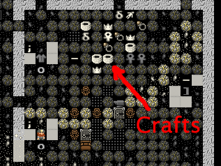

…Lots of Crafts! I’ve gone through and completed all of the tasks at the end of Tutorial 3, and to prove it, here is a picture of my pile of crafts. Looks like I haven’t made much in the way of bins yet, so the crafts haven’t been tidily stored in a single bin. Don’t worry, once bins are produced the dwarfs will sort all this out.

I’ve also got piles everywhere, workshops set up and food and booze production going. Things are looking good! But we have yet more useful jobs to do.

First up, we need to move our booze production down stairs. I want to set up a trade depot upstairs and I’ve decided I don’t want to leave the depot outside, and I don’t want to dig out any more of our limited top-floor space just now. Of course, we have many options for how we expand the fortress, but we’ll go for simple right now, so lets get shifting stuff.

Before we head on to the trade depot, lets get get on with some digging and our new booze space. Hell, lets move the food downstairs as well and keep it nice and close to the dining room, where dwarfs are going to want to eat it.

Here’s how I’ve plotted things out:

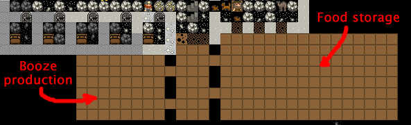

Once that digging is done, set up the big food storage hall as a food stockpile. Then build a still downstairs using “b”, “w”, “l”. This should be easy-peasy for you now! Your next job is go to upstairs and remove the food stockpile and the still. Let everything clear and we’ll go on to trade depots!

Blankets, beads, muskets and cat skull totems!
==============================================
Trading is very important for your fortress. Every few months you’re likely to get a trade caravan and envoy arrive at your fortress looking to trade with you. They offer a wide range of goods and one of the most common things we trade back to them is crafts made from the craftsdwarf’s workshop. And the easiest crafts to trade are rock ones. Rock mugs and instruments are popular as well, so get a bunch made of all of the above when you’ve got the time.

But for the traders to visit properly they need a trade depot. This is a big structure which requires a 3-wide corridor for the trader wagons to access. Often people build them close to the fortress entrance, but there’s no reason you couldn’t build a trade depot deep inside your fortress to keep it nice and safe.

For now, we’re going to enlarge the space we have upstairs with a little digging and get this depot set up. Here’s what I’ve set to be dug out:

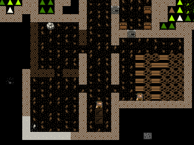

Once the space is dug out, hit “b” and then “D” for “Trade Depot”, note, that’s a capital-d, not the usual lower case “d”. Place it near the back. Here’s mine:

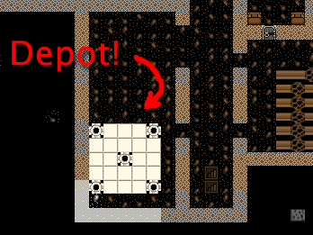

Now that we have the depot up we can expect to see traders turn up to unload their goods here now and then. To trade with them you “q” over the building and follow the options: “g” to move goods to the trade depot, and “r” to request your boss dwarf to go do the trading. Once he turns up you hit “t” and then enter the trade screens. Note again, do not trade anything wooden to the elves, including wooden barrels and bins! They will get pissy, leave, and attack you some years later! Trading is beyond the scope of this current tutorial as there’s quite a lot to it, but you can read a lot more about it on the Dwarf Fortress Wiki. I suggest you make an effort to trade as trading encourages new immigrants to come to your fortress and provides you with items you can’t make or find yourself. Speaking of which…

Look what the cat dragged in!
=============================
At some point you’re going to get immigrants. I got some right now.

.. image:: images/dftutorial52.png
   :align: center

Soon after the message a stream of new loafers streak into the fortress. And what’s the first thing they do? Eat and drink! Slacker bastards! This has me a little concerned about our food stocks, and if this has happened to you, I suggest you do what I do and sort out some more booze and dig some more bedrooms downstairs and assign those new dwarfs to it. Next tutorial we’re also going to have our first close look at our dwarfs, but not until after we build ourselves a nice new farm and ensure we are overflowing with food (and food goods to produce booze out of).

Outdoor farming for fun and profit
==================================
You know about farming inside, now how about farming outside? As you may recall we’ve had some plant gathering going on outside. In temperate climates that means we’re generally gathering strawberries. And once we’ve eaten strawberries, what do we have? Well, if you’re a dwarf, you end up with strawberry seeds. And wouldn’t it be great to plant them? Yes it would! Do we have some? I don’t know yet! But I think so!

We’ll cover looking at our stocks of goods later, by the way, so just trust me for now.

But strawberries are going to require being planted outside, as they love the sun don’t they? Of course, we don’t want to go outside where it could be nasty and dangerous, so what do we do?. We can’t really expect strawberries to grow in a dark cave, can we? So how about we compromise with these fruity demons. We’ll build an outdoor farm, but we’ll lock it off from the world with a wall and an entrance only available to us. Can’t we all just be friends?

To achieve our goals we first need to dig some handy exit to the outdoors. Perhaps near our existing farm. This is what I did:

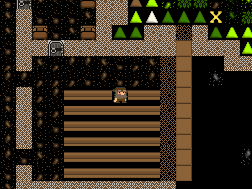

I’ve expanded the farm room a little and set a passage to the outside to be dug. Once the space is dug you’ll notice that the slope icons still exist around the exit. This could be a problem. If we built walls around a nicely enclosed farm now enemies would still be able to get to it from above, by walking down the slopes! So we need to remove the slopes. To remove it, we hit “d” for “Designations” and then “z” for “Remove Stairs/Ramps”.

I’ve selected almost all of the slopes across the front of my fortress. I don’t want any surprises “dropping” in anywhere along our front. Here you can see my miners hard at work  stripping away the outside ramps so there’s essentially a sharp drop between the level above and this level. That will keep us safe from wandering critters.

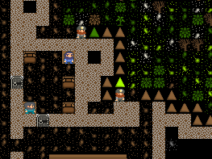

While you’re at it, you could tidy up the outside edge of the fortress with digging and ramp removal. Here’s my much tidier fortress entrance:

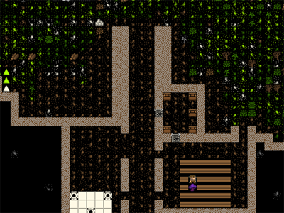

Later on we might incorporate some complex defenses into this area. Perhaps later.

So, lets get on with this farm! We need to surround a nice large area with walls, right? Keep our dwarfs safe from wandering critters. To build walls we need to:

* Hit “b”.
* Hit “C” (that’s “shift+c”), or scroll through the list and look for “Wall/Floor/Stairs” and hit enter.
* “Wall” is selected by default, hit enter.
* You now have a green X. Like the farm plot you can change the size with “u”, “m”, “k” and “h”.
* Hit “u” until you’ve got a max-height wall.
* Place the wall right next to the entrance, hit enter (below you can see how I placed mine).
* Scroll through the materials list using “alt”+”down arrow” and select limestone.
* Hit enter until the list goes away and you see the wall outline. You’re selecting one limestone for each segment of the wall.
* Hit “space” until the game resumes.

You will now have a wall under construction! Again, hit “q” and move it down your wall, you’ll see the construction status. Don’t worry, your dwarfs will get to the wall pretty quickly.

While you’re waiting, clear all the trees and bushes from inside your soon-to-be farm space using “d”, “t” (cut down trees) and “d”, “p” (harvest plants).

Once you’ve got this under way, build two lengths of wall across to the right go down a length and a bit, and back to the cliff face. Of course, use stone for each piece of the wall, no need on wasting wood we’ve worked hard to chop down. Here’s how my outdoor farm plot looks so far:

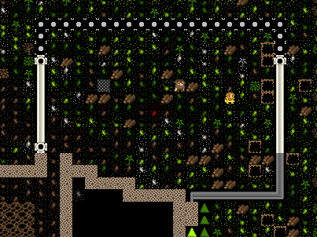

Isn’t it coming along nicely? Yes it is! Soon we’ll be able to hide inside and behind our walls and ignore the nasty outside world. Yay!

Once your walls are complete you could easily build two 6×6 farm plots inside this space. One point though, make sure all those trees are cut down and plants harvested, otherwise you’re going to end up with a patchy farm plot. Also, if there are any trees in the way of a wall being built you won’t be able to place the wall. Get them cleared and the problem will go away.

Oh, I’ve just noticed. Our farm plots will have holes in them anyway, there are white blobs on the ground which a farm square won’t be built on. If you hit “k” and move the cursor around you’ll see that those white spots are limestone. Clearly plants don’t like clinging to rock so no plot will grow there. Never mind, a holey farm isn’t really a big problem.

Here’s my private outdoors farm yard with the farm plots built as well:

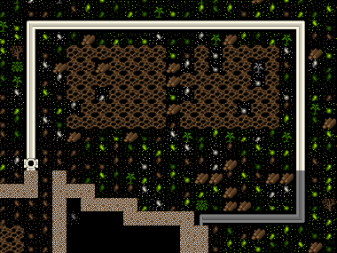

There you go! Beautiful! Now, just like farms inside, you need to specify what the fields will build (“q”). On the first, I’ve set strawberries for every season (don’t forget to cycle through the seasons using “a”, “b”, “c”, “d”). When I tried to select strawberries on the second field they were red, suggesting to me we won’t have enough seeds that this isn’t the season for planting those items (thanks commenter Ookpik! See comments for more info). So instead, I selected some other random plant. Not sure we’ve got seeds for those, but we’ll find out all about that later! And later on you can come back and fix up some better planting instructions. Oh, don’t select  “Seas Fert” or “Fertilize”. We don’t have any fertilizer yet.

While I remember things, lets take a moment to build a wall along the top edge above our outside farm. We don’t want any goblins walking up to the edge of the cliff, looking down, and shooting up our farmers with their crossbows! So go up a level, using good-old “shift”+”<” and plan out your wall. Here I’ve built a wall (after stripping trees, which should once and for all block off any possible approach to my farm.

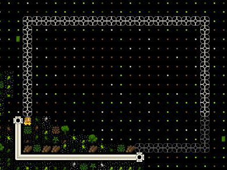

But what’s this, we have a problem! Can you spot what it is? Yup, our stupid dwarf has gone and got himself stuck on the wrong side of the wall. He can’t get out! Now, we could use the “b”, “C” menu to construct some up stairs to him (and then down stairs to connect from this level down to the upstairs), but how about I show you a handy trick…

You see, dwarfs getting stuck will happen to you a lot unless you take countermeasure. Here’s how you fix our current problem, and how prevent it from happening again:

* Hit “d”.
* Hit “n” for “Remove construction”.
* Select a single wall space and hit enter.
* Once the wall space is removed you’ll have a gap. On the inside of the wall gap (where we don’t want our dwarf to stand), set a wall to be built that completely covers the gap.
* Resume the game and then immediately pause it.
* Hit “q” and move down each piece of your fake-wall and hit “s” to “Suspend construction” of each segment. Dwarfs don’t like standing where buildings are due to be placed, so this means when our dwarf comes back to fill in the gap he won’t lock himself in again.

Here’s how my gap and “fake” wall look. You can see my X over a fake wall segment, and on the right, the wall segment is suspended:

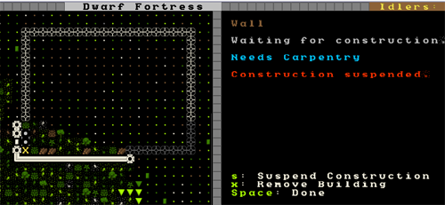

You can now build a single wall space to close the gap and our dwarf won’t get trapped. Once you’ve done that, go back over each wall space with “q” and hit “x” to remove the suspended wall spaces. Look here, job done! Dwarfs safe!

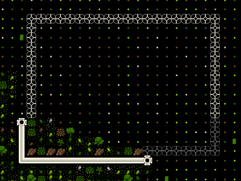

And when I go down and look at my fresh outside farm plot, something is being planted! Great!

That’s all for now. We’ve got traders in our trade depot and we need to sort out all these scummy immigrants. That will take a while, so lets leave all of that for Part 5.

Until then go make a bunch of crafts, get the booze flowing and wait on my return!

