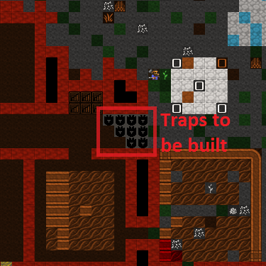
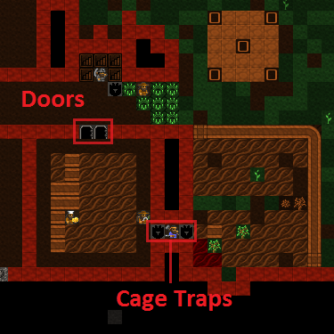
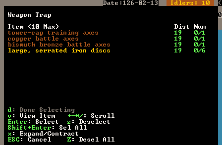
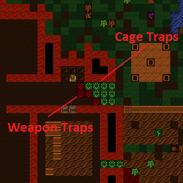
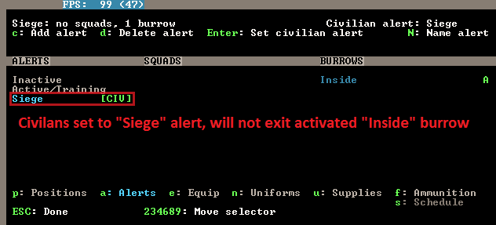

.. _chapter06:

############
It's a trap!
############

Traps form the majority of many people’s defences, so it’s best we get
sorted and make some. First up, we will need a lot of mechanisms, so go
find that mechanic’s workshop and fill it’s job queue with mechanisms.
They’ll end up in a finished goods pile when done.

Next, go to the Carpenter’s workshop and add a ton of cages (:kbd:`j` is the
shortcut from the :guilabel:`Add Task` menu). Try and get ten built. Add another
carpenter’s workshop to your workshop floor if you fancy, makes it
easier to queue up more than a few of any item and get things made
faster.

Defence and Traps!
==================
You’ve got mechanisms, you’ve got cages, now lets make some traps! Head
to the front entrance of your fort and we’ll get building traps and
then ponder the various strategies one might employ in setting up the
defence of your fortress. Follow along:

* At the front entrance, hit :kbd:`b`.
* Scroll to :guilabel:`Traps/Levers` and hit :kbd:`Enter`, or just hit :kbd:`T`.
* You will now see a list of traps, lets briefly discuss them.

:Stone-fall traps:
    These are simple one-shot traps that drop a big rock on an enemy’s
    head. These are great for a quickly built defence, but clearly, as
    one shot traps, a little limited. Note, with all traps, if your
    dwarfs fall onto them, unconscious, they will trigger the trap!

:Weapon Trap:
    These will probably be your bread and butter as they will attack
    any enemy triggering them and with multiple weapons can be quite
    powerful.

:Lever:
    Not a trap, but a device used to manually trigger things like
    bridges, cages, doors, floodgates, supports, etc. More on these
    later some time.

:Pressure Plate:
    Can be part of a complex trap or can be used to trigger other
    objects when conditions are met (such as water being on them,
    creatures stepping on them, magma flowing over them, etc). More on
    those later too.

:Cage Trap:
    What we’re going to be working with in a moment! A trap that
    catches the enemy in a cage. You can then do amusing things with
    the trapped bad guys, like tossing them off a tall bridge, dropping
    them into magma, or stripping them and using them for military
    sparing practice. Good fun!

:Upright Spear/Spike:
    A peculiar sort of trap device that can only be triggered by a
    pressure plate or lever.

You should read about :wiki:`traps <trap>` and :wiki:`trap design
<trap_design>` on the wiki for a lot more detail, but only after you’ve
completed this tutorial, ok?! For now, get back to work!

* Scroll down to :guilabel:`Cage Trap` and hit :kbd:`Enter`.
* You now have a green X, place it in front of your entrance somewhere
  with :kbd:`Enter`.
* Do this a few times, you can see below how I’ve set a few traps to be
  built.

This is hardly an impressive defence, but it will do for now. With luck
it might help against any casual raiders, although sneaky 'trapavoid' monsters
will still be able to sneak past your traps. To beef our defence up a
bit we need to get some weapon traps installed as well as sort out some
way to strike back at attackers who aren’t so gracious to step on all
of our traps. So with that in mind, get producing a lot more mechanisms
(at least 10) and follow along as we produce some trap components!

Smelting and other dwarfy things!
=================================
This wouldn’t be a *dwarf* fortress if we didn’t fill the place with
the clang of forge hammers and the stink of furnaces, right? Lets have
some fun then and make some sharp things to hurt our enemies!

.. note::

    If you haven't dug up any :guilabel:`Magentite` yet, this is a good
    time to go find it - it's a form of iron ore, and we can't smelt iron
    without any ore!

First up, let me point out that item production can be fairly
confusing. Essentially what we’re going to do is turn some wood into
charcoal (at a wood furnace), then use the charcoal to turn metal ores
into metal bars (at a smelter), then we’re going to use more charcoal
to smith metal bars into items (at a metalsmith’s forge).  As you can
no doubt imagine the problem we will face is the charcoal bottleneck.
It will take a lot of wood to fuel all our furnaces! Most of the time
this problem is got around by players using magma smelters and magma
forges. We haven’t struck magma yet, so we’re going to plough ahead
with the hard way, at least for a while.  The goal of all this is to
produce a few fearsome trap components to fit out some weapon traps –
think spinning disks from Indiana Jones! So follow along:

* Find your wood furnace, hit :kbd:`q`, :kbd:`a`
* Select :guilabel:`Make Charcoal`, on :kbd:`r` repeat.
* With the job selected, :kbd:`Alt`-:kbd:`w` to open workflow.
  Set this to keep 5 to 10 charcoal bars available.
* Now go to the smelter, and try to :kbd:`a`, :guilabel:`Add new task`.
  You'll see a list of the tasks available at this workshop. Note, the tasks
  will change as you uncover more ores or deplete older ores. For
  interest, note that you can set the workshop to melt objects you wish
  to dispose of (turns the object back into a metal bar). More on that
  some other time.
* Chose :guilabel:`Smelt Magnetite Ore`, hit :kbd:`Enter`. Magnetite is
  a form of iron ore, so some of the rocks lying around will become iron bars.
* Fill the queue and then fill it again (or build another smelter and
  fill both queues).
* Once we’re done with this tutorial why not go and smelt all of that
  native platinum ore you saw on the list as well? If you’ve dug
  downstairs out you may have gold to smelt too!

Your dwarfs should be pretty busy now, hauling charcoal, wood, ores and
bars around. While you’re at it, make sure you’ve got enough wood around
for charcoal by cutting more down outside!

If you want to check your progress, go look at your Bar/Block stockpile
and see what is being built up. If you suspect all of your production
is in bins, use :kbd:`k`, find the bin, hit :kbd:`Enter` and look inside it.

A little on food processing
===========================
While all this is going on, why not go to your farmer's workshop and
add a task of :guilabel:`Process Plants (to bag)`. Set it on repeat.
Then add a task of :guilabel:`Process Plants (to barrel)`, again,
set it on repeat. Now some
dwarves will process anything you’ve grown that needs processing. I won’t
list those plants here now (go look at crops for all the detail), but
suffice to say, some plants need to be processed so they can be eaten
or used in other sorts of manufacture (eg, cloth making).

Hopefully you’re not short on bags. If you are, try and pick up a bunch
off a trader. Alternately, buy leather and/or cloth off a trader and
using the Leather Workshop or Clothier’s Shop (we’ve not built one yet)
make bags. Bags are very handy for storing seeds and processed plants,
you can never have too many of them. They’re like barrels and bins in
that way.

I also just noticed that our farm entrance was entirely undefended,
so I added some doors and cage traps.  Hopefully that'll be enough!

Back to the iron!
=================
With a few iron bars made, head on back to the smelter - we’re ready
to rock! I hope, at this point, that you’ve not
been invaded, attacked or otherwise molested. With our fortress around
two years old now it’s likely you’ll start to see the odd goblin ambush
– especially if you send your dwarfs outside a lot. I hope you survive
those ambushes just fine! Perhaps we should have started this chapter
sooner...

Anyway, head over to your metalsmith’s forge, and:

* Hit :kbd:`q`, :kbd:`a` You will now see a list! Explore the list,
  see all the neat things we can make! You might need to hit :kbd:`Tab`
  to expand the menu size so you can see everything.
* Scroll to :guilabel:`Trap Components` and hit :kbd:`Enter`.
* Scroll to :guilabel:`Iron`, hit :kbd:`Enter`.
* Hit :kbd:`Tab`, :kbd:`Tab` so we can see the full item names.
* Chose to make a :guilabel:`large, serrated Iron disc`.
  I love the sound of that!
* Queue up three disks.

At this point you might want to think about other items you’d like to
make in due course. Hit :kbd:`a` again and then hit space to back down the
make-item tree. Chose :guilabel:`Weapons and Ammunition`, chose
:guilabel:`Iron` and let's
make three Iron warhammers. These will come in handy once we start our
military. I like warhammers because it’s funny to watch goblins fly a
half dozen tiles and then expire in a heap.

Once you’re confident your items are made, go back and make sure you’ve
got some more charcoal in production, you’ve got more ore being smelted
and add, under Armor, three suits of iron chainmail and three iron
shields. This will all come in handy later.

Oh, you may be getting annoyed at slow production. I know it’s been
bugging me. Perhaps it’s time to pack your production rooms with more
smelters and charcoal burners. One issue you’ll face is you need to make or
buy an anvil off the traders in order for you to make another metalsmith's
forge. Keep it in mind for your next trading deal.

The other thing to consider is setting up Workflow for every step -
automating complex industries like steelmaking (or soap) is exactly
what it's designed for.

Deploy Zee Traps!
=================
Once you’ve got your nice, big spikey discs, head back to your
entrance. Get ready for trap placing fun!

* Go to place another trap, a :guilabel:`Weapon Trap` this time.
* Chose a mechanism.
* A new screen will be displayed looking something like this:

* From this screen you can chose the weapons you want to deploy with
  your trap. Facing goblins, we really only need one awesome iron disc
  per trap I think, but we’re able to select more if we wish.
* Scroll to the :guilabel:`large, serrated Ir...` and hit :kbd:`Enter`,
  you’ll see :guilabel:`1/3 selected`.  Weapon traps can have up to
  ten weapons each, but we need to save some for the other traps!
* Hit :kbd:`d` for :guilabel:`Done Selecting`.
* Your first weapon trap is now placed! Place three more.

Weapon traps are great ways of getting rid of a bunch of trash weapons
you might have lying around – this is particularly the case once you’ve
killed off a few goblins and have their rubbish cluttering up your
piles. When filling a trap with weapon trash you might want to put
ten low-quality weapons per trap, to ensure maximum damage!

Here are my traps, laid out. I’m actually going to add another row of
slicey dicey weapon traps as I don’t have a military and I’m a bit
paranoid. Do something similar!

Well done on the trap placing! But we’re not done with our defences
just yet. We need to stop our drunken citizens from casually strolling
into an invading army - and that means the Burrows system!

Learn to love Burrows
=====================
"Wait!" you're probably thinking, "Why do we need filthy burrows when
we have a perfectly good fortress?".  Well, I'm glad you asked!

A burrow isn't a physical part of your fortress, it's a way of designating
where dwarves are allowed to live and work.  More importantly, you can
set a :guilabel:`Civilian alert` to confine their movements too - perfect
for stopping Urist McSuicidal from wandering off to make friends with a
troll.  Here's how to set it up:

.. image:: images/06-burrow.gif
   :align: center

Want some more detail?  You're in the right place! Start by hitting
:kbd:`w` for the burrows menu, and :kbd:`a` to add.  As shown in the
gif above, :kbd:`Enter` to designate is the important thing.
Cover the whole underground area, since it's safe there, and
:kbd:`n` name it something like "Inside".

The key feature here - for civilians, the military is complicated -
is that on the left we have :guilabel:`ALERTS` and on the right we have
:guilabel:`BURROWS`.  This means that we can set non-military dwarves to
be confined to a burrow, and change which if any that is with a single
alert setting.

This is the :kbd:`m` military :kbd:`a` alerts screen, which is also
used for for civilian alerts.

.. image:: images/06-burrow-explanation.png
   :align: center

Now, let's set up a civilian alert in our new burrow, to make sure
nobody gets caught on the wrong side of the traps:

* :kbd:`c` to add an alert, then :kbd:`n` to name it.
  I called mine "Siege" because it's to use during a siege. Yep.
* Now move the cursor to the :guilabel:`BURROWS` column, and hit
  :kbd:`Enter` to associate that burrow with your new alert.
  You'll see a green :guilabel:`A` next to the burrow when you have
  that alert selected.
* Hit :kbd:`Esc` a couple of times to get out of the military menus.

You're all set up!  In case of invasion :kbd:`m`, :kbd:`a`, select the
Siege alert, :kbd:`Enter`, and you should see a green :guilabel:`[CIV]`
next to it.

Congratulations, your civilians are now confined to the burrow!
Watch any civilians who were outside drop what they were doing and come
running back inside. Note they will not go for food, so your safe room
may become a death sentence if there's no supplies (but that shouldn't
be a problem by now, right?).

When the 'fight' (against brave... traps) is over, come back and select
:guilabel:`Inactive` and hit :kbd:`Enter` to cancel the alert and let
your civilians back out of the burrow - that's all there is to it.

Anyway, that’s enough to now. Get on with building lots of traps,
making bags, armor, barrels, food, bins, shields, weapons and so on! Go
to it, and I'll see you in `the next chapter! <chapter07>`.

