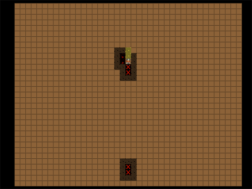
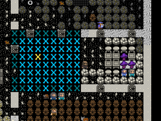
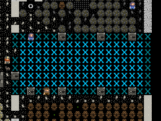
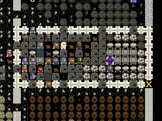
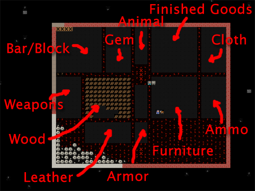
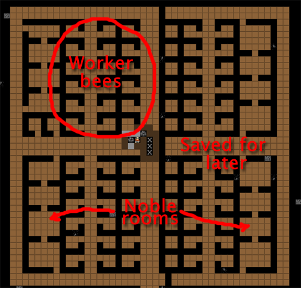
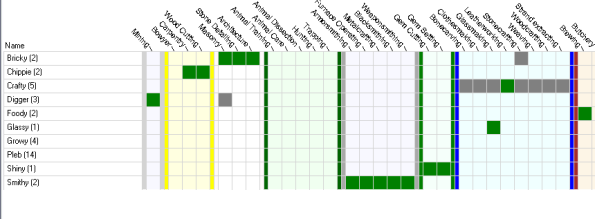

##################
A Mighty Fortress!
##################

You have come a long way, young jedi! Your dwarf herding skills are strong! You now know the basics of building, production, trading and managing your dwarfs. But we still have work to do, so lets get back to our fortress!

More Production!
================
We took a bit of a detour earlier by getting into managing dwarfs and trading and whatnot, but I think you’ll agree those were important lessons. But what really gets us going is building awesome new stuff in our fortress, right? Lets start with some new workshops you should get to grips with. I won’t list the keys you need to use for every task, you should be able to remember the basic stuff from earlier lessons, so lets just get building these workshops around our four big production rooms:

* Mechanic’s Workshop
* Leather Works
* Farmer’s Workshop
* Kitchen
* Butchers
* Metalsmith’s Forge

In addition, go to the Furnaces menu (from “b” and then “e” for “Furnaces”) and build:

* Wood Furnace
* Smelter

While those places get built lets look at expanding a bit. In the middle of our four room area we have three stairs going down. Right now they go nowhere, so lets go down about 5 levels. Remember, “d” and then “i” for “Up/Down Stairs”, set to the level below, will get that construction going.

We also have room to expand between our production floor and our entrance, so lets go up a level and put some storage there. I suggest the easiest way to do this will be to “b”, “build” a “C” “construction”, that is, an up-stair. So chose the space I highlight below, and then follow along!

.. image:: images/dftutorial79.png
   :align: center

Find the spot in the picture above, just below those down stairs.

* Hit “b”.
* Hit “C” (capital ‘c’).
* Hit “u” for “Up Stair”.
* Chose some stone.
* Repeat to set three up stairs to be built.

Once the job is done you’ll have some stairs like this:

.. image:: images/dftutorial80.png
   :align: center

Now we want to “connect” this level to the one above. If you go up a level you won’t see anything but dirt, but we know the stairs are leading up to this level, so it’s a matter of constructing some, right? WRONG! We want to designate some stairs, because our miners will carve out some matching stairs! We only use “construct” when we’ve got an empty space to deal with.

One challenge you’ll face is working out where on the floor above the spot is you need to dig out. So try this technique:

* Hit “d”.
* Hit “i” for “Up/Down Stair” (we want a series of stairs almost back up to the surface).
* Put your X over the top stair in the line, like the screenshot

.. image:: images/dftutorial81.png
   :align: center

* Now go up a level and at the above level, designate three stairs in a row (ie, hit enter, then hit down-arrow a couple of times, and then hit enter), the above level should look like this:

.. image:: images/dftutorial82.png
   :align: center

You’ll note I wasn’t quick enough when I took this picture and two of my three stairs are already dug out. Good dwarfs!

With the new stairs dug out (providing easy access to all the space we’re going to create for our production dwarfs) lets make a massive space for them to stockpile goods. Here’s how much I dug out:

In case you’re wondering, that’s about a 40×40 box with our first stairs at the bottom. And one nice thing about digging in dirt (which this layer is), is that it doesn’t leave any messy rock around to clutter up our nice stockpiles!

While that’s completing, lets start an important job, making our dining room awesome! You see, dwarfs love to spend time in an attractive meeting hall. Right now mine is packed with loafers. They clearly need a bit more room! A bit of digging will sort that:

.. image:: images/dftutorial84.png
   :align: center

Once the room is expanded, fit doors and some more tables and chairs. Once that’s done you’ll need to do something important, and that’s resize the room. As you may remember we set the room up from one of the tables. But if you “q” over the dining room table now you’ll see it doesn’t fill the space:

The room will be more “valuable” and widely used if it’s set to be bigger, to fill this space. Lets do that now:

* Hit “q” and move the X over the table which is setting the room up…
* Hit “r” for “Resize Room”.
* Using “alt”+”down arrow” expand the room size till you fill the space:

* Hit “enter”

Job done! The room is resized and better. But we want to make it MUCH better because I noticed a dwarf with a red down arrow flashing and when I viewed his info it turned out he was pretty unimpressed with his surroundings. Lets get to impressing him!

How do we do that? Simple! We smooth the walls and then engrave them with fine carvings all about our fortress! To do this:

* Hit “d”.
* Hit “s” for “Smooth Stone”.
* Select the entire dining room and walls using “enter”, move cursor, “enter”.

The room will now look all flashy like this (until you back out of the menu, anyway):

Any dwarf with the “Stone detailing” labour on will now set about smoothing the walls and floors. The next step, once the space is smooth, is to designate the room to be engraved using “d” and “e”. Engraved walls make dwarfs happy and increase the value of your fortress. You can even look at them by using “k” and hitting enter with the engraving highlighted. Some walls have some quite amusing engravings (randomly generated and based on the history of your dwarfs and your fortress), so it’s worth looking around and finding the good ones. The better the quality of the engraving the more text there is to read, so keep an eye out for the engravings with the metal-bars icon next to them.

With the smoothing under way, lets get back to the piles. In that big space upstairs you can pretty much set up a space for everything it’s possible to make a pile for (except refuse, of course, which we want to be outside). So go do that now. Here’s how mine is laid out.

Pretty complete huh? Well, almost, I’m sort of tempted to make a stone pile and using custom settings have it as metal ores only. It would make things a bit tidier, but on the other hand probably doesn’t gain me that much efficiency right now. Be very careful with stone stockpiles, hauling stone can consume a heap of your dwarfs’ time, which is a bit pointless.

Hotel Califortress!
===================
We’ve got some new workshops set up, we’ve got some great storage, and we’ve dug down a few levels. Good stuff! Unfortunately, (or fortunately?) you’ve probably had a bunch of immigrants arrive over the course of the past couple of tutorials and they haven’t been assigned anywhere to live. We also don’t have any space dug out for the inevitable arrival of nobles, and these boys and girls are one set of dwarfs that need hard work to keep happy!

Fortunately we’ve dug down a few levels and we have a lot of nice rock down there. So lets go take some time to lay out some great bedrooms for our dwarfs. The majority of your rooms should be 2×2, but lets make some space for nobles too.

Nobles usually want two-to-four rooms. So lets make things easy and give them all four rooms of size 3×3 or so, that should be good enough. Here’s how I have planned out my bedroom level:

A couple of points. Firstly, the whole right side of my new bedroom level won’t be dug because it’s not connected to the stairs, etc. I’ll connect it up later once we’ve got the left side done. Second, my layout is pretty boring, go and check out some of the bedroom designs on the wiki. I love the fractal pattern! Very efficient! Finally, you’ll notice the big wide corridors for the main arterial routes. Dwarfs need space to move around, remember!

Also, remember that you will need a lot of new doors and beds for our beautiful hotel. While you’re at it, build a ton of tables and chairs and at least a half dozen coffers, cabinets, armor stands, weapon stands. You’ll find all those items under the masonry workshop menus. Oh, and lets connect up the southern most stairs (the first ones we built way back in tutorial 1 or 2) with this level as well. Construct down stairs from the workshop floor and then designate Up/Down stairs till we’re all connected up.

While that is being built (oh, we’re going to find some jems too, cool!) lets continue with…

The Joy of Traps!
=================
Traps form the majority of many people’s defences, so it’s best we get sorted and make some. First up, we will need a lot of mechanisms, so go find that mechanic’s workshop and fill it’s job queue with mechanisms. They’ll end up in a finished goods pile when done.

Next, go to the Carpenter’s workshop and add a ton of cages (“j” is the shortcut from the “Add Task” menu). Try and get ten built. Add another carpenter’s workshop to your workshop floor if you fancy, makes it easier to queue up more than a few of any item and get things made faster.

While you’re at it, queue up a bunch of booze at the still too, we don’t want to run out, ok!

Now would be a good time to go fiddle with Dwarf Manager. Sort out your profession groups, make sure your diggers have no job other than diggers and your masons and stone details are doing nothing but those jobs, after all, we want them to stay on task and not get distracted, right? Set all the peasants to haul jobs only, remove all hauling jobs but food hauling from your farmers, you get the picture!

Here’s how I’ve got my lads and ladies sorted:

Couple of interesting points. First up, I’ve got 14 dwarfs assigned to the “Pleb” profession: All they do is haul stuff. The others are grouped around certain jobs – farming, crafting, digging, masonry/stone detailing, etc. In a few situations, for example, my “Foody” class, I have a dwarf who is good at cooking and another who is good at brewing, and to make life easier I’ve turned on both jobs for both dwarfs. Eventually they’ll be great at both, and it saves me a little admin with dozens of production classes. I engage in this sort of rationalisation frequently in my dwarf management.

I’ve also got four dwarfs set to farm, and they only farm and haul food, nothing else. With nothing to distract them they will fill the fields with crops! I’ve also got at least one dwarf in there who has no farming skill, it’s never to soon to start training them up though!

With so many dedicated haulers I can afford to leave some dwarfs to specialise in these various production tasks. But be careful of having to many dwarfs who aren’t doing anything, idle hands are the devil’s plaything, after all! Dwarfs with no jobs will eventually get bored and throw parties that tie up lots of time and dwarfs. If your dwarfs have little to do, set a few making stone blocks (blocks make any item made out of them more valuable and can also be stacked in bins, a great way to remove stone clutter) or have them out their harvesting plants, smoothing stone or whathaveyou. No need to have them lazing about!

Hang on a second.. weren’t we meant to be talking about traps? Yes! I think we were! So, with cages and mechanisms built lets get on and make some cage traps…

Dwarfs and their strange moods!
===============================
…or not! Oh dear! Something is going down in dwarf land!

If you get a dwarf in a strange mood, find them using “u”, looking for their name, and then “c”. You will see the dwarf flashing with a grey exclamation mark (red is very bad, by the way). Follow this dwarf closesly. This dwarf has got a strange mood and is off to claim a workshop to start building some amazing object based on their whim and fancy. We can’t control what they build, all we can do is hope they build something cool and that they can find all the materials they want for their fancy. If not, they go suicidal or homicidal. Oh dear! Lets watch and see what happens. Of course, this event is random, so it might not happen to you at this point in the game, but it will happen sooner or later.

Right, my dwarf, Endok Oltarisos has rushed off to claim a leather workshop. No surprise, he’s a tanner after all. Once he claims the workshop you can “q” and see the status of the workshop, and if you wait, it will scroll through what items the dwarf is looking for. Endok is looking for “stacked leather” and “skeletons”. I’m not sure if I’ve got any. I’ll find out pretty quickly though, the dwarf will either run off and start fetching stuff, or sit in the workshop, seemingly doing nothing…

.. image:: images/dftutorial92.png
   :align: center

Well, the leather isn’t a problem, I just bought a ton from a trader, and the bones, I think he’s grabbed some from the refuse pile. Thankfully, my worries about the dwarf not getting stuff are put to rest when I get this message:

Endok has begun a mysterious construction! Great! Now we just wait and see what crazy object the dwarf produces. With luck it will be useful!

..or maybe not! Our dwarf has made a cap, a simple hat, out of dog leather! Damn! On the plus side though the dwarf has become a legendary tanner. If they gain skill from a mood it often leaves them “Legendary”, which is pretty neat. With legendary skill I could use Endok to make leather armour and it would be as good as metal armour, handy.

Lets look at the item. If we hit “l” we get a “list” of artefacts. With only one artefact there’s no list, so we can go straight in to hitting “v” to “View”.

Behold! Triberiddle, the dog leather cap (click on the picture here if you can’t read the text)!

.. image:: images/dftutorial95.png
   :align: center

A nice hat depicting when one of the trade caravan guards shot a goblin. No one will wear it though, it’s an :wiki:`artifact`, only champions consider themselves important enough to grab artifacts from stock piles.

We were lucky this time with our moody dwarf. He was able to get everything he needed to make his artifact. If he couldn’t find it he would go quite crazy in the workshop, or if a suitable workshop isn’t available, in his room. When you see the dwarf start to go crazy (flashing down arrows and not moving from their workshop are a good sign) it’s time to either assign the dwarf some war dogs (more on that later) or to construct some walls and wall them in to their workshop, or to lock the door on their quarters. At some point the dwarf will go beserk and either get attacked by nearby military dwarfs or war dogs, or if locked inside, slowly starve to death.

If the crazy dwarf is ignored they will destroy stuff and attack dwarfs, probably killing a couple before they are put down, so watch those moody stunties closely!

…Hang on a second, weren’t we supposed to be doing something about traps? Bugger! We’re out of time. How about next time? OK? Seriously? I really promise we’ll get to traps, ok!

