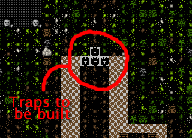
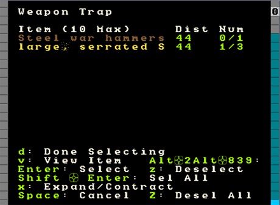
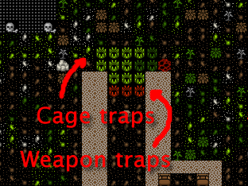
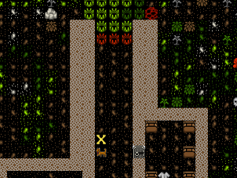
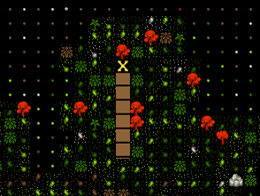
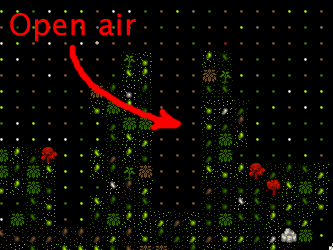
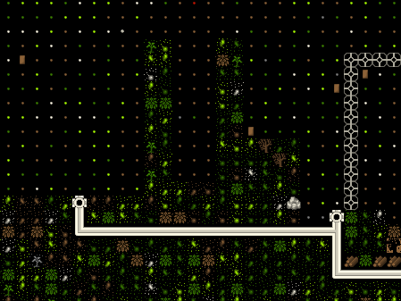
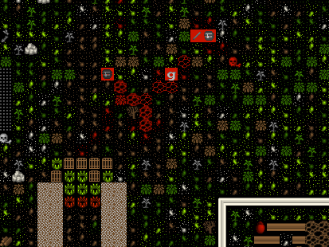

############
It's a trap!
############

Traps form the majority of many people’s defences, so it’s best we get
sorted and make some. First up, we will need a lot of mechanisms, so go
find that mechanic’s workshop and fill it’s job queue with mechanisms.
They’ll end up in a finished goods pile when done.

Next, go to the Carpenter’s workshop and add a ton of cages (:kbd:`j` is the
shortcut from the :guilabel:`Add Task` menu). Try and get ten built. Add another
carpenter’s workshop to your workshop floor if you fancy, makes it
easier to queue up more than a few of any item and get things made
faster.

Defence and Traps!
==================
You’ve got mechanisms, you’ve got cages, now lets make some traps! Head
to the front entrance of your fort and we’ll get building traps and
then ponder the various strategies one might employ in setting up the
defence of your fortress. Follow along:

* At the front entrance, hit :kbd:`b`.
* Scroll to :guilabel:`Traps/Levers` and hit :kbd:`Enter`, or just hit :kbd:`T`.
* You will now see a list of traps, lets briefly discuss them.

:Stone-fall traps:
    These are simple one-shot traps that drop a big rock on an enemy’s
    head. These are great for a quickly built defence, but clearly, as
    one shot traps, a little limited. Note, with all traps, if your
    dwarfs fall onto them, unconscious, they will trigger the trap!

:Weapon Trap:
    These will probably be your bread and butter as they will attack
    any enemy triggering them and with multiple weapons can be quite
    powerful.

:Lever:
    Not a trap, but a device used to manually trigger things like
    bridges, cages, doors, floodgates, supports, etc. More on these
    later some time.

:Pressure Plate:
    Can be part of a complex trap or can be used to trigger other
    objects when conditions are met (such as water being on them,
    creatures stepping on them, magma flowing over them, etc). More on
    those later too.

:Cage Trap:
    What we’re going to be working with in a moment! A trap that
    catches the enemy in a cage. You can then do amusing things with
    the trapped bad guys, like tossing them off a tall bridge, dropping
    them into magma, or stripping them and using them for military
    sparing practice. Good fun!

:Upright Spear/Spike:
    A peculiar sort of trap device that can only be triggered by a
    pressure plate or lever.

You should read about :wiki:`traps <trap>` and :wiki:`trap design
<trap_design>` on the wiki for a lot more detail, but only after you’ve
completed this tutorial, ok?! For now, get back to work!

* Scroll down to :guilabel:`Cage Trap` and hit :kbd:`Enter`.
* You now have a green X, place it in front of your entrance somewhere
  with :kbd:`Enter`.
* Do this a few times, you can see below how I’ve set a few traps to be
  built.

This is hardly an impressive defence, but it will do for now. With luck
it might help against any casual raiders, although sneaky 'trapavoid' monsters
will still be able to sneak past your traps. To beef our defence up a
bit we need to get some weapon traps installed as well as sort out some
way to strike back at attackers who aren’t so gracious to step on all
of our traps. So with that in mind, get producing a lot more mechanisms
(at least 10) and follow along as we produce some trap components!

Smelting and other dwarfy things!
=================================
This wouldn’t be a *dwarf* fortress if we didn’t fill the place with
the clang of forge hammers and the stink of furnaces, right? Lets have
some fun then and make some sharp things to hurt our enemies!

First up, let me point out that item production can be fairly
confusing. Essentially what we’re going to do is turn some wood into
charcoal (at a wood furnace), then use the charcoal to turn metal ores
into metal bars (at a smelter), then we’re going to use more charcoal
to smith metal bars into items (at a metalsmith’s forge).  As you can
no doubt imagine the problem we will face is the charcoal bottleneck.
It will take a lot of wood to fuel all our furnaces! Most of the time
this problem is got around by players using magma smelters and magma
forges. We haven’t struck magma yet, so we’re going to plough ahead
with the hard way, at least for a while.  The goal of all this is to
produce a few fearsome trap components to fit out some weapon traps –
think spinning disks from Indiana Jones! So follow along:

* Find your wood furnace, hit :kbd:`q`, :kbd:`a`
* Select :guilabel:`Make Charcoal`, on :kbd:`r` repeat.
* With the job selected, :kbd:`Alt`-:kbd:`w` to open workflow.
  Set this to keep 5 to 10 charcoal bars available.
* Now go to the smelter, and try to :kbd:`a`, :guilabel:`Add new task`.
  You'll see a list of the tasks available at this workshop. Note, the tasks
  will change as you uncover more ores or deplete older ores. For
  interest, note that you can set the workshop to melt objects you wish
  to dispose of (turns the object back into a metal bar). More on that
  some other time.
* Chose :guilabel:`Smelt Magnetite Ore`, hit :kbd:`Enter`. Magnetite is
  a form of iron ore, so some of the rocks lying around will become iron bars.
* Fill the queue and then fill it again (or build another smelter and
  fill both queues).
* Once we’re done with this tutorial why not go and smelt all of that
  native platinum ore you saw on the list as well? If you’ve dug
  downstairs out you may have gold to smelt too!

Your dwarfs should be pretty busy now, hauling charcoal, wood, ores and
bars around. If things aren’t moving quick enough turn off the hauling
jobs for anyone involved in your metalworking industry. While you’re at
it, make sure you’ve got enough wood around for charcoal by cutting
more down outside!

If you want to check your progress, go look at your Bar/Block stockpile
and see what is being built up. If you suspect all of your production
is in bins, use :kbd:`k`, find the bin, hit :kbd:`Enter` and look inside it.

A little on food processing
===========================
While all this is going on, why not go to your farmer's workshop and
add a task of :guilabel:`Process Plants (to bag)`. Set it on repeat.
Then add a task of :guilabel:`Process Plants (to barrel)`, again,
set it on repeat. Now some
dwarves will process anything you’ve grown that needs processing. I won’t
list those plants here now (go look at crops for all the detail), but
suffice to say, some plants need to be processed so they can be eaten
or used in other sorts of manufacture (eg, cloth making).

Hopefully you’re not short on bags. If you are, try and pick up a bunch
off a trader. Alternately, buy leather and/or cloth off a trader and
using the Leather Workshop or Clothier’s Shop (we’ve not built one yet)
make bags. Bags are very handy for storing seeds and processed plants,
you can never have too many of them. They’re like barrels and bins in
that way.

Back to the iron!
=================
With a few iron bars made, head on back to the smelter. Go and :kbd:`a`,
:guilabel:`Add new task`. You should now see a new task listed,
:guilabel:`Make Pig Iron Bar`.
Pig Iron is made out of one iron bar and one piece of flux material
(eg, limestone, which we’ve got a lot of). Next on the production chain
for us will be steel (which requires a pig iron bar an an iron bar and
a flux material), which is second only to Adamantium in sharp
awesomeness, and will let us make some great weapons, trap components
and armor.

Before your imagination gets carried away, go produce a lot of iron
bars and a dozen or so pig iron bars. Check in here again when you’re
done.

Right, with iron and pig iron bars complete, go back to your smelter
and check the :guilabel:`Add tasks` menu. You should now see steel as a
smelting option! Smelt up a half-dozen steel bars. And while you’re at
it, build a lot more cages and mechanisms and put at least half-a-dozen
cage traps around your entrance. Come back once you’ve got a bunch of
steel bars made.

Ok! Now we’re ready to rock! I hope, at this point, that you’ve not
been invaded, attacked or otherwise molested. With our fortress around
two years old now it’s likely you’ll start to see the odd goblin ambush
– especially if you send your dwarfs outside a lot. I hope you survive
those ambushes just fine! Perhaps we should have started this chapter
sooner…

Anyway, head over to your metalsmith’s forge, and:

* Hit :kbd:`q`, :kbd:`a` You will now see a list! Explore the list,
  see all the neat things we can make! You might need to hit :kbd:`Tab`
  to expand the menu size so you can see everything.
* Scroll to :guilabel:`Trap Components` and hit :kbd:`Enter`.
* Scroll to :guilabel:`Steel`, hit :kbd:`Enter`.
* Hit :kbd:`Tab`, :kbd:`Tab` so we can see the full item names.
* Chose to make a :guilabel:`large, serrated Steel disc`.
  I love the sound of that!
* Queue up three disks.

At this point you might want to think about other items you’d like to
make in due course. Hit :kbd:`a` again and then hit space to back down the
make-item tree. Chose :guilabel:`Weapons and Ammunition`, chose
:guilabel:`Steel` and let's
make three steel warhammers. These will come in handy once we start our
military. I like warhammers because it’s funny to watch goblins fly a
half dozen tiles and then expire in a heap.

Once you’re confident your items are made, go back and make sure you’ve
got some more charcoal in production, you’ve got more ore being smelted
and add, under Armor, three suits of iron chainmail and three iron
shields. This will all come in handy later. You could make steel
chainmail instead, but it takes a bit of time to make those steel bars
and we want to get on with the chapter, right?

Oh, you may be getting annoyed at slow production. I know it’s been
bugging me. Perhaps it’s time to pack your production rooms with more
smelters and charcoal burners. One issue you’ll face is you need to make or
buy an anvil off the traders in order for you to make another metalsmith's
forge. Keep it in mind for your next trading deal.

The other thing to consider is setting up Workflow for every step -
automating complex industries like steelmaking (or soap) is exactly
what it's designed for.

Deploy Zee Traps!
=================
Once you’ve got your nice, big spikey discs, head back to your
entrance. Get ready for trap placing fun!

* Go to place another trap, a :guilabel:`Weapon Trap` this time.
* Chose a mechanism.
* A new screen will be displayed looking something like this:

* From this screen you can chose the weapons you want to deploy with
  your trap. Facing goblins, we really only need one awesome steel disc
  per trap I think, but we’re able to select more if we wish.
* Scroll to the :guilabel:`large, serrated St...` and hit :kbd:`Enter`,
  you’ll see :guilabel:`1/3 selected`.  Weapon traps can have up to
  ten weapons each, but we need to save some for the other traps!
* Hit :kbd:`d` for :guilabel:`Done Selecting`.
* Your first weapon trap is now placed! Place three more.

Weapon traps are great ways of getting rid of a bunch of trash weapons
you might have lying around – this is particularly the case once you’ve
killed off a few goblins and have their rubbish cluttering up your
piles. When filling a trap with weapon trash you might want to put
ten low-quality weapons per trap, to ensure maximum damage!

Here are my traps, laid out. I’m actually going to add another row of
slicey dicey weapon traps as I don’t have a military and I’m a bit
paranoid. Do something similar!

Well done on the trap placing! But we’re not done with our defences
just yet. We need to do some terraforming to make things a little nicer
for ourselves. Let me explain…

Defending stuff better
======================
.. note::

    This section needs to be updated.  DF2014 uses the burrows menu to
    set areas, and doesn't have the simple inside/outside toggle.

If you hit :kbd:`o` for :guilabel:`orders` you will see a list of global
commands you can issue to your dwarfs. The first one at the top is
:guilabel:`Dwarves can go outside`. For amusement, hit :kbd:`i` to
toggle through the options. First :kbd:`i` turns it to
:guilabel:`Soldiers can go outdoors`. If you resume the game all
but soldiers will immediately rush into your fortress and refuse to
come out again. Hit :kbd:`i` again and you’ll see that all dwarfs are now
instructed to stay inside. Hit :kbd:`i` once more to return it to the default.

Setting orders to :guilabel:`Soldiers only` is what you will want to do when
you’re invaded. But there’s a problem with this, can you figure it out?
The answer is that it’s in the definition of :guilabel:`outside`. Right now,
right up to the edge of our cave mouth is :guilabel:`inside`. Can you imagine
the result when goblins invade? You got it! Dwarfs may hang around right at
all those traps and get in the way of soldiers or get themselves killed
(or more amusingly, get knocked unconscious, fall on a trap, and then
get sliced to bits).

We can prevent this comedy routine by creating more :guilabel:`outside`. For
starters, how about we hollow away the roof above our cave entrance?
Then that cave mouth becomes :guilabel:`outside`, but entry to our fortress is
still restricted by the walls and protected by traps. Good idea huh?!
Follow along:

* Go to our entrance.
* Hit :kbd:`d`
* Place the X about where I’ve got it below:

* Go up one level.
* Hit :kbd:`h` for channel.
* Channel all the way up to the tree:

Channelling cuts down through the ground to the level below. It can be
used in place of mining to clear space and provides a safer way for
dwarfs to get to stuff below their toes. Note, it is possible to cause
cave ins by removing land connecting terrain to the rest of the world.
This may be fatal for your dwarfs, so be careful! But for now:

* Designate all those trees around this level to be cut down. We can’t
  dig a channel on a tree, right? Come back when the cutting is done.
* Continue designating the channel all the way to the end of the spit
  of land.
* Designate another channel the same full length to the right of the
  first designation.
* When these are complete, finish our three-channel wide cut  with
  another designation to the right of the second designation. Don’t
  designate all three at once or your dwarfs may accidentally cause some
  cave ins by cutting the wrong piece of land in the wrong order!

When finished, your three channels will be open space above our
entrance, like this:

Now, when we issue the order for our lads to :guilabel:`stay inside` they won’t
be hanging around the entrance! Super! One thing I’m concerned about is
that anyone above our entrance could get a clear shot down to fleeing
dwarfs. Lets stop that by building a wall. While we’re at it lets tidy
the bits of land poking out over open air. Flip up and down between
levels and you’ll see where some tidying needs to be done. Channel
away! As for the wall,  you know how to make walls using :kbd:`b`, :kbd:`C`
so go ahead and do it, here’s how mine turned out!

Walls to secure anyone dropping in, nice open space to out
outdoors/indoors problem.

While you’re fiddling with :kbd:`o`, :guilabel:`orders`, have a look at
:kbd:`r` for :guilabel:`refuse` orders. Unless I’m in battle, or worried,
I like to toggle :kbd:`o`
under the refuse menu so it’s set at  :guilabel:`dwarfs gather refuse from
outside`. They will then grab all the loot from dead goblins
scattered around on the grass. Pretty handy huh? Nothing like free
stuff, is there?

Arg! More goblins!
==================
Oh dear! I got badly ambushed by goblins. I drafted my miners into the
military (they tend to be strong and are armed with picks – ok scratch
defence) and they were cut down by the hordes of goblins! Terrible! On
the plus side a number of goblins were caught in traps and two were
killed by my miners. Others are out there still so all dwarfs have been
ordered to stay inside. Such is life. When you play for real you’ll be
able to work through all you’ve learnt much faster and so you’ll be
better prepared if this sort of bad luck has happened already.

As you can see, there’s a little dwarf head icon to mark my fallen
dwarfs as well as a red g to mark the dead goblin. There’s also lots
of blood about. If you ever face something similar, hit :kbd:`k` and have a
look around at the destruction! You can also see the full cages where
my cage traps are. If I didn’t forbid dwarfs to go outside they’d be
out there now trying to pick up the full cages and replace them with
empty ones. See why we remove the roof now? Careless dwarfs are going
to get themselves killed. Help them be not careless.

Good news about the goblins, I drafted some more dwarfs, armed and
amored them, and sent them out and smashed some gobos. Great stuff! I
think we better cover the military somewhat soonish.. after nobles in
the next chapter.

One point to note: If you forbid your dwarfs to go outside they may
suspend construction jobs out there. Best to check around over anything
you’ve got being built with :kbd:`q` and hit :kbd:`s` to un-suspend them as
appropriate.

Anyway, that’s enough to now. Get on with building lots of traps,
making bags, armor, barrels, food, bins, shields, weapons and so on! Go
to it, and see you in chapter 9!

