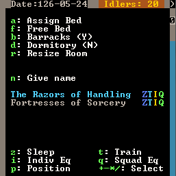
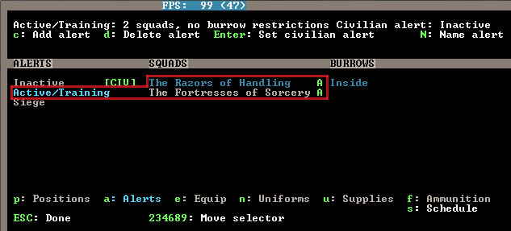
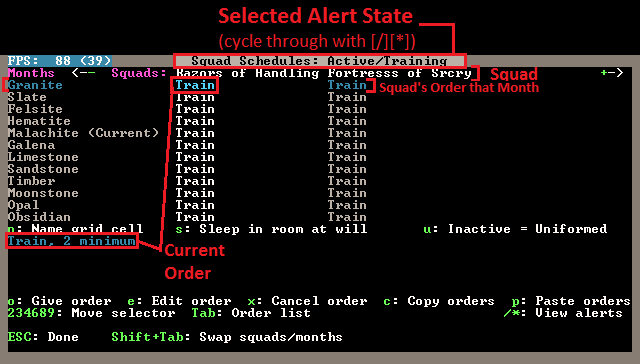
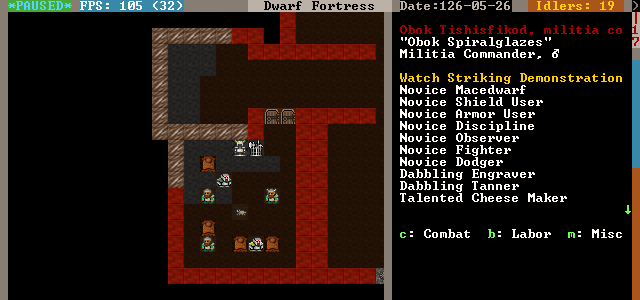

.. _chapter08:

######################
Soldiers and your army
######################

While you're exploring and digging around, how about we
set up a military? You're going to need one, goblins are pesky bastards
and likely to bother you more and more (if they haven't already).
Soldiers can be a bit fiddly to manipulate, but once you get the hang
of it you'll find it second nature.

Drafting some dwarves
=====================
The first thing you will need to do is draft some
dwarves into your military. There are a few different strategies for
this. First up, you can pick complete newbies and let them work up
their skills and strength through sparing. Another strategy is to have
some peasants work on screw pumps to quickly build up their strength
and toughness before drafting them. Others like to use miners (which
train up quickly and are thus easy to replace) as they usually are
quite strong and tough already.

As a further consideration, some don't like to recruit women as
soldiers. When they give birth it's not uncommon to see them running
into battle carrying a baby. This is both somewhat alarming and
somewhat risky as you're going to have potentially dead babies on your
hands due to combat, something that might cause a lot of emo among your
dwarves.

For this tutorial we're not going to worry about detail to much and
we're just going to grab 6 peasants – which is 10% of my current
fortress population. Something similar will work for you for now. So
here's what we'll do:

* Hit :kbd:`m` for the :guilabel:`military` screen.

You'll note this screen is not unlike the :kbd:`u`, :guilabel:`units` screen.
The difference is that there are a few different commands at the bottom of
the panel. Primarily, this screen lets you organise your squads and it
lets you set squad weapons. We're going to aim for two squads of three
dwarves. Smaller squads helps your response time to enemy threat and
gives you a bit more control. Lets get on with it:

* Hit :kbd:`c` to create a squad, and using metal armour.
  (You *did* make the iron armour in chapter 6, right?)
* Scroll left then down with the arrow keys, to one of your no-life peasant
  dwarves, hit :kbd:`Enter`. You will see the peasant is marked and you
  can chose another dwarf. Chose another pleb, hit :kbd:`Enter`.
* Scroll, chose another dwarf, and hit :kbd:`Enter` again.
* Hit space to stop promoting. We've created our first squad.
* Chose another spare peasant, hit :kbd:`Enter` to promote and then choosing
  two more dwarves, create squad two.

You will now note that the dwarves in the same squad are now sharing the
same squad name, :guilabel:`The Razonrs of Handling` and
:guilabel:`Fortresses of Sorcery` for me!

But they're not doing anything yet, they're assigned to
squads but aren't active doing soldierly stuff, so:

* Scroll to the first squad leader, hit :kbd:`a` for activate.
* Scroll to the second squad leaders and :kbd:`a` activate him as well.
* Scroll to the top of your military list, your squads are now up there
  with their names in grey.
* On the first squad leader, hit :kbd:`v` for view squad.
* If the squad is :guilabel:`on duty` hit :kbd:`t`  to stand them down.
* Hit :kbd:`f` for :guilabel:`Food carried` and they'll go get backpacks
  and put a stock of food in them for long duties.
* Leave other settings and repeat for squad two.

Our dwarves are now soldiers and are going to go do soldierly things.
What's that you ask? Well, drink, eat and hang around the barracks
sparing mostly. But shouldn't we give them some weapons and armor?
Maybe, is the answer, lets show you how:

* With the military screen up, hit :kbd:`w` for weapons.
* You now have a field you can move around using the arrow keys and
  cycle using :kbd:`Enter`. Leave the dwarves unarmed.
* Scroll to the first :kbd:`A`, which is for :guilabel:`armor` and hit
  :kbd:`Enter` until the field shows :guilabel:`Lth` for leather.
  Then go to the next column and hit :kbd:`Enter` until you see
  :guilabel:`Shd` for shield.
* If you look further down your weapons list you may note how
  woodcutters are armed with an axe. And note that any you've told to be
  woodcutters who don't have an axe won't cut wood… although they might
  try and arm themselves due to being tasked. Anyway…
* Space back out.

Your soldiers will now go and get a bunch of leather armor and a shield
each. You did remember to make a bunch of armor as instructed earlier,
right? They will then go to the barracks and spar. Why do we want them
to spar unarmed? A few reasons:

#. Sparring unarmed trains the wrestling skill, and
   builds the key stats (like all training) but also trains quickly.
   Hammer weapon skill is the skill used by crossbow dwarves when
   out of bolts. Yes, they bash the enemy to death with their crossbows.
   We can train hammering latter.
#. Wrestling helps when an enemy disarms your dwarves as they have to
   fight unarmed then, and yes, a few enemies can disarm your lads.
#. Finally, picture newby dwarves with no skill training with razor
   sharp steel battleaxes. Yes, picture a few graves. Wrestling gets them
   tough enough to spar with decent weapons without a lot of weapon access
   micromanagement in the stocks screen (ie. forcing them to pick up
   wooden weapons and later on dropping them in favour of proper weapons).

Using the :kbd:`m` military :kbd:`a` alerts system, start training!

Specifically:  we want them training in small groups, in every month.
This is the fastest way to build martial skill, since they don't all stop
if one lazy midget wants a drink.

One thing you might want to think about is providing food and drink and
somewhere to eat close to your military dwarves. That way they will
hopefully spend more time training and less time walking!

...hmm, actually, I have so many bloody dwarves I'm going to put each
squad up to four members each. That means we'll have up to 8 dwarves
sparing at once, good stuff. To add more dwarves, go to the military
screen again, hit enter on the leader and then chose a dwarf to add to
the squad.

Note: It's possible to end up with really convoluted command structures
by accidentally making the boss of one squad the boss of another squad.
This is annoying and pointless, as far as I can tell. To fix it, chose
the problematic squad or person, hit enter on them, and then hit enter
again. Hopefully that will remove them back up the chain of command.
Or, hit enter on the boss and then enter on the dwarves 2 steps down,
that will pull them back up to being directly under the boss's command.

While the boys are sparring go to your leather workshop and make sure
you've got some backpacks, armor and helms on order. You can check your
stocks too, to make sure there's enough kit to go around. In time we'll
get our lads into steel chainmail and plate, but for now, we need to
get them into leather, and yes, armor does stack later.

War Puppies!
============
A nice addition to your military are some war dogs. How do you get war
dogs? Easy! Find a space in your workshop and :kbd:`b` build a :kbd:`k`
kennel. This is a large building, so you may have to free up some space to
place it. Then ensure you have someone with the animal training labour
on (so it gets built and so you will be training animals).

Then, go to the kennels using :kbd:`q` and hit :kbd:`a` for add task
and then :kbd:`w` for :guilabel:`Train War Dog`. Hit :kbd:`r` to set
the task on repeat. Hopefully all
the adult dogs will now go about being trained. You'll soon start
getting messages like :guilabel:`An animal has become a stray war dog`. Good!

How can these help us? Well, we can either assign them to restraints we
build - use :kbd:`b`, :kbd:`v` and choose either a rope or a chain;
once placed use :kbd:`q` to assign an animal to the restraint - or we
can assign them to soldiers. Lets assign one to each soldier:

* Hit :kbd:`m` to bring up your military.
* Hit :kbd:`c` to look at a soldier.
* Hit :kbd:`p` for :guilabel:`Preferences`.
* Hit :kbd:`e` for :guilabel:`Work Dogs`.
* Hit :kbd:`r` to assign a dog to that dwarf. Once you have enough trained,
  assigned one each.

You can also train hunting dogs at a kennels and they are quite handy
for hunters, since they too have the ambush skill that Hunters use. I
don't usually bother with hunter dwarves so wardogs is all I want!

Get tough, little guys!
=======================
So your boys are training, putting each other in arm bars and whatnot.
If you use :kbd:`v` and look around your soldiers, hitting :kbd:`g` for General,
you should see their skills climbing. Use :kbd:`=` to see the
full range.

Let them keep this up until they become champions or heroes. At this
point they will no longer accept work dogs and become impossible to
assign other jobs. The good news though, is that champions will
actually use artifact items! Yay! So, let them train and while that
goes on, keep digging as per the last chapter. Grid up all the digable
space on the various levels and find gems, ore and whatever else is around!

Ok, lets assume your boys have trained up to pretty damn good
wrestlers, getting very tough and agile in the process. What's the next
step? Well, we'd like them to use chainmail, right? We could set them
right into plate, but plate slows them down if they aren't very good
armor users (they won't be yet). Chain will be just fine. Hopefully
you've build a good pile of iron chainmail, helms, shields, grieves
and whatever else you can see on the list. Now it's time to assign.

At the same time you've set a lot of iron warhammers to be built,
right? Good!

But before we assign the weapons we want to make sure our soldiers
don't pick up the wrong armor, right? So this is what we do:

* Go to your stocks menu under :kbd:`z`. You should now see all your stocks
  updated by your bookkeeper, handy!
* Find the :guilabel:`weapons` first. Scroll through and look for any other
  hammers. Chances are :guilabel:`iron hammers` are all you have. For good
  measure, set everything that looks useless (ie, not an axe or a pick)
  to :kbd:`m` for melt. Or put that trash into weapon traps.
* Go to the :guilabel:`armor` list (and subsequent clothing lists) and look for
  chainmail. Any chain item that isn't iron chainmail set to :guilabel:`forbid`
  using :kbd:`f`. Now your boys won't go picking up the rubbish when you
  change their armor setting. Make sure you've got enough suits of
  chainmail armor, shields, helms, etc, to equip your lads. Or near
  enough.
* If you're unhappy with how your armor settings turn out, set everyone
  to no armor and once they've dumped all their items, go back through
  the equiping process again.

Now, you can go to the :kbd:`m` military menu and hit :kbd:`w` for the weapons
and change them from :guilabel:`Lth` to :guilabel:`Chn` and the
weapon to :guilabel:`Ham`. Your
dwarves will rush off, grab a warhammer and throw some chainmail
on top of their leather armor, great! If a few of them get to be
awesome armor users you can change them to plate and they will even put
the plate on top of their chain on top of their leather. A tiny, cute,
drunk, ball of fury!

MAD: Mutually Assured Dwarfiness
================================
How do you use your dwarves then? Well, when they aren't mucking about
your barracks working on their skills they can be out fighting bad
guys! How I do it, when invaded is:

* Hit :kbd:`m`.
* Go to a squad leader, hit :kbd:`v` (*not* :kbd:`a`, that turns them back to
  peasants – but :kbd:`a` again will turn them back to squadies).
* Hit :kbd:`t` to make the squad respond to orders.
* hit :kbd:`z` to zoom to the commander.
* I then go to the level and place I want the squad to go.
* Hit :kbd:`s` to station the soldiers there, or hit :kbd:`p` to place a patrol
  point and then move your cursor around and hit p again to place another
  point (and keep hitting :kbd:`p` to place more).

Your soldiers will now stop what they are doing and rush to the station
point. Sometimes it's a good idea to set it in a safe place first, so
you can at least get a few moving all at the same time. If you just
drop the station point in the middle of the bad guys you risk your lads
charging in one by one.

There's a lot of ways of handling military, and we haven't even covered
crossbow weilding marksdwarves, multiple weapons, archery targets, or
any of that stuff. For now, go and build your military and come back
for `the next and final chapter <chapter09>` where we'll round out your
lesson with some final touches!

