.. _chapter09:

##################
That's All, Folks!
##################

This is the final chapter of the Dwarf Fortress walkthrough.

Marksdwarves for Pest & Goblin Control
======================================

It was about this time that I realized that the grazing animals in
their pastures outside had scattered and the dwarves attempting to
round them up were fleeing in abject terror. The reason was clear:
at the bottom of the screen I saw:

    :guilabel:`Etur Ozarlolor, Farmer cancels Pen/Pasture Stray Water
    Buffalo Calf (Tame): Interrupted by Kea.`

Bringing up the :guilabel:`Units` screen by
pressing :kbd:`u` and scrolling right to :guilabel:`Others`, I
select a :guilabel:`Kea`. Bracing myself, I press :kbd:`v` and lay
my eyes on the beast.

:guilabel:`A small, green, intelligent mountain parrot.`

Terrifying stuff. Let`s locate it on the map. Go back to the
:guilabel:`Units` screen, select a :guilabel:`Kea`, and press
:kbd:`z` to :guilabel:`Go to Unit`.

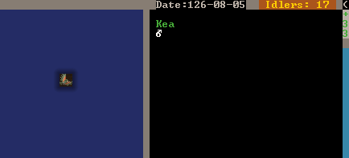

The keas are flying around up in the sky, out of reach of our
military. This seems like a great time to organize a marksdwarf
militia! Marksdwarves are an excellent tool for repelling invasions
of non-undead creatures because they can engage from behind
fortifications without exposing themselves to much danger.

First, let`s build some archery targets.

* Press :kbd:`b`, :kbd:`A` (or find :guilabel:`Archery Target` at
  the bottom).
* Place four or more in a room somewhere. I built mine in the spare
  room next to the melee squad barracks:

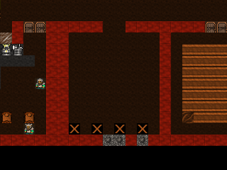

* Hit :kbd:`q` over a target.
* Hit :kbd:`q` for :guilabel:`Make Archery Range`.
* Increase the blue size until it covers each of the targets
  neatly, hit :kbd:`Enter`.
* Look at the top right. You'll see :guilabel:`Shoot: From Left to Right.`
  Use :kbd:`wasd` to chose the proper direction. For me, I want them
  shooting down so I hit :kbd:`s`.
* Repeat this on each target you placed. Unfortunately, a bug
  necessitates this micromanagement.
* Job done! Range is now ready!

Now, we need some warm bodies to fill the ranks.

* Make a squad of six or more slackers. Ten is great.
* Set them to use the :guilabel:`Archer` preset uniform. This
  includes leather armor (if you have any) and a crossbow of any
  material.
* Make a bunch of wood crossbows. Crossbow ranged attacks are
  identical across material type, so wood ones are fine. Wood
  crossbows are made at a :guilabel:`Bowyers Workshop` (:kbd:`b`,
  :kbd:`w`, :kbd:`b`). Material type for ranged weapons only effects
  their damage in melee.
* Unlike shields, bucklers can be used simultaneously with
  crossbows but give a penalty to hit. Build some if you`re feeling
  generous.
* Marksdwarves should only be used from behind
  :guilabel:`Fortifications` or against harmless pests, so armor is
  not necessary. But, if you like, armor certainly helps when an
  :guilabel:`Elite Goblin Crossbowman` starts threading bolts through
  your carefully-constructed :guilabel:`Fortifications`. If you
  decide to use metal armor, be sure to edit the archer squad's
  uniform accordingly with :kbd:`m`, :kbd:`e`, :kbd:`U`.
* Queue up some more backpacks and quivers at the
  :guilabel:`Leather Works`.

Unfortunately, a bug often prevents marksdwarves from switching
between bolts of different materials for combat and training.
Therefore, we have to ensure that we use a single material type of
bolt for training and combat. We have lots of bone lying around
outside in our refuse stockpile, so let`s make bone bolts for now:

* Build one or two :guilabel:`Craftsdwarfs Workshops` next to the
  outdoor refuse pile.
* Queue up :guilabel:`Make bone bolts` and set it on repeat or use
  workflow to make about 400.
* Hit :kbd:`m`, :kbd:`a`, :kbd:`f`, to bring up the
  :guilabel:`Ammunition` menu.
* Select your marksdwarf squad. To ensure that only bone bolts are
  used in combat and training:
* Select the exiting bolts and hit :kbd:`d` to delete them.
* Hit :kbd:`c`, select :guilabel:`bolts`, press :kbd:`Enter`, then
  hit :kbd:`M` and select :guilabel:`bone`.
* Ensure that the resulting :guilabel:`bone bolts` are used in
  training and combat by pressing :kbd:`T` and :kbd:`C`.
* Change the amount to 200 with :kbd:`+`/:kbd:`-`.
  Your ammo screen should look like this:

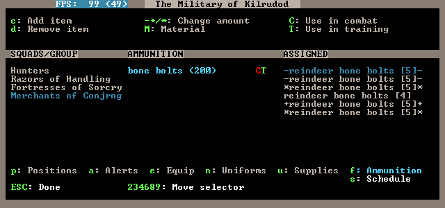

* Make sure that your marksdwarf squad is set to
  :guilabel:`Active/Training` in the :guilabel:`Military` screen
  (:kbd:`m`, :kbd:`a`).
* Set up your Marksdwarves training schedule like you did with your
  melee squads. Hit :kbd:`m`, :kbd:`s` to bring up the
  :guilabel:`Squad Schedules` panel, navigate to :guilabel:`Squad
  Schedules: Active/Training` with :kbd:`/`:kbd:`*`, and set your new
  Marksdwarf squad to train with at 2 or 3 minimum for every month.
* With everything set up correctly, your marksdwarves should grab
  some equipment and start practicing!

Due to a bug, dwarves sometimes cannot drop carried ammo in order
to pick up ammo of a different material type, such as iron. This
can cause them to never practice or even fail to engage the enemy
because they cannot drop their ammo in order to pick up practice or
war ammo. You may be affected by this bug if you eventually decide
to switch from bone bolts to metal bolts, which are much deadlier.
If you have problems, consult the DF Wiki.

Putting the Fortress in Dwarf Fortress
======================================

Congratulations on your new squad of marksdwarves! Besides
:guilabel:`Kea` sniping, marksdwarves are great at defending from
behind :guilabel:`fortifications`. Let's make some!

There are a few important things to keep in mind when building
complex fortress defenses:

* Enemies will take the shortest path from the outside into your
  fortress.
* Some enemies can destroy doors and other furniture, but none can
  destroy closed draw bridges or constructed walls.
* Marksdwarves must stand adjacent to :guilabel:`fortifications` in
  order to shoot through them, so it`s a good idea to make 1-tile
  wide halls adjacent to :guilabel:`fortifications` and use burrows
  to ensure they stand in the right spot.
* You should also account for the unexpected - attackers that
  can fly, jump, climb, etc.

The specific design of your fortifications and traps is limited
only by your creativity. The design below is an example of
maximizing the distance that attackers must cover while being
exposed to marksdwarf fire. As the attackers wind down the descent,
they are exposed to fire from the fortified gallery above. Then,
they must get past the melee squads in the secondary killzone which
is also covered by a fortified gallery. You can make far more
complex (and satisfying) defenses than this - TinyPirate's
automatic minecart shotgun is a noteworthy example!

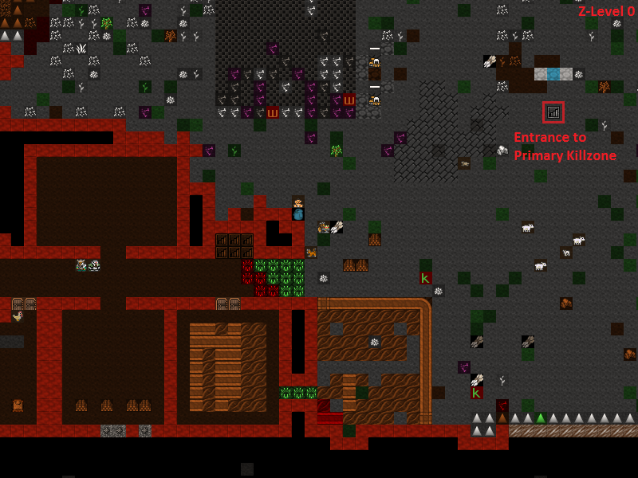
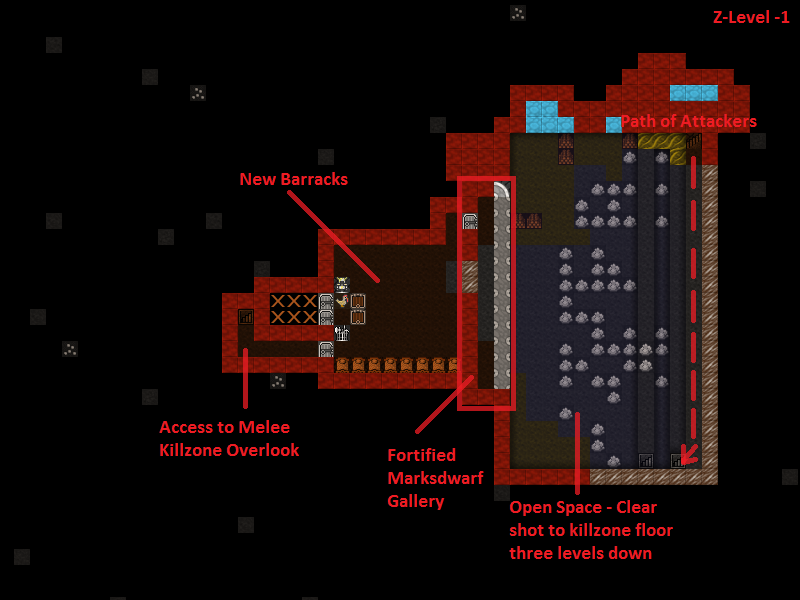
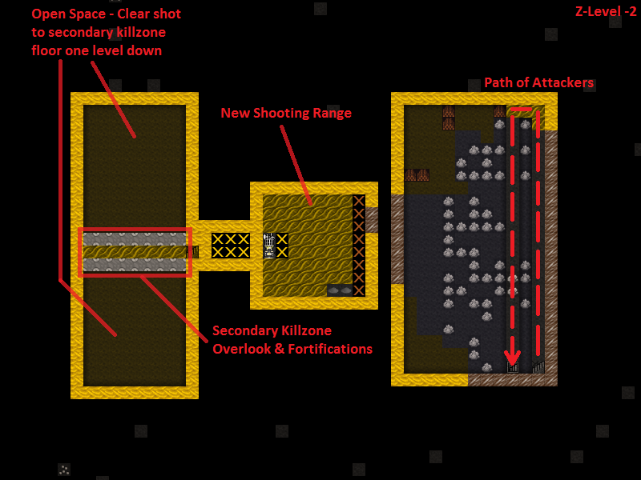
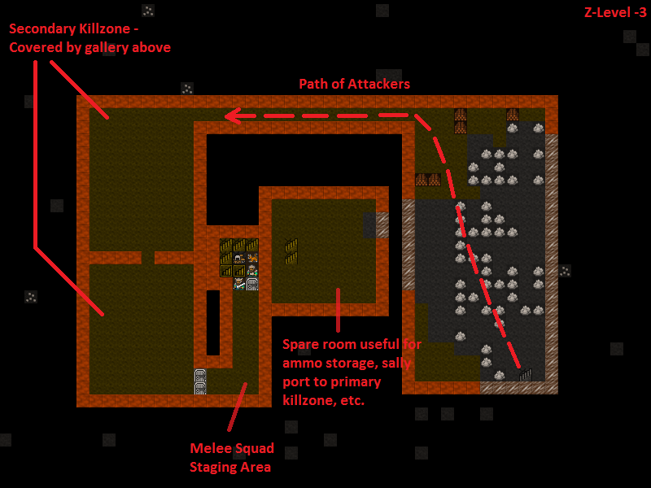

Though formidible, these defenses are incomplete. Can you see the
flaw? Our main stairwell is wide open, protected only by some
traps! Remember that attackers will use the shortest route to get
into your fortress, and right now the shortest route is over those
traps. Let's build a drawbridge that we can raise to block off our
main entrance and force attackers to take the route through the
killzone.

* Hit :kbd:`b`, :kbd:`g` to bring up the :guilabel:`Bridge`
  placement menu.
* Use :kbd:`u`, :kbd:`m` and :kbd:`k`, :kbd:`h` to create a 3x3
  footprint and place it at the entrance to the fortress, adjacent to
  the first line of traps.
* By default, bridges retract when activated. We want ours to raise
  to the left so that when raised, it blocks access to the fortress.
  Hit :kbd:`a` to accomplish this.
* Hit :kbd:`Enter` to place the bridge and use stone blocks to
  build it.
* A Dwarf with the Architecture labor enabled will come to design
  the bridge and a Mason will then construct it.

Now we need to hook the bridge up to some kind of mechanism to
raise it. The most straightforward method is to connect it to a
lever. Levers do not need to be near the machines they operate, so
let`s build ours in a high traffic area near the dining hall.

* Hit :kbd:`b`, :kbd:`T`, :kbd:`l` and place the lever near the
  dining hall.
* Once the lever and bridge are built, hit :kbd:`q`, place the
  cursor on the lever, and hit :kbd:`a`, :kbd:`b` to bring up a list
  of bridges it can be linked to.
* You should have only one bridge. If you have more, select the
  entrance bridge and hit :kbd:`Enter` to :guilabel:`Assign` it to
  the lever.
* Use any old mechanisms. Mechanism quality only effects the time
  delay for traps to fire when sprung, not bridges.
* You`ll see the :guilabel:`Link a Building to Trigger` job on the
  lever's :kbd:`q` screen. A Mechanic will use the two mechanisms you
  selected to hook them up.
* To raise/lower the bridge, hit :kbd:`q`, place the cursor on the
  lever, hit :kbd:`a` to :guilabel:`Add new task`, :kbd:`P`. If the
  situation is critical - eg during a siege - hit :kbd:`n` for
  :guilabel:`Do task now!` and the closest Dwarf will run to pull it.
* Go ahead and test it out. Be careful: any object or creature on
  the bridge when it raises will be flung across the map! Bridges can
  be weaponized in this way.
* Lastly, build a stone wall north of the bridge to seal off the
  diagonal gap. Good job! Now we can funnel attackers into our kill
  zone with a pull of a lever!

The finished bridge in the raised position:

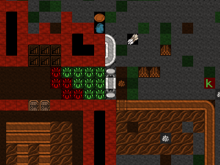

Assigning Battle Stations
=========================

Finally, it's a great idea to set up burrows for each killzone
gallery. Although you can use :kbd:`s`, :kbd:`m` to move squads
around, Marksdwarves have a bad habit of never standing in the
right position to shoot the massive army bearing down on them. A
failsafe method is to use the :guilabel:`Alerts` screen (:kbd:`m`,
:kbd:`a`) in conjunction with burrows.

Remember the :guilabel:`Inside` burrow we set up to keep civilians
inside? The same principle applies here. We will make a tiny burrow
for each killzone gallery, create cooresponding alert states, and
set up orders to defend the specific burrow when the alert state is
active. This will cause the squad subject to the alert to
immediately move to the correct burrow.

* Start by creating a burrow on the main killzone gallery
  encompassing the areas where marksdwarves must stand to shoot -
  directly adjacent to the fortifications. Name this burrow "Prm
  Kllzn Gallery".
* Do the same for the secondary killzone gallery. Name it "Sec
  Kllzn Gallery".
* Make a burrow in the melee staging area as well. Name it "Melee
  Staging".
* Hit :kbd:`m`, :kbd:`a` and create three new alerts with
  descriptive names like "Prim. Kllzn. Gallery", "Sec. Kllzn.
  Gallery", and "Melee Staging Area." Use :kbd:`c` to :guilabel:`Add
  alert` and :kbd:`N` to :guilabel:`Name alert`. Here is how the
  alerts panel should look:

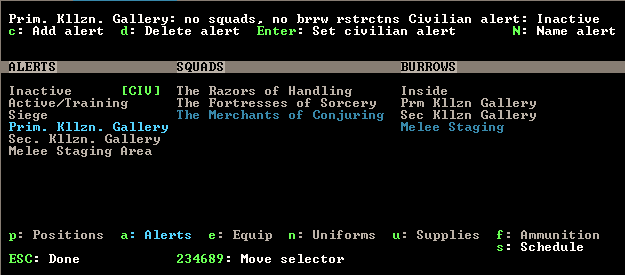

Now we will associate each of these alerts with a cooresponding
burrow so that when a squad is set to, for example, "Prim. Kllzn.
Gallery" alert, it moves to occupy the "Prm Kllzn Gallery" burrow.
The game calls this an :guilabel:`Order` and manages orders with
the :guilabel:`Squad Schedules` interface.

* Hit :kbd:`m`, :kbd:`s` to bring up the :guilabel:`Squad
  Schedules` interface. Make sure our first melee squad column is
  highligted.
* Use :kbd:`/`/:kbd:`*` to cycle to the :guilabel:`Prim. Kllzn.
  Gallery` alert (displayed in the gray bar at the top of the screen).
* Hit :kbd:`o` to :guilabel:`Give order`. Hit :kbd:`o` again until
  the :guilabel:`Defend burrows` order appears.
* Highlight :guilabel:`Prm Kllzn Gallery` and press :kbd:`Enter` to
  :guilabel:`Select` it.
* Use :kbd:`-`/:kbd:`+` to set the minimum number of soldiers to the
  number in the squad as displayed on the right. Each of our melee
  squads should have three soldiers, so get it down to :guilabel:`3
  soldiers minimum`.
* Press :kbd:`Shift`-:kbd:`Enter` to enter the changes.
* Hit :kbd:`c` to copy the order and :kbd:`p` to paste it to each
  month for our first melee squad. We can also paste the order for
  each month under our second melee squad because that squad also has
  three dwarves.
* For the Marksdwarf squad, do the same steps above but instead of
  three soldiers minimum, use however many soldiers are in the
  Marksdwarf squad. I have ten and I want them all to show up when I
  give the order, so I set 10 minimum.
* "Prim. Kllzn. Gallery" alert is set up!
* Now just do the same steps for each separate alert, but use the
  appropriate burrow for each. On the :guilabel:`Squad Schedules`
  panel, press :kbd:`/`, :kbd:`*` to cycle to the next alert over,
  :guilabel:`Sec. Kllzn. Gallery` and set it up so that the
  :guilabel:`Sec Kllzn Gallery` burrow is used. After you`re done
  setting up that alert, do the same for the last alert -
  :guilabel:`Melee Staging Area`.

To order a squad to man a position, hit :kbd:`m`, :kbd:`a`,
highlight an alert, use :kbd:`6` or the arrow keys to higlight the
squad you want to move, and press :kbd:`Enter` so that a green
:guilabel:`A` appears next to the squad. The squad will execute the
:guilabel:`Defend Burrow` order we set above and move to the burrow
with weapons out and armor on. Although somewhat cumbersome, this
will guarantee that your Marksdwarves man an effective fighting
position at the critical time. Go ahead and give it a try.

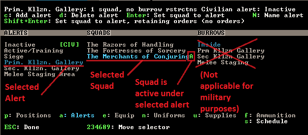

With "Prim. Kllzn. Gallery" highlighted, the green :guilabel:`A`
shows that The Merchants of Conjuring are under this alert and are
moving to the "Prm Kllzn Gallery" burrow.

Further Fortifications
======================

The surface entrance to our underground deathtrap is a choke point
for attackers and will cause them to bunch up as they try to get
in. Let`s build a tower to shower them with death! Here is a design
I came up with that uses the existing stairs that run through the
barracks. As a bonus, it covers the entrance way as well.

The main Marksdwarf gallery is directly above the drawbridge. It
uses the terrain to cover the north and is completely sealed off
from the outside.

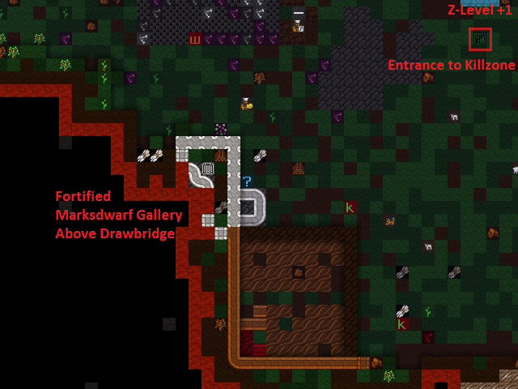

A stone roof seals it from above. Create roofs by building floors
on the level above: :kbd:`b`, :kbd:`C`, :kbd:`f`. Note: walls
create floors on the square directly above them, but fortifications
do not. Remember to build floors above all fortifications or
nasties will drop in from above!

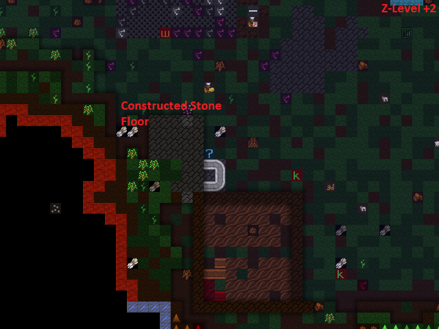

Access is through a staircase...

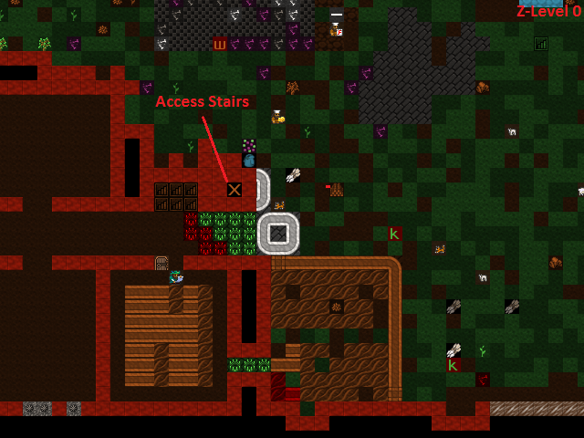

...that leads to the barracks below ground.

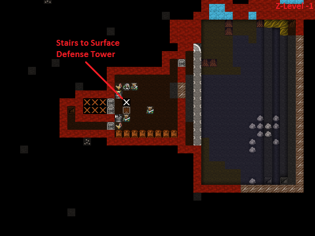

Don`t forget to set up a burrow for this tower just like in the
previous section!

Man Your Battle Stations!
=========================

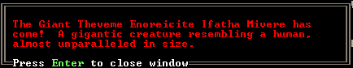

The first test of my defenses came somewhat after this when a
:guilabel:`Giant` appeared on the southwest corner of the map:

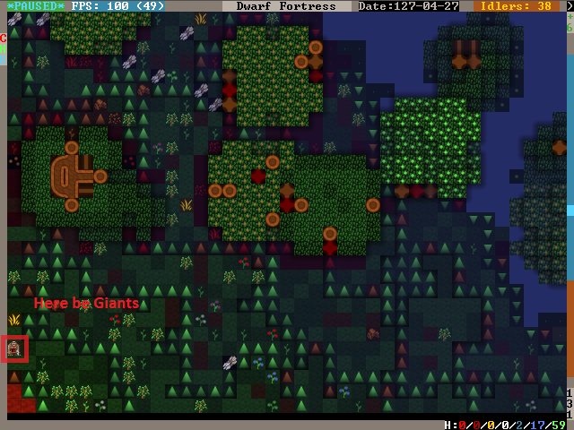

Lets see how tough our defenses are. Our priority is to get
everyone inside, batten down the hatches, and man the outer defenses.

* Set the civilian alert to :guilabel:`Siege` (:kbd:`m`, :kbd:`a`,
  then select siege and press :kbd:`Enter`). This restricts civilians
  to the :guilabel:`Inside` burrow and will cause them to drop
  everything and run inside. Now is also a good time to ensure that
  your :guilabel:`Inside` burrow is in fact inside and out of the
  line of fire!
* Station our Marksdwarf squad in the primary killzone gallery. Hit
  :kbd:`a`, select the :guilabel:`Prim. Kllzn. Gallery`
  :guilabel:`Alert`, move right to the :guilabel:`Squads` column,
  highlight the Marksdwarf squad, and hit :kbd:`Enter.` A green
  :guilabel:`A` next to the Marksdwarf squad means that they will
  move to that burrow.
* Station our Melee squads in the melee staging area. Use the same
  procedure as above, but activate the :guilabel:`Melee Staging Area`
  :guilabel:`Alert` for them.
* Now the tricky part. We need to shut our main drawbridge when
  everyone is inside but before the :guilabel:`Giant` arrives. A good
  method is to pause the game and use :kbd:`.` to advance time
  incrementally. Keep your eye on that Giant! If anyone
  is left outside, they will have to outrun the Giant as
  it comes in through the killzones.
* If you lose track of the Giant, use the
  :guilabel:`Units` screen (:kbd:`u`) to find it in the
  :guilabel:`Others` submenu and hit :kbd:`z` to :guilabel:`Go to
  Unit`. Then press :kbd:`f` to follow it.
* When the time is right, close the drawbridge by hitting :kbd:`q`,
  moving the cursor onto the lever, and hitting :kbd:`a`, :kbd:`P`,
  :kbd:`n`. Bridges shut slowly, so give lots of time!

The gate shuts, our dwarves are in position, and the
:guilabel:`Giant` is making a beeline for the killzones. Perfect.
Just remember to reposition your Marksdwarves if the
:guilabel:`Giant` makes it underground!

I mistime the throw of the lever but the :guilabel:`Giant` is
distracted by the strategic diversionary livestock pastured
outside, giving time for the gate to shut! Those poor sheep, though...

.. image:: images/09-3-invader.gif
   :align: center

The Giant pauses to destroy the Craftsdwarf`s Workshops
outside, then descends into the killzones...

.. image:: images/09-4-invader.gif
   :align: center

and is struck down by the waiting melee squads.

Our defenses worked! It`s always fun to look at the combat log -
hit :kbd:`r`, scroll down to :guilabel:`the Giant Theveme
Enoreicite Ifatha Mivere is fighting!` and hit :kbd:`Enter`.

.. image:: images/09-5-invader.png
   :align: center

Scrolling up past the pages of Dwarves beating on the
:guilabel:`Giant`, I notice that the :guilabel:`Giant` dodged a
bolt when it entered the killzone. Look back at the second GIF
above. Do you see what happened? The :guilabel:`Giant` appeared on
the first level of the killzone walkway and immediately came under
fire. When it dodged, it went over the side and landed on the
second walkway! It was only a 1-z level drop so it did no damage,
but what if we lined the killzone with iron spikes? There`s always
room for improvement in fortress defenses!

.. note::

    Don`t forget to set your squads back to
    :guilabel:`Active/Training` and civilians back to
    :guilabel:`Inactive` on the alerts menu!

Medic!!
=======
If you`ve made it this far without a dwarven casualty, you are
extremely lucky! Injury is a certainty in Dwarf Fortress, but
adequate healthcare will keep your maimed citizens from succumbing
to blood loss or infection. Dwarven healthcare is complex to set
up, but a hospital system will keep even badly mangled dwarves in
the army/workforce and prevent fort-ending tantrum spirals due to
loss of loved ones. Once running, the whole thing is automated and
requires little management.

A hospital requires:

* A source of fresh water - preferrably not muddy to minimize
  infection.
* Cloth - for bandages.
* Thread - for sutchurs.
* Splints - to set broken limbs.
* Crutches - allow injured Dwarves to be useful while recovering.
* Buckets - to wash and give water to patients (patients can drink
  only water in the hospital!)
* Beds - allow patients to be diagnosed, rest, and receive water.
* Tables - for surgical operations.
* Traction benches - immobilize patients when setting bones.
* Soap - to clean wounds and prevent infection.
* Gypsum powder - for casts.
* A chief medical dwarf - to diagnose injuries, assigned in the
  nobles screen (:kbd:`n`).
* Doctors - Dwarves with the various healthcare jobs enabled.

That sounds like a whole lot, but you likely have most of it on
hand. Get started by designating a hospital zone. I evicted
everyone from our original set of bedrooms and hollowed out those
rooms to be my hospital zone.

* Hit :kbd:`i`, place the zone and :kbd:`h` to make it a hospital.
* Build and place beds and traction benches in the hospital zone
  with tables adjacent to them. Adjacent tables make it easier to
  move a patient for surgury.
* You probably will need to build some chains or ropes for the
  traction benches. The traction benches themselves are made at the
  Mechanic's workshop using one chain/rope, one mechanisms, and a
  table.

Here is a setup with tables and traction benches clustered around
the beds:

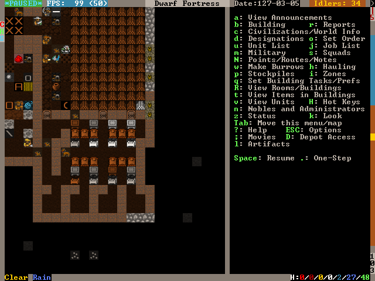

* Hospitals require containers to store supplies. Hit :kbd:`b`,
  :kbd:`h` to build six or so :guilabel:`Containers` within the
  hospital zone. Coffers are best because bags are used in other
  industries.
* Once the containers are placed, Dwarves will start stocking the
  hospital zone with supplies. Let`s take a look at those parameters.
  Hit :kbd:`i`, place the cursor over the hospital zone, and hit
  :kbd:`H` to :guilabel:`Set hospital parameters`.

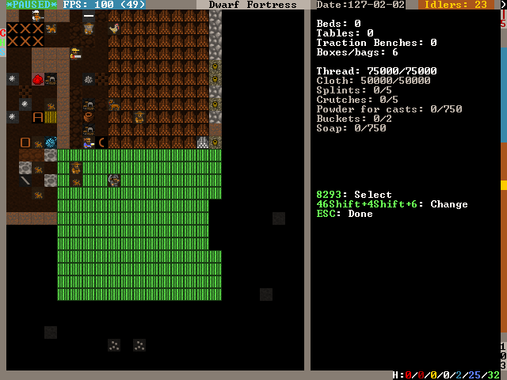

Already, we have enough :guilabel:`Thread` and :guilabel:`Cloth`.
Note that hospital item counts are a thousand times the acutal units,
so you don't really need 75,000 stacks of cloth.
Let`s move on to the other items.

* That bucket count looks low. Select :guilabel:`Buckets: 0/2` with
  :kbd:`2`/:kbd:`8` and use :kbd:`6`/:kbd:`4` to increase it to 10.
* Queue up 10 splints, 10 crutches, and 20 buckets at the
  Carpenter's Workshop.
* Build a :guilabel:`Kiln` with :kbd:`b`, :kbd:`e`, :kbd:`k` and
  queue up 10 :guilabel:`Make plaster powder` jobs. Each job requires
  a bag and a boulder of gypsum or other plaster-making stone, and we
  have gypsum in abundance.
* Build a :guilabel:`Soap Makers Workshop` (:kbd:`b`, :kbd:`w`,
  :kbd:`S`) and an :guilabel:`Ashery` (:kbd:`b`, :kbd:`w`, :kbd:`y`).
* Soap's recipe is: Lye + Tallow/Oil = Soap. Lye is made from ash
  at a Wood Furnace. Queue up 10 units of ash at the Wood Furnace and
  10 units of Lye at the Ashery. Finally queue up 10 units of soap
  (:guilabel:`Make soap from tallow`) at the Soap Maker's Workshop.
  If you have no tallow, butcher an animal and a Dwarf will
  automatically render the fat into tallow at a Butcher's Shop.

Great work! While your dwarves execute all the orders you've put
in, let's secure a source of fresh water. Easy access to fresh
water is essential because injured dwarves cannot drink booze.
Moreover, water must be brought to them as they lay injured in bed.
Therefore, it`s critical to have a year-round source of fresh water
close to our hospital. Otherwise, injured dwarves will die from
dehydration in their hospital beds.

Let`s take stock of the fresh water sources we have available.

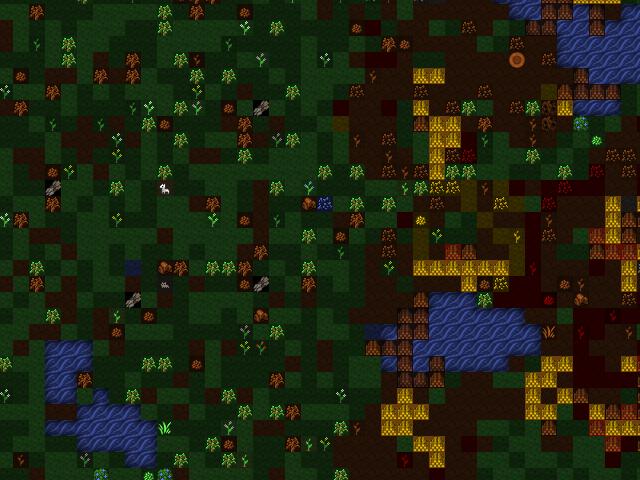

To the east we have a number of small ponds. When we look at the
water in them with :kbd:`k`, we see :guilabel:`Murky Pool` filled
with :guilabel:`Stagnant Water [7/7]`. Murky pools are no good to
us because :guilabel:`Stagnant Water` increases the risk of
infection when used to wash wounds and also creates an unhappy
thought in any Dwarf that drinks it. Moreover, these pools are
frozen for half the year! That pretty much rules these out unless
we have no other choice.

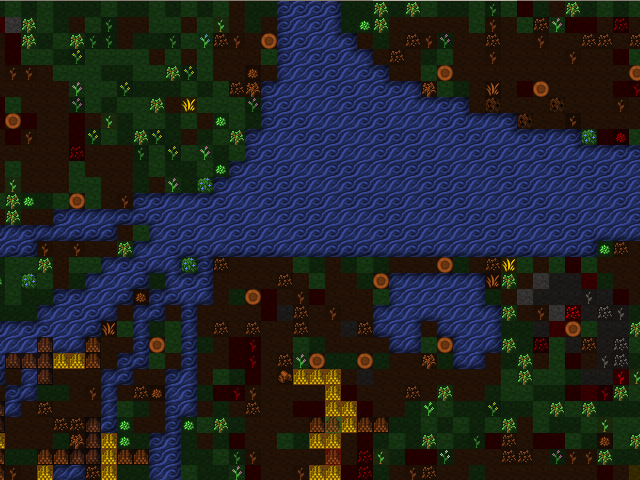

Fortunately, we have a small river in the northeastern portion of
the map. Using :kbd:`k` to look at its water, we see that it`s
fresh, wholesome, :guilabel:`Water [7/7]`. This is what we`ve been
looking for. The only problem is that like the :guilabel:`Murky
Pools`, the river is frozen much of the year and it`s very far from
the hospital. However, if we divert the water into an underground
cistern, it will not freeze and we can accumulate enough to last us
through the cold months. Let`s do some hydrological engineering!

First, let's dig out our cistern. It`s best to locate it near the
hospital and it needs to be at least two z-levels deep to avoid mud
contamination. If water is taken from a 1 z-level source and the
floor has a :guilabel:`Pile of mud` on it, the water will cause
infections. The easiest way to avoid this is to make the cistern
two or more layers deep. Here is where I placed mine:

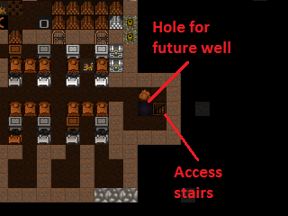

It goes down an additional 3 z-levels directly below the well room:

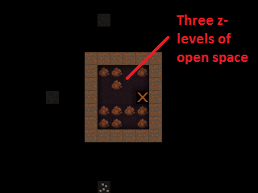

Now we have to bring the water to the cistern. Easy, right? Just
dig a really long trench from the river and connect it up.
Actually, that`s a recipe for a flooded fortress! Water pressure
will act to force the river water - flowing from above our cistern
- up over the top of it and into the rest of the fortress. So, we
need to use floodgates controlled by levers to manage the water
flow. The only wrong way to accomplish this is the one that floods
the fortress, but below is an example scheme that prioritizes flood
safety.

* Queue up 20 floodgates from the Masons.
* Stick a door on the well room. If the worst happens, you can
  always lock that door to stop the water until you figure out what
  to do. Also, keep pets out of it by pressing :kbd:`o` with the door
  selected - pets have a bad habit of drowning in cisterns and
  spillways.
* Dig a spillway tunnel from the top of the cistern to the edge of
  the map, then :guilabel:`Smooth` (:kbd:`d`, :kbd:`s`) and
  :guilabel:`Carve fortifications` (:kbd:`d`, :kbd:`F`) on the stone
  at the edge of the map. That will allow water to flow off the edge
  of the map in the event of overflow, relieving pressure in the
  cistern.

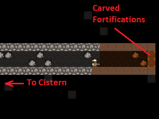

* Build :guilabel:`Floodgates` (:kbd:`b`, :kbd:`x`) between the
  cistern and the spillway. Make sure to leave one tile free adjacent
  to the floodgates to allow access for when we hook them up to the
  control lever.
* Build a :guilabel:`Lever` (:kbd:`b`, :kbd:`T`, :kbd:`l`). Place
  it in a location where you'll remember what it does and where it
  will be accessible in the event of a flood. You can use a
  :guilabel:`Note` (:kbd:`N`) to mark it, too.
* Connect the :guilabel:`Lever` to the :guilabel:`Floodgates`. Hit
  :kbd:`q`, place the cursor on the :guilabel:`Lever`, :kbd:`f`, and
  select one of the floodgates you placed, using any old mechanisms.
  Then hit :kbd:`q`, :kbd:`f` again and select the other floodgate to
  hook it up, too.
* When the Mechanic finishes these jobs, test out the
  :guilabel:`Lever` by queueing a :guilabel:`Pull the Lever` job
  (:kbd:`a`, :kbd:`P`). If both floodgates open, it`s all set up!
  Close them again when you're satisfied.

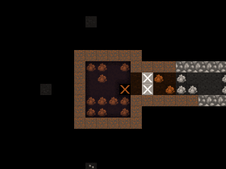

Next, let's dig the water channel from the river.
Start at the river and :guilabel:`Channel` (:kbd:`d`, :kbd:`h`) a
3x1 section as pictured. Make sure to leave at least one tile
intact between the river and the channel! Otherwise, the channel
will flood prematurely. When we are ready to tap the river, we will
:guilabel:`Channel` out this canal to let the water flow.

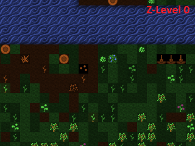

* We need to make a ramp all the way down to the top of our cistern
  at z-level -6. Remembering that each :guilabel:`Channel` job will
  create a ramp on the tile below it, we move one tile south and one
  z-level down for each subsequent :guilabel:`Channel` designation.

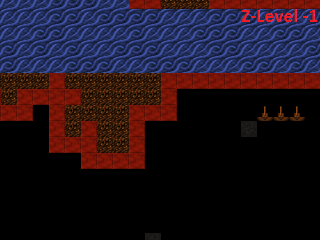
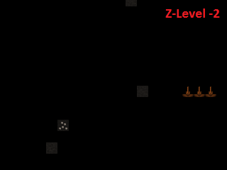
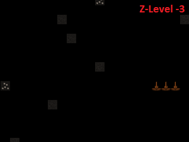
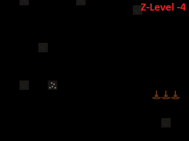
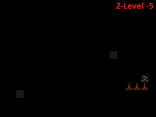

* At z-level -6, :guilabel:`Dig` a 3x1 tunnel south to the spillway
  tunnel...

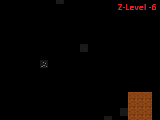

* then dig west until the cistern.

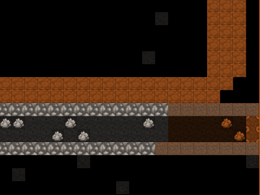

* Dig out two wall tiles at the cistern.

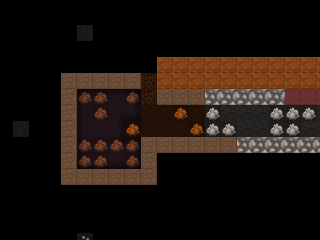

* Build :guilabel:`Vertical Bars` (:kbd:`b`, :kbd:`B`) across the
  water supply tunnel to keep the surface riffraff out. Although bars
  can be destroyed by a building destroyer (like that
  :guilabel:`Giant` from earlier), we will make sure that the bars
  stay submerged and inaccessible to all but acquatic building
  destroyers.
* After the :guilabel:`Vertical Bars` are built, place three
  :guilabel:`Floodgates` across the tunnel to the south of the
  :guilabel:`Vertical Bars`.

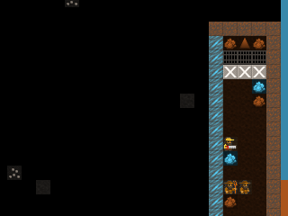

* :guilabel:`Dig` a 3x1 relief valve to connect the water supply
  tunnel to the spillway tunnel. Then install :guilabel:`Floodgates`
  across it. Safety first!

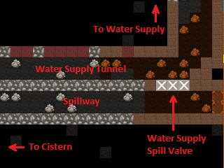

* Install the last :guilabel:`Floodgates` between the water supply
  tunnel and the cistern. If dwarves get stuck behind them, move on
  quickly to the next step where we install levers to open the gates.

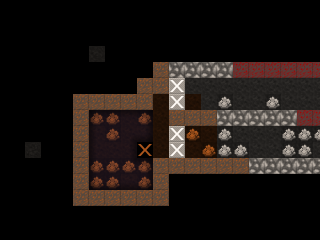

Build three :guilabel:`Levers` (:kbd:`b`, :kbd:`T`, :kbd:`l`) to
control the three sets of floodgates. It`s important to keep track
of which lever controls which floodgate, so I like to build a mini
facsimile of the tunnel network and place the levers where the
floodgates are located. It`s also a great idea to put a
:guilabel:`Note` on each lever (:kbd:`N`, :kbd:`p`) and name it
with :kbd:`n` so you don`t forget. Here is the scheme that I came
up with:

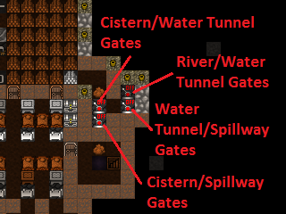

* Hook up each :guilabel:`lever` to the cooresponding set of
  :guilabel:`floodgates`. Select the correct :guilabel:`floodgate`
  with :kbd:`+`/:kbd:`-` and use any old mechanisms.
* Test out the levers after they are hooked up to ensure that each
  one operates the appropriate set of floodgates.
* Stick a door on the entrance to your lever room in order to
  further floodproof it.

Floodgates can become stuck open if debris like boulders block
their tile when open, and moving water tends to push boulders under
open floodgates. This floods the fortress. Therefore, we must
remove all boulders from our waterworks.

* Hit :kbd:`i`, designate a 1x1 zone somewhere outside the
  waterworks, and hit :kbd:`d` to make it a :guilabel:`Garbage Dump`.
* Hit :kbd:`d`, :kbd:`b`, :kbd:`d` to enable :guilabel:`Dump Items`
  designation. Designate all stone in the water supply tunnel and
  spillway tunnel to be dumped. Our workforce should be large enough
  by this point to get the job done relatively quickly.

It`s time to remove the dike between the river and the water
channel, but it`s a good idea to take some precautions when doing
so because dwarves tend to path through fast-moving water and get
swept away. We`d like to keep our Legendary +5 Miners alive despite
their idiocy.

* Ensure all floodgates are closed.
* Hit :kbd`d`, :kbd`o`, :kbd`r` and designate a
  :guilabel:`Restricted Traffic Area` encompassing the dike and the
  ditch. This will make dwarves prefer any route other than over the
  designated area and hopefully clue them in that walking over it
  means certain death.

.. image:: images/09-22-hospital.gif
   :align: center

* :guilabel:`Channel` out (:kbd:`d`, :kbd:`h`) the middle tile of
  the dike at the river. Then, :guilabel:`Channel` out the outer two
  tiles.
* If anyone drowns, build them a :guilabel:`rock Slab` at a mason's
  workshop and have a Craftsdwarf :guilabel:`Engrave Memorial Slab`.
  Then place it next to the river so the idiot`s family will know why
  he died. Disregard any dead bodies in the water supply.

We now have :guilabel:`Water [7/7]` from the river held back by the
water supply tunnel floodgates at the bottom of the ramp we dug.
That means that everything above that point is completely submerged
by water. Therefore, if we opened both the water supply tunnel
floodgates and the cistern floodgates at this point, the water
pressure would push water all the way back up to z-level -1 - the
level of the river. Consequently, we must ensure that at no point
is the cistern opened directly to the river.

* Ensure all floodgates are closed.
* Open the water supply tunnel floodgates at the base of the ramp
  and allow the water to fill the entire water supply tunnel.
* When the water has reached :guilabel:`[7/7]` for most of the
  water supply tunnel, close the water supply tunnel floodgates.
* Confirm that the water supply tunnel floodgates at the base of
  the ramp are closed, then open the cistern floodgates.
* Allow the cistern to fill. Due to our design, the cistern will
  not flood so long as the floodgates leading to the river remain
  closed. There`s nothing to do but wait!
* While the cistern is filling up, hit :kbd:`b`, :kbd:`l` to build
  a :guilabel:`Well` on the open space above the cistern. Use the
  highest-quality materials available because dwarves get happy
  thoughts when they use a well-put-together well.
* When the well is complete, hit :kbd:`i`, designate a 3x3 zone in
  the well room, and hit :kbd:`w` to make it a water source.
* If you feel like enhancing the nanny state of your fortess, you
  can put some :guilabel:`Horizontal Bars` over the river water
  intake ramps at z-level 0 and a :guilabel:`Hatch` over the well
  access stairs. Forbidding the :guilabel:`Hatch` will at least keep
  the dwarves from drowning themselves at that location.

The cistern is filling nicely.

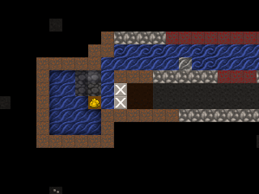

* Check the water level the top level of the cistern (one z-level
  below the well room) using :kbd:`k`. When it is at
  :guilabel:`[7/7]` or :guilabel:`[6/7]`, close the cistern
  floodgates. If it stabilizes before reaching at least
  :guilabel:`[6/7]`, close the cistern gates, refill the water supply
  tunnel, seal it from the river, and reopen the cistern gates.
* At this point we could leave the cistern floodgates open
  indefinately. So long as the water supply floodgates are closed to
  the river, the cistern will not overflow.

In the (extremely likely) event that something goes wrong and the
fortress begins flooding, take immediate action to:

* :guilabel:`Forbid` and :guilabel:`Keep Tightly Closed` (:kbd:`q`,
  :kbd:`l`, :kbd:`o`) the door to your lever room and all doors
  leading to the flooding area. Doors are watertight so long as they
  stay shut.
* Open all floodgates to your spillway. Use :kbd:`a`, :kbd:`P`,
  :kbd:`n` on the :guilabel:`Levers` for maximum haste.
* Close all other floodgates.
* If things are particularly dire, extend your central staircase
  downward until you hit the caverns. The water will tend to flow
  down your staircase and into the caverns where there is usually
  enough room for it to dissipate. That may buy you enough time to
  dig a permanent spillway or seal off the flooded parts of the
  fortress, but it also opens yourself to visits from uninvited guests.

Our last task is to staff our new hospital. We need to appoint a
:guilabel:`chief medical dwarf` so that patients get timely care.

* Hit :kbd:`n` to bring up the :guilabel:`Nobles` panel. Scroll
  down to :guilabel:`chief medical dwarf` and hit :kbd:`Enter`.
* The first dwarf listed is the best diagnostician available, so
  highlight him/her and hit :kbd:`Enter`.

With that, we have a functional hospital! Dwarves can recover from
very severe injuries with a good healthcare system in place, so
don`t be afraid to send your melee units into combat. Now, broken
bones will build character, not body count!

The End!
========
And welcome to the end of the tutorial! By now you should be able
to play the game on your own.  You can also check out the tutorials
in the `index <index>`, for short chapters that cover a particular topic.

You might consider a mega project like an enormous tower, a
castle, or a fortress entirely surrounded by magma. There are many
options, and just surviving the increasingly severe raids from
goblins and other critters can be a challenge.

You're also ready to upgrade to the :DFFD:`Starter Pack <7622>`,
and explore the wider world of DF addons.  From alternative graphics
to advanced tools or a real 3D visualiser... the world is your oyster!

