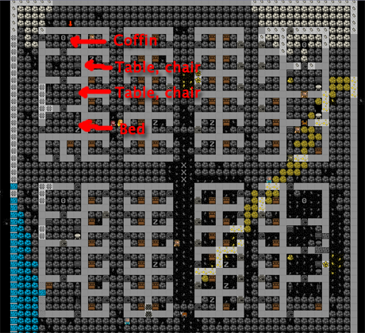
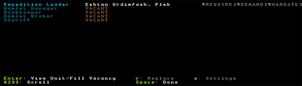
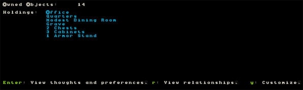
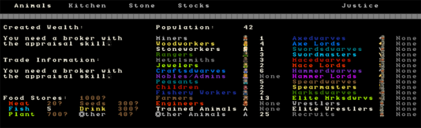

#############################
Nobles and other useless sods
#############################

You’ve come a long way, padawan, but don’t worry, I won’t let any
stupid angsty teenager come and strike you down because he’s in a tizzy
having lost his mum! No, nothing of the sort! Baby Dwarf Fortress
managers like yourself will prosper and grow strong like a seedling,
going on to bear nice dwarven fruit. And not the Class-C sort of fruit
that gets picked and sold on the streets, no, nice, rare, delicious
fruit! Anyway, where was I? Oh, yes, tutorial 9, Nobles and other
layabouts. Get on with it!

Interior decorating
===================
Decorating your massive housing project should be complete now. Here’s
how mine looks. Every room has a bed and a door and the noble rooms
(they will need four rooms each, as a rule) are kitted out with
assorted stuff to keep any nobles who visit happy. Lets cover off the
details.

Nobles (from the “n” menu) generally want a bedroom (assigned from a
bed), a dining room (assigned from a table), an office (assigned from a
chair) and often a tomb as well (assigned from a coffin). For
simplicty’s sake, set up each room in its own contained area and then
throw in some decorations to keep the noble happy, like armor stands,
weapon stands, containers, statues, cabinets, cages (with their
favourite animal in them), that sort of thing. Usually nobles want at
least two of most of those items so produce a ton and get placing!

What is all this about nobles I hear you ask? Well, once your fortress
gets to a certain size, those purple slacker dwarfs will come to live
in your fortress. They usually don’t do much (other than haul stuff)
but they do make demands. Their biggest demand is for rooms, which need
to be of a certain quality. Quality can be increased through smoothing
and engraving the walls of the room as well as adding more furniture,
especially high quality furniture.

The other thing nobles do is make mandates.  Mandates are demands by
the noble for things to be done, like the production of certain goods,
or a ban on the export of certain goods. It pays to try and meet the
demands of your nobles or they may go crazy and cause all kinds of
problems.

Lets have a look at nobles. Go ahead and hit “n”. This is your noble
list, right now it should be very short, but in time it will grow.
Chances are it looks like this (click for big):

With a newby fortress only one dwarf is set as expedition leader. As
the fortress grows more noble ranks will appear in this list and more
positions will be filled. Lets look at the current expedition leader.
Hit “enter” and you’ll see info about the current leader. Our dwarf
owns 14 objects (mostly clothes and stuff), has “meagre quarters”. Lets
assign Eshtan Urdimfash a full set of noble rooms, just for kicks. He’s
not demanding any, but we’ll do it for practice. If he were demanding
more rooms you would see them in red on the left. If he had a room, but
not a good enough room, it would show what he’s currently got and what
he’s actually demanding.

Once you’ve assigned the bedroom, office, dining room and tomb, if you
go back to the noble list and view our chap you will now see his
holdings have changed (clicky biggy):

Next job for you is to assign a book keeper. Usually, if you embark
with at least one dwarf with the “appraiser” skill (good idea, by the
way), this job would already be filled. But for now it’s vacant. This
skill is what makes our stock count accurate (more on that later).
Fortunately for us we can chose a dwarf to do the job. They might not
be doing a good job at first (having no skill), but they will learn,
and they provide a useful function, accurate stocktaking!

So, in the nobles screen use the arrow keys to scroll down to
“Bookkeeper” and hit “enter”. Find Eshtan and hit enter, assigning him
to this job. The bookkeeper requires an office to work, just as well we
just assigned him one, right?

Next, with Bookkeeper still highlighted hit “s” for “settings” (the
only noble role you can assign settings for). The screen you’ll see now
dictates how much time your dwarf will spend counting. Use the arrow to
scroll to “Highest” and hit enter. Eshtan will now work very hard to
get all our stock counts accurate!

There you go, a quick overview of nobles. As you play the game more you
will have to deal with nobles a lot, but don’t worry, the Dwarf
Fortress Wiki should provide you with heaps of tips and advice should
you get confused.

Accounting is fun! Really!
==========================
We’ve mentioned stocks, but not discussed the stock screen yet, so lets
get to it now. Hit “z” and you’ll see this screen:

Lets go over what you’re seeing here:

* Across the top are sub menu options. You can scroll through them
  using the arrow keys (left and right) and then hit enter to learn more.
* There’s a description of your wealth on the left. We don’t know yet
  as we need a noble with skillz.
* There are food store stats, but those question marks indicate we
  really aren’t that sure how much food or drink we’ve got. The
  bookkeeper should turn these figures accurate fairly soon.
* Then we have population information. Not too interesting I find.

With “Animals” selected, hit enter. You can see all the animals in the
fortress on the following screen. This is also the screen you can set
animals to be butchered on mass. If you set a few to be butchered a
dwarf with “small animal dissection” and “butchery” skills enabled will
run off and start grabbing those animals and chopping them up in the
Butchery. You won’t need to set anything at that workshop, the butcher
tasks gets added automatically.

Butchering animals is a great way to get a lot of food, bones and skin
(for tanning into leather) but be careful! If you assign a big list of
animals to be slaughtered by the time the butcher gets to the last one
the animals may have become someone’s pet. This results in the butcher
walking up to the animal, as it follows its master around, dragging it
off and turning it into steak. This is somewhat disturbing to the dwarf
whose pet you’ve just killed! So, don’t tag too many animals at once.
Also, make sure you leave at least one breeding pair (male and female
symbols to the right of the pet’s name), or you won’t get any more baby
animals popping out, will you?

Now go back to the stocks menu and hit “Kitchen”. This is where you see
a list of what your dwarfs will consider using to cook meals in the
kitchen when ordered (dwarfs like cooked meals). Remembering that
cooking destroys plant seeds, here are some guidelines for you:

* Cooking meat (ie, “cook” is blue) is fine.
* Don’t cook spawn or seeds (“cook” is red”) unless you have way, way
  too many.
* All plants can be brewed as brewing returns seeds.
* Turn off cook for “Plump Helmet”, you don’t want to cook them out of
  stock, right?
* Cooking booze is great as you end up magically creating more food
  than you started with. Trust me on this (or look it up on the wiki).

Good work! Now back out of that menu and chose stone. In the stone menu
you see (in red) all the stones your dwarfs are forbidden to build
with/use and in green, all the ones they are allowed to use. Scroll
through with the arrows and hit enter over every stone that does not
have a use description appear on the right. The only exception may be
bauxite due to its special magma-proof qualities.

The reason you are doing this is so that the dwarfs have much more
choice in the stone they will use to make doors, walls, etc etc. This
stops them running half way across the map to get some boring stone
when a perfectly useful stone (that just happens to be yellow) is
sitting next to them, but ignored.

Backing out to “z” the final menu is “stocks”. This is a master list of
all items in your fortress and is a good way to see exactly how much of
certain items you’ve got . Until your bookkeeper gets working you won’t
get any detail, but trust me, you’ll see heaps, in time.

You can use this menu to manage the items in your fortress more easily.
For example, you might find, after a goblin raid, that you’ve got a ton
of their crappy weapons lying around, what to do with them? Well, you
could add them to weapons traps, or you could find them in the stocks
menu and hit “m” for “melt” when they are selected and then any smelter
with the “melt metal object” task on will have a dwarf grab the item
and then melt it back to a metal bar.

You can also use this menu to “forbid” items. If you have a bunch of
low-quality junk you don’t want your dwarfs to use, hit “f” for
“Forbid” with the item highlighted and you’ll find they will ignore it.
This is handy when setting weapons and armor up for your military as
you can prevent them from picking up wooden swords and thus push them
to pick up your non-forbidden steel swords!

The last menu “Justice” doesn’t come in to play until we have more
nobles who will start wanting to throw dwarfs into jail if they ignore
their mandates. Worry about that latter!

Homework time!
==============
You’ve got a tricky job to do now, ok, not so tricky really. I want you
to dig exploratory tunnels in EVERY DIRECTION from your living room and
the below levels. Try and cover much of the map with your grid of
tunnels. We’re looking for three things: 1. Ore, 2. Gems, 3. Magma. You
may want to assign another dwarf or two to mining duty, and to make a
few more picks as well (at the metalsmith’s forge, under “weapons”).
We’ll see what this map is like when we return in Tutorial 10!

