##################
That’s all folks?!
##################

The final chapter of the Dwarf Fortress walkthrough! We’ll cover some
broader fortress design questions, stuff that I’ve previously forgotten
to mention and thoughts about fortifications. Lets get to it!

Engineering your ultimate fortress
==================================
If you’ve lasted this far you’ve had an excellent grounding in Dwarf
Fortress.  What’s more, you understand the concepts well enough that a
bit of digging around :wiki:`on the wiki <Main_Page>` will answer most
of your questions. If the wiki fails, there’s always the Q&A forum over
on Bay12 Games.

But something that seems to stump a lot of people are the big
engineering jobs such as digging pits, sorting defences, and building
above ground. So lets get on with it and do some of that ourselves!
We’ll do so in the name of choosing a new, more secure, more roomy
entrance for our fortress.

Lets see, I think about a screen north and a screen east of our main
entrance is a nice, open, flat area, and one we could easily defend if
we were to dig some passage down. If you think about it, wouldn’t it be
cool to have the trade depot close to our big storage stockpile? Then
our dwarfs wouldn’t spend too long hauling crafts and with the trade
depot deep inside the fortress we could more easily defend it.  So lets
get on with it!

* Find a spot.
* Clear it of trees. About a screen full of clearing will be required.
* Go down a level and used “d”, “r” for “ramp” to set a 10-wide row to
  be turned into ramps. Now is a good time to remind you that shift+arrow
  keys makes the X move in blocks of 10.
* Here’s how mine is laid out, I’ve dropped the top width of ramps
  first so that I can check I’m happy with how it will be laid out.

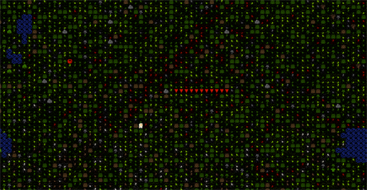

* Now I’ll continue setting a ton of ramps at the below ground level.
  My selection there is 10 x 20:

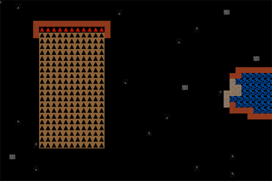

* Now, make your I-shaped diggings into an L-shape by digging some amps
  off to the left. Here’s mine done with another 10×10 ramp selection dug
  to the side of the first diggings as well as another 10 x 10 space dug.
  More on that later:

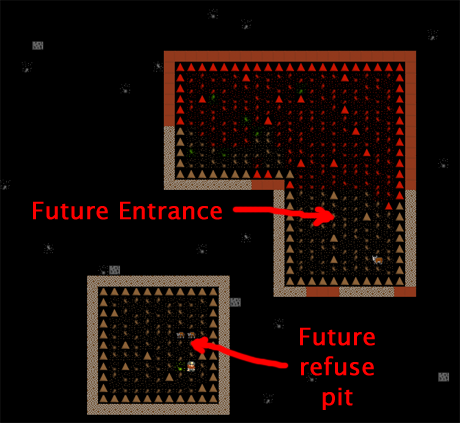

With the first level dug out we now want to go down another level, that
would put us on the same level as the storage level, which would be a
handy place to have an entrance huh? And we could move the barracks
here as well, nice and close to the action, right? But before we do
that, we need to remove the spare ramps. Those are the ramps which we
don’t actually want to be part of the entrance slope.

* Hit “d” and “z” for “remove ramps”.
* Select all but the bottom line of ramps in the entrance L. Select all
  the ramps on the pit. You can’t see it, but all the designated ramps
  will be set brown – as in – job to be done! We need to remove all those
  ramps because if we dig under them we’ll have rocks falling on the
  miner’s heads! Here’s the end result:

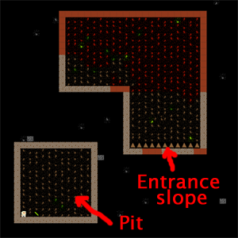

You may have noticed we’ve got a dwarf stuck in our pit! Why? Because
there’s no ramp or steps to get out! But now we can keep digging. So go
down a level and again dig out the 10×10 below with ramps. For the
L-shaped diggings, dig out athe level below, but be careful not to dig
out the ramps we’ve left – otherwise you’re likely to get a cave in on
our dwarfs and you’re also going to remove the entrance path we’re
trying to create.

* Once you’ve gone down another level remove all the ramps in the L
  room except for, again, one line at the bottom. That way you’ve got a
  ramp going down to the first below ground level, and then another ramp
  going down to the storage floor level. That is, the two sets of ramps
  take you from the ground level down two levels underground.
* In the Pit, remove all the ramps and go down again, you’re aiming to
  be at the workshop level. Again, remove ramps at that level and connect
  up with the main workshop floor.
* Have a look at how my setup looks from the top down through to the
  bottom. Note, the Z minus 1 level has a room dug out in the un-ramped
  corner. This room will overlook the entrance.

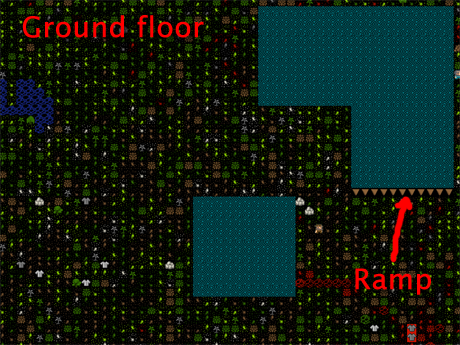

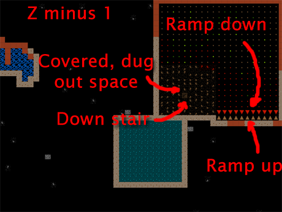

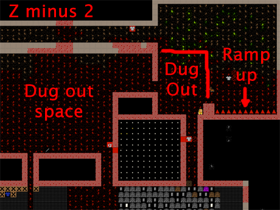

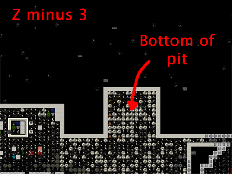

That should give you a pretty good idea of the sort of digging we’ve
done. As you can see, the pit goes down deeper than the entrance right
into the heart of the fortress. We want this because this open air
space means we can set a refuse pile down there and not generate
miasma! Cool huh? Now our dwarfs only have to walk across the hall to
drop rubbish in a secure place, rather than walking all the way up to
the surface to drop rubbish outside, where it’s dangerous. You might
also want to make some statues at a masons to place them in the middle
of the pit and to turn that area into an statue garden (“q” over a
placed statue). Dwarfs like to hang around statue gardens and since the
bottom of that pit counts as outside it will help prevent cave adaption.

You may be wondering about all the dug-out space. I set the crook of
our L to be dug out as rooms for our soldiers to overlook the entrance.
First the bottom room, (before digging steps up) and then the room
above at the Z minus 1 level. I would have left the room walls up but
then I remembered that those silty, clay walls can’t be carved into
fortifications, so I had to dig out all the dirt. I plan to replace the
dirt with constructed walls, which I will cave to be fortified. I’ll
show you a couple of pictures when I’m done and you can try something
similar.

Marksdwarfs go PEW PEW!
=======================
I’d feel bad if I didn’t spend more time on marksdwarfs as they are a
very handy part of one’s army. So lets go over them a bit. First up,
lets build some archery targets. I’ve got a corner of the storage room
chosen. Do the same:

* Hit “b”, “A” (or find “Archery Target” at the bottom).
* Place four-or-so targets roughly near to each other. Here are mine
  almost all built:

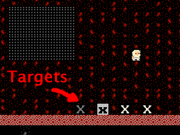

* Hit “q” over the middle one when they’re built.
* Hit “r” for “Make Archery Range”.
* Increase the blue size until it covers each of the targets neatly,
  hit “enter”
* Look at the top right. You’ll see “Shoot from Left to Right”. Use
  WASD to chose the proper direction. For me, I want them shooting down
  (from where the dwarf is in my picture) so I hit “s”.
* Job done! Range is now ready!

Now we need some soldier types!

* Go and make a new squad of half-a-dozen slackers.
* Set them to be equipped in leather armor only.
* Now, go and make a bunch of useful items! Like crossbows, perhaps
  steel ones.
* Make some steel bucklers as well (that’s a small shield that can be
  strapped to ones arm and doesn’t slow one down as much as a shield does).
* Go to your leatherworks and queue up some more backpacks and add some
  quivers as well.
* Make some more assorted steel armor bits.
* Let your archer dwarfs skill up a bit as wrestlers. Strong and tough
  dwarfs are always good.
* Once you’re happy, change them all to carrying crossbows and bucklers
  and chainmail armor. They will go equip themselves and start to
  practice at the range:

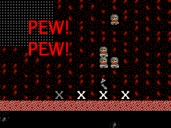

* You will need to keep them supplied with bolts. You can make wooden
  ones at a craftsdwarf’s workshop (and these are used for practice) and
  bone ones there as well (for fighting with).
* You can also forge metal bolts, which are better, but at 25-or-so
  bolts per steel bar, it gets a bit costly. At least they will only be
  used in a fight when it really counts.

Now you have marksdwarfs! Over time they will be awesome shots, and
fire quickly. They will be useful in firing through our fortifications
that overlook the entrance L. If you look at the picture below you can
see how I’ve put in double-thickness walls that have been carved with
fortifications in areas I want me dwarfs to be safe in. I first put in
one wall, carved it, then another. Double-thickness walls keep the
enemy a bit further away and makes it harder for them to shoot in at
us, while we can still shoot out just fine.

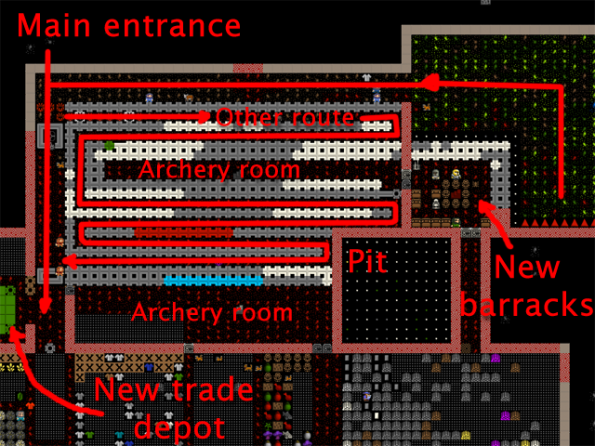

Also in this picture can see the general layout of my new entrance. The
pit leads down to a passageway into the fort and to the new trade
depot. Along the way to the depot are two bridges. At the first sign of
invasion I pull the lever to the first bridge, now the only route to my
fortress is that long winding path which is bracketed by two archery
rooms. I can park dwarfs in those rooms and they can shoot through all
those fortifications to hit the various invaders.

Along that long and winding path I am also constructing a lot of traps.
It will be very hard for any bad guy to get far, with luck! Further,
about half way along the final straight to my entrance I’ve put a
pressure plate linked to last bridge. The pressure plate is set to be
one-use only, and when stepped on, it triggers the final bridge (if it
wasn’t one use only the bridge would open and close every time it was
stepped on). End result is even if the bad guys make it close to my
entrance as soon as they cross that plate, up pops the interior bridge
and we’re safe and they’re stuck!

A momentary distraction
=======================
While this constructing has been going on I have been digging up some
obsidian stone. The obsidian can be found around the edge of the magma
pool at all levels. Obsidian is going to be very handy! Why? Because
when we go to the craftsdwarf’s workshop we can chose “Make rock sword”
from the task menu. Obsidian short swords are as good as steel swords
and they are easy to make. I like to use three of them in a weapon
trap, very effective! Obisian objects are also more valuable than
normal stone. You’d have to set the obsidian to be usable in the “z”
“stone” menu, but once it is you could place a stockpile near a
masons’s shop and using “q” on the stockpile, then “s” for “settings”,
set it to be obsidian only and thus trick masons into using the
obsidian to make some valuable furniture or crafts.

If you try and dig out the obsidian you are likely to get a lot of
“warm stone located” messages and have your digging stopped. Don’t
worry if you do. Just set the stone to be dug again and carry on. As we
can see all of the magma on the levels we’re digging we can be
confident we’re not going to have magma burst in on us.

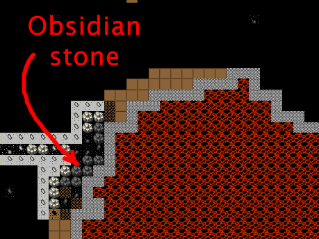

Bottom of the pit
=================
I’ve gone ahead and smoothed the bottom of the pit, put in the refuse,
and in one corner I’ve placed a few statues and set the area as a
statue garden.

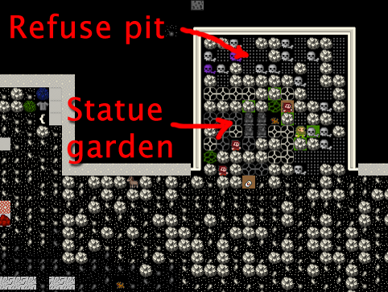

Further fortification
=====================
While I was digging away downstairs I thought it might be nice to have
a place above ground from which to shoot at invaders and perhaps
somewhere to build some siege engines as well. Hence, I’ve started
construction of a keep overlooking the entrance. In the picture below
you can see I’ve dug a stair down to the level below (Which is hollowed
out and walled in and has constructed stairs up) and I’ve put a wall
around this area.

Now, I could go and set these ground floor walls as fortification, but
I prefer my archers to shoot from above the enemy. It makes them much
harder to get shot in return! So, instead of fortifying this level I’ve
constructed another stair upwards.

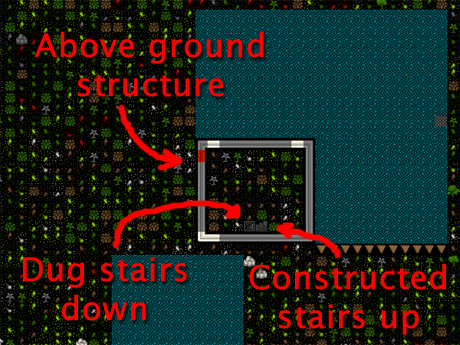

As you can see below, on the level up, I have matching down stairs
constructed and thus now have access to this level. If my dwarfs wanted
to go up here they’d have to walk on the tops of walls (walls come with
a floor and a ceiling component, by the way, so the top of a wall
counts as a floor). But wouldn’t it be better to have some floor? Yes!
I agree! So I’m using the build, construct (“b”, “C”) menu to set a big
floor to be built. Eventually I’ll ensure the whole area is built over.
But, if you do the same, do not put a floor over a wall top. This will
prevent you from building a wall on that space. Walls can never be
built on top of another construction. So leave the wall tops free and a
wall all the way around on top of your existing walls. We’re building a
tower you see! Also, make sure you leave one space clear of floor. This
is where you can “b”, “C”, construct another set of steps going up.

.. image:: images/dftutorial9944.png
   :align: center

The picture below shows the floor built with fortified walls around the
edges. This will be a great place for our marksdwarfs to stand and
shoot at any invaders as they approach the fortress. You can also see
another set of steps I’ve built going up.

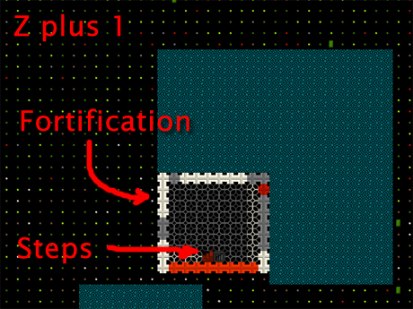

And here’s the floor above. No walls, a smooth surface. Ready for me to
put siege engines on, perhaps.

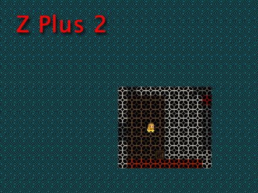

And for a special treat here’s a screenshot from 3Dwarf Visualizer,
which is a third-party tool which roughly displays how your fortress
looks in 3D. you can see the entrance (but from this angle, not the
ramps down), the keep and the pit.

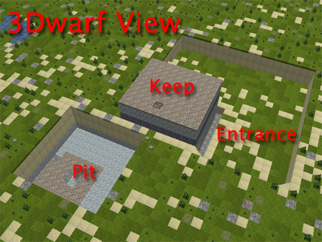

The End!
========
And welcome to the end of the tutorial! By now you should be able to
play the game on your own. If you’re lost as to what to do next, how
about digging around and looking for more ore to smelt? How about
building a :wiki:`well` so any injured dwarfs can be brought water more
safely?

You might also consider a mega project like an enormous tower, castle,
or a fortress entirely surrounded by magma. There are many options, and
just surviving the increasingly severe raids from goblins and other
critters can be a challenge. Good luck! And thanks for reading this far!

