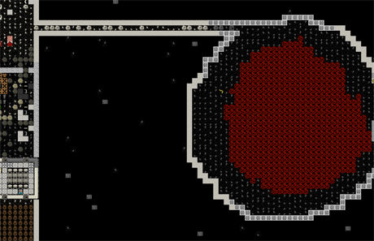
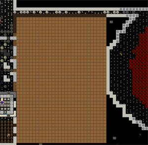
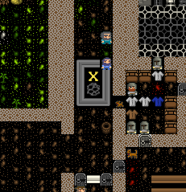
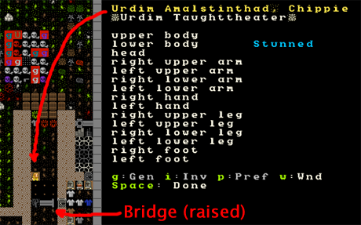
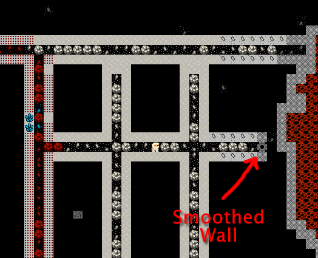
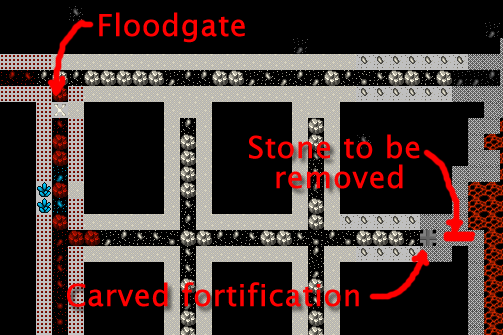
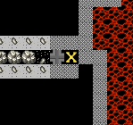
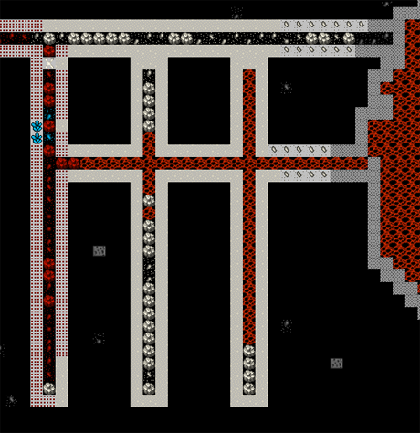
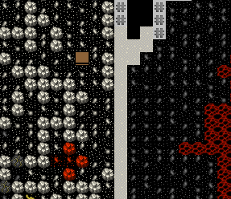
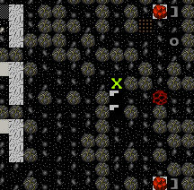

##################
Burning hot magma!
##################

This is our second-to-last tutorial (unless you all beg for more). Today we’re covering building magma forges and smelters and how you can set up some magma channels. Then we’ll talk a bit about constructing steps and how to remove constructions. Read on!

Mmm! Mag-maaaa!
===============
By now you should have discovered a magma pool. If you find it at any level lower than our workshop floor you’ll get a message about hot stone and digging will stop. If you discover the pool at the workshop level you’ll see something like this…

What we have here is a magma pool on the right, with an open floor for us to walk around on, and a passage I’ve dug from the workshop floor to the pool. I didn’t know the pool was just there, but it is extremely handy for us that it is! Why, I hear you ask? Well, the reason is that magma helps us skip a step in the metal production phase – charcoal! We can just use the heat of the magma to do the work for us, neat!

But how do we tap this awesome source of power? Easy! We dig of course! But before we get carried away, lets talk generally about magma. In addition to being a source of smelting power magma is also extremely dangerous. If a dwarf falls into it, they’re dead quickly. If a monster falls into it they also die quickly. The exception is certain magma creatures like Fire Imps. You will see a few of these in our magma pool if you go down a few levels.

Fire Imps are quite dangerous. If your dwarfs go sight-seeing around the edge of a magma pool you can be pretty sure Fire Imps will eventually make an appearance and start  breathing fire at your dwarfs. And yes, your dwarfs can catch on fire and set other things on fire! Like your precious booze (which will explode)! To help prevent this I’ve put a door on the passage to the pool, and I suggest you do the same!

Harness the POWER!
==================
With those notes in mind, lets get expanding our workshop floor and plan to harness the magma. We’ll cover the ins and outs of why once we’re under way. So follow along:

* Expand your workshop floor using the dig command so you’re taking up most of the space right up to the pool. But don’t breech the pool wall! Try something like this:

* While that’s being dug, go up a level and expand our storage floor as well. We’re going to want room to expand and we’re going to want to put bar storage as close to the new furnaces we’ve got planned as possible. Something like this perhaps?

.. image:: images/dftutorial9913.png
   :align: center

* With those levels dug, go to a level below your workshop floor and dig some tunnels like this, right up to within a couple of spaces of your magma pipe. We’re aiming to eventually create a grid of magma which workshops above will be able to tap for their smelting. Like this:

.. image:: images/dftutorial9914.png
   :align: center

You’re going to have to do a lot of waiting now while all that digging is done, so why not lets do something useful and build ourselves an awesome drawbridge to keep us even safer! Here’s how…

Bridge building intermission!
=============================
Drawbridges are wonderfully dwarfy things and central focal points of many fortresses’ defences. Drawbridges can block an entrance perhaps closing a straight-forward entrance to your fortress, leaving only a highly complex, trapped and winding tunnel, or they can be used to drop magma or flood a room (by holding said substances above an entrance way) and they can even be used to fling bad guys into the air! Lets build on!

* Go to your entrance.
* Set a couple of squares to be dug down into using “d” and “h” for channel.
* Maybe something like this will suit. Monsters can’t cross a pit.

.. image:: images/dftutorial9915.png
   :align: center

* Once it’s dug you’ll end up with a pit, trapping your dwarfs inside and outside. So lets move quickly and get this bridge built!
* Hit “b” and then “g”, you will have one green square. Expand the bridge’s width to cover the width of the hall and make it one higher and deeper than the channel. It’s not really required to be that big, I just think it looks cooler. Here’s how mine will be laid out.

.. image:: images/dftutorial9916.png
   :align: center

* **DO NOT HIT ENTER** just yet (if you have, “q” over the bridge and hit “x” to cancel the construction). Look at the top of the placing/size window. See the text that says “Bridge (retracts)”? This is where you can change the bridge to either retract (pretty much vanish) or to raise in one of the cardinal directions. Work through “w”, “a”, “s”, “d” and “x” and see how the arrow changes. Me, I hit “x” as I want it to raise downwards, sealing my dwarfs into the fortress.
* Hit “enter” and then select the stone you wish to build with.
* Your bridge now needs someone with architecture enabled to come and plan it, and then it needs masons to come place the stone. It will happen in due course.

Meanwhile, you need to build a lever to trigger your bridge! The lever, when pulled by a dwarf, causes the bridge to raise (after a brief delay). Once the lever is build we’ll connect it to the bridge. Both of these tasks require the mechanics skill, so make sure you have a dwarf with mechanics enabled. Follow along:

* Head back down to your dining room and chose a corner for your lever. Don’t do what a friend did and put the lever close to the bridge and then groan as the dwarf running to pull the lever gets cut down by the invaders (who then stormed his fortress and killed all but one of his dwarfs, who then went mad and killed most of the immigrants who arrived at his fortress, and who then died of thirst (he was to busy chasing immigrants to bother with drink)).
* Hit “b”, “T”, chose “Lever”, place the lever in a corner of your dining room, choosing a mechanism along the way.
* Wait for the lever to be built.
* With the lever and bridge built you need to hook the lever up to the bridge.
* Hit “q” over the lever.
* Hit “a” and then “b” to link up the lever with a bridge.
* You only have one bridge right now so it should go right to it with a big yellow X over it, like this:

* Hit “enter”, and then hit “enter” twice to select the two mechanisms for the lever/bridge hookup (one at the bridge end, one at the lever end). Since we don’t have to worry about magma, chose any mechanism. If there was magma involved we’d want to be using bauxite mechanisms as they are magma proof.

Now simply sit back and wait! Once the hook-up job is done (check by doing a “q” over your lever) have a bit of fun and go “q” and then “P” to “Pull the Lever”. It might take a few seconds, but hopefully someone comes over and pulls the lever promptly and then a few seconds later your bridge should be up. Here’s mine up!

If you look closely you’ll see that I’ve got a stunned dwarf on the edge of my pit. Amusingly, he was crossing the bridge when it went up and got tossed in the air. Thankfully, he’s ok, but somewhat surprised I’m guessing! Pull the lever again and let the dwarfs get in and out of your fortress once more.

…Er, a quick note about that. If your dwarfs are under the bridge when it comes down you you get this message (click for big):

This is an example of the :wiki:`Dwarven Atom Smasher <bridge>` in practice! Oopsie! Right, with that dwarf murdering job done, lets get back to delicious magma!

Preparing the channel
=====================
By now you should have most everything dug out. Once the channel under the workshop layer is complete we need to flood it with magma. How should we do that? If your first instinct is to send a digger down there to dig through to the magma pipe then you’re a very silly dwarf manager! This will work but will also result in a quick-roasted dwarf. What we’re going to do instead is channel from above until our channel meets our tunnel.

But before we do that we need to think aout those imps. Do you know Fire Imps and other magma creatures can sneak along your tunnels and then pop out in your forges? And that this can be quite painful for everyone concerned? Hah! Well now you do! So what should we do about this? Some sort of grate might be handy, right?

We could use a wall grate (constructable at a masons), but lets practice another technique. The last space we’ve dug to the magma should be smoothed, (“d”, “s”) and then carved, like this:

From here we’re going to do something cunning. We’re going to “d” designate that same square of wall to be a “a”, “carve fortification”. What happens then is that the wall will have slots cut in it so as to potentially let your crossbow dwarfs shoot out. But while we won’t have dwarfs down here, the holes will let magma through, but not monsters! So go “d” and “a” that same smoothed square.

While you wait, go to a mason’s workshop and get a floodgate built. It will be a boxy shaped thing with an X on it. This is what we’ll use to block the magma from exiting our tunnel complex. Why a floodgate instead of a door? No particular reason, the floodgate does guarantee no one will try and open the door, which is handy. Floodgates can only be opened or closed by levers and pressure plates. Here’s my complex all completed:

So now what? Clearly we need to remove the stone. To do that we need to channel from above, which is relatively safe. Lets do that now:

* Viewing your tunnel complex hit “d”, and then “h”.
* Place your X over the first spot to be removed, like this:

* Now go up a level and you will see your X near the edge of the magma.
* Hit “enter” and move the cursor across three places, hit “enter again”, the end result will look like this:

.. image:: images/dftutorial9923.png
   :align: center

* Wait, the channel will be dug and magma will flow into your channels, through your fortification grill (which you can’t see unless you “k” and place it over the spot, by the way). Awesome!

Here are my channels slowly filling with lava. Now lets USE THE HOTNESS!

Magma Forges for fun and profit
===============================
Lets get sorted with some magma stuff. Chose a square in your magma channels where there’s some magma, go up a level, and cut a single channel down. Here’s the spot ready to be cut. This will give our magma workshops access to the lovely hot stuff.

Now, to build:

* “b”, then “e” for smelters.
* “l” for “Magma Smelter”.
* Place the dark green X over your magma hole, hit “enter”.
* Check out my finished magma smelter!

.. image:: images/dftutorial9926.png
   :align: center

Now, get to work!

* Build another couple of smelters.
* Build three magma glass furnaces.
* Under the workshop menu build three magma forges. If you don’t have enough anvils for your forges, go make some more at your existing charcoal-powered forge. They have two dark green X’s, either one will do for placing over the hole.
* Here are my 9, almost-completed workshops. One isn’t placed yet as I need to forge a new anvil.

.. image:: images/dftutorial9927.png
   :align: center

If you have problems placing any forge/smelter or running them it’s possible that there isn’t enough magma under the building, you may have to wait for the tunnels to fill more. But once the workshops are complete you can smelt all that ore on repeat and not worry about charcoal. Best set your smithy’s up with furnace operation, armoring and weapon smithing and no other job! Get all that ore into bars and into shiny armor, weapons or trap components! Hurrah!

Now, what about those glass furnaces? That’s something for you to research and toy with. Glass is a whole ‘nother ball game. Don’t worry, your twenty level tower made entirely of glass can come later

Constructing stuff
Hang on, wouldn’t it be handy if we could get to our new stockpiles above our furnaces without having to walk all the way over to the central staircase? But how can we when we’ve dug out all this dirt? We have no chance at designating some up-stairs!

But we can construct some. Using the “b”, “C” menu. Constructed stairs and ramps can be put anywhere, as long as they are connected to the ground below them or to one side. The same rule applies to floors, and walls, as you saw earlier. So lets get some more stairs going.

* Hit “b”, and then “C”.
* Chose the “Up Stair” option.
* Chose a spot, hit “enter”, select the materials, hit “enter”.
* Here are two stairs set to be constructed, with one more due to be set:

The stairs will quickly be done, but they won’t be in use. Why not? Go up a level! There’s no down stair! Thankfully, because there’s dirt between the floor above and the floor below, we can use the “d”, “j” (for “downward stairway”) and the steps will be dug, connecting up with the up-stairs below.

If there wasn’t dirt, and there was space instead, we would have to “d”, “C”, construct some stairs down.

Now would be a good time to answer a common question is how you remove steps and walls in Dwarf Fortress. You’ve got a few ways, one of which will always work:

“d”, “n” for “remove construction”. All items that are constructed will flash with a green C. Select in the usual way and the constructed items will be smashed down.
“d”, “h” for “channel”. If you’re above something that has been dug and you want it removed, you can channel the dug space away. To fill the gap you’ll either need to construct a floor on top or you’ll need to construct something in there.
You can dig your way through anything constructed, thus removing it.

There you go! Magma! In our final lesson we’ll cover building defences and siting a new entrance! Hope you’ve had fun, now go away and make a ton of awesome steel items and set some more traps up.

