################
Training Archers
################

Source: :reddit:`Mechanixm's Archery Training Primer <2k65yc>`

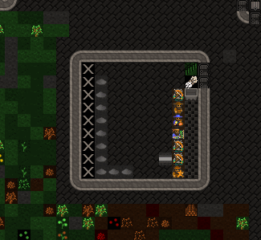

I've had several requests to create a guide as to how I set up the
Archery Training Room of Highsteppes. I'll go through the core steps
to train crossbow dwarves. I assume you have some DF experience, so I won't
tell you literally everything.

Building the training room
==========================
Dig out a simple 11x11 room and seal it off with doors. There is
nothing special about this... it's just a room. Then build the targets
(:kbd:`b`, :kbd:`A`) in a vertical line, one space from the walls.

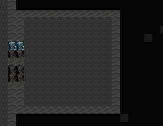

The material of the blocks used has no effect on anything. Dwarves
with Masonry enabled will come and build the targets.

Dig a channel next to the walls, to save any bolts that miss a target.

.. image:: images/archery04.gif
   :align: center

This way, if a bolt flies and hits the north or south wall,
it will be saved - bolts that are fired from one z-level and land
on another are not destroyed when they hit the ground.
Reclaiming ammunition like this is more useful for combat (ie metal)
bolts, so this is just to demonstrate the technique.

:kbd:`q`, :kbd:`r` each target and set its room size. Yes, you have
to do this for each of them.

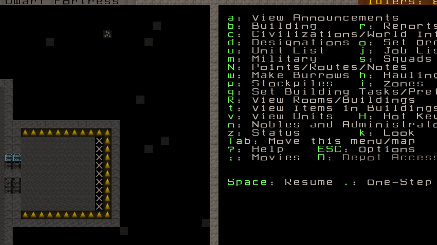

If you're not planning to shoot from left to right, press
:kbd:`w`/:kbd:`a`/:kbd:`s`/:kbd:`d` to change the firing direction.

Creating the squad
==================
In my example, I haven't created any squads yet. I assign them
:guilabel:`No Uniforms` because I literally have no armor in this
fortress. Rename your squad if you wish. Assign all of your
Crossbow dwarves to the squad.

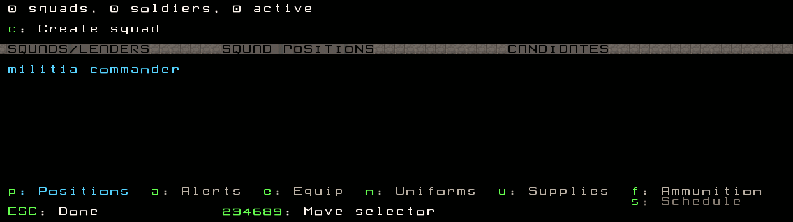

If you have uniforms created that contain crossbows, you should be
able to just assign your guys that uniform. Otherwise, manually
assign a crossbow to each dwarf as the example shows.

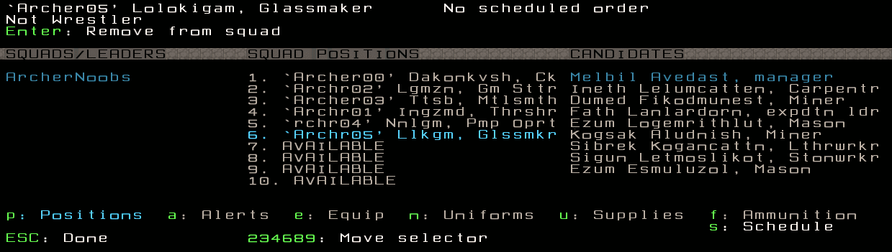

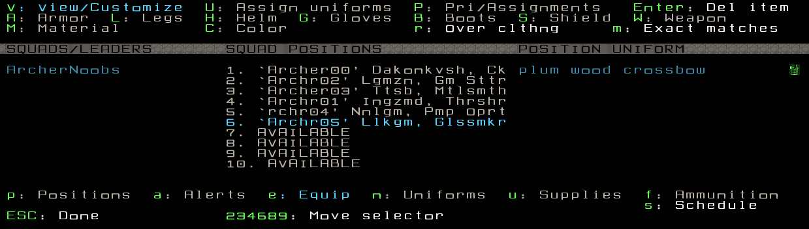

Highlight the squad name and press :kbd:`c` to add a new item.
Add Wood Bolts and Bone Bolts and set the amounts to 600 of each.
I've never had an issues with ammo when setting 100 bolts per
dwarf. The bolts are set for both Combat and Training.

When you graduate your dwarves out of a Training Squad to a Legit
Crossbow squad, only use metal ammo. Crappy materials are for
training.

You'll need some other supplies - waterskins, quivers, and backpacks.

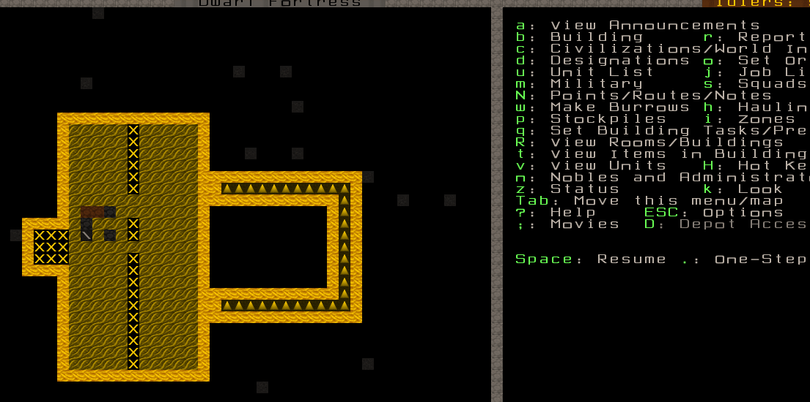

Quivers are mandatory - marksdwarves won't train if they can't carry
ammo! Waterskins or flasks are optional, but your military dwarves need
them to carry booze and thus avoid drink breaks. Backpacks are used to
carry food with them, so they don't need a dining room to eat.

Make some crossbows and wooden bolts. I hardly ever
ever ever use wooden crossbows, but use whatever you want.

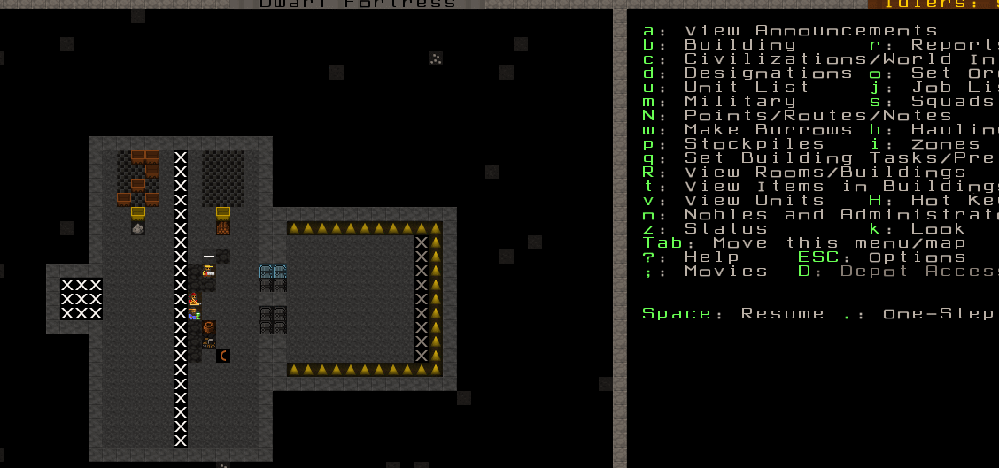

I have 6 dwarves in this Training Squad, so I'm going to create
minimum training orders. I then delete that unnecessary Train 10
minimum order by pressing :kbd:`Tab`, :kbd:`x`.

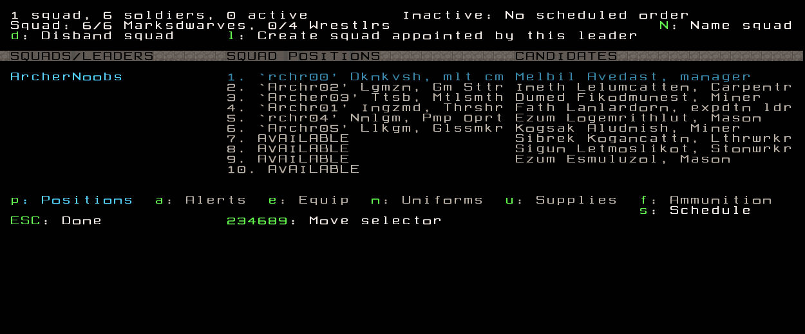

Press :kbd:`Tab` to get back up to the schedule grid where
it says :guilabel:`Train for each Month`. On the month I created
the 6 Train 1 Soldier minimum orders, I press :kbd:`c` to copy,
then :kbd:`p` paste those orders for each month of
the year. :guilabel:`Sleep in room` and :guilabel:`uniformed inactive`
stay at default settings.

Finally, :kbd:`s` for squads, :kbd:`a` to choose my squad, :kbd:`t`
to set active.

Assign your squad to the Archery Training Room.
===============================================

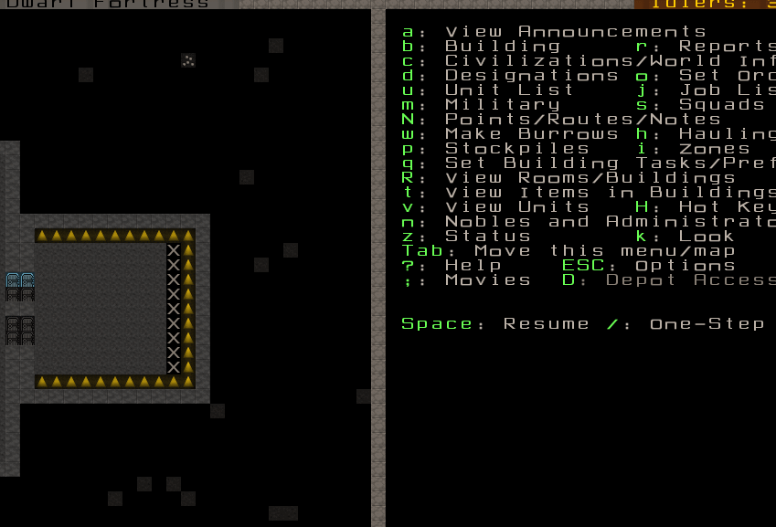

Yes. You need to do this for the room set from every target, individually.
Press :kbd:`q` and highlight an Archery Target Training Room,
highlight your squad and press :kbd:`t`. My squad is already highlighted
because I only have one squad right now. Set your squad to train
for each target... and let the training begin!

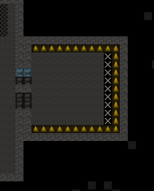

If you've done everything correctly, the dwarves will come in
and shoot. Once they are done, they will go on break.
It is not unusual for your dwarves to shoot an entire quiver while
training and then just sort of hang around for a month.

Instead, you can give the squad a Kill command to go kill some
helpless animal. After they kill it, they should go right back
to the training to train some more. Be patient, and your dwarves
will continue to train. They just like to take breaks after emptying
each quiver.

You'll need to create an ammunition stockpile in the room.  DO NOT try to
store ammunition in bins; it's very buggy.  Use a quantum stockpile or
learn to live with it.

Reclaim ammo from the channel with :kbd:`d`, :kbd:`b`, :kbd:`c`
and select the items to recover.

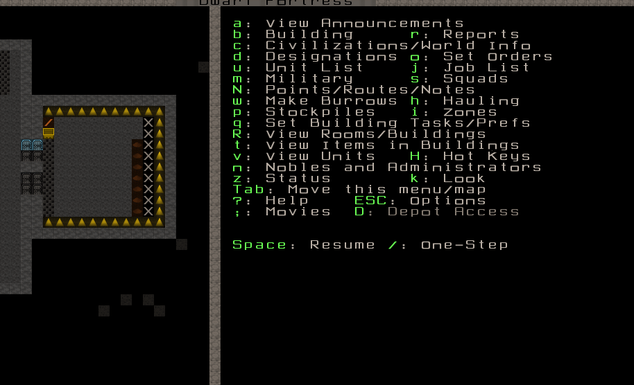

Your dwarves will grab the bolts and bring it over
to your ammo stockpile. In my case, it gets quantum stockpiled
which allows for easy grabbing when refilling quivers. Here is a
gif showing ammo reclamation during training. Notice how no one
gets hit in the crossfire. That is normal:

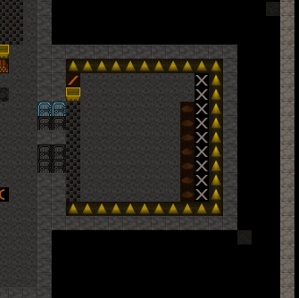

Slowly but surely their skills will rise.

Thanks for taking the time to read. A complete list of my other guides
can be `found here <http://mechguides.reddit.com>`_. If you have any
questions or comments, please let me know. **-Mech**

