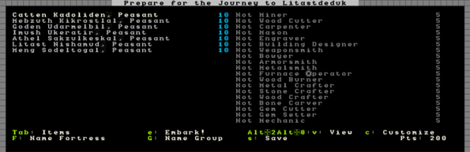
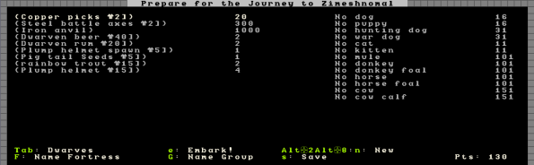
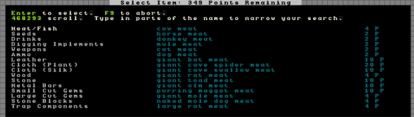
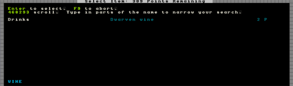

########################
Custom Embark Strategies
########################

The custom embark feature of Dwarf Fortress is a handy part of the
game as it lets you customize exactly what sort of dwarfs you take
with you and allows you to set their supplies to your exact
specifications. Read on for more information!

Embarking the custom way
========================
So you’ve chosen your perfect location, as per the world generation
tutorial, and now you’re ready to embark. What you want to be doing
now is selecting :guilabel:`Prepare for your journey carefully` from
the embark menu. You will now be presented with your list of dwarfs
and the skills they can access.

Have a fiddle with your controls. The left-right arrows move between
the list on the left (dwarfs) and the list on the right (dwarf
skills). Select your first dwarf, then arrow over to the skill list
and scroll through it. Currently this dwarf has no skills assigned.
Find :guilabel:`Mining`, hit :kbd:`-` and keep hitting it until the
dwarf is set as a :guilabel:`Proficient Miner`. Do the same for
:guilabel:`Mason`.

You have now made your dwarf a pretty good mason and a miner! Note,
there’s a zero next to his name? This means he can’t accept any more
skills. Most of the time you’re going to be giving each dwarf a couple
of skills, but one or two dwarfs might be given some outlier skills
(leadership skills, for example) to ensure you have a broker from the
get-go. There are many strategies when it comes to skill selection,
we’ll cover some samples later.

Meanwhile, get back to a dwarf using the arrow key. You’ll see at the
bottom the :kbd:`c` menu for :guilabel:`Customize` and :kbd:`v` for
:guilabel:`View`. Hit :kbd:`v` and have a read about your dwarf’s
personality. I usually look for the "friendliest" and mark them in my
head for any possible leadership skills.

Head back to the list (:kbd:`Esc`) and then hit :kbd:`c`. Here you can
modify a dwarf’s nickname and profession name. This is handy if you
want to make a note of how you’ve skilled each dwarf, or just for your
own amusement, of course! Once you’re done there, hitting :kbd:`F` or
:kbd:`G` takes you to a group and fortress menu list. Fiddle around
here and come up with a creative name if you want!

When you’re done, (you may have to hit :kbd:`Esc` to head back out of
the menu), hit :kbd:`Tab` to go to the item list. Many items will be
on your list already, on the left, with animal options on the right.

As in the last menu, use the arrows to move left and right and the up
down arrows to move through the list. Head across to the animal list
and hit :kbd:`-` a couple of times to add 2 dogs to your party. Go
down, add a couple of cats as well. No, make that three of each, then
you’ve got a pretty good chance of getting one of each sex. That’s
handy for reproduction, so my mum tells me!

:kbd:`=` reduces the number of items. Reduce the number of battle axes
to one. I usually don’t bother taking two steel battle axes as one
skilled woodsman with a single battleaxe is quite enough and getting
rid of one will free up some points you can use for other things. As
for the rest of the items, that depends on your strategy. For now, hit
:kbd:`n` for :guilabel:`New`. You’ll be taken to a huge menu of
purchasable items.

Lets add some turtles to the list of stuff we’re going to take. Scroll
down to :guilabel:`Fish`, then across to the right and down to
:guilabel:`Turtle`. Hit :kbd:`Enter`, you will now be taken back to
the main goods menu and you’ll see turtles added to your list. Hit
:kbd:`-` until you’ve got 20 turtles. Note, the points available to
you will go down as you do this – your available points are in the
bottom right corner and the point cost of each item is listed next to
the item.

Lets add some Dwarven Wine the other method. Hit :kbd:`n` for new,
then start typing :guilabel:`wine`. Pretty soon you’ll be left with
only one option, :guilabel:`Dwarven Wine`. You’ll note that the
:guilabel:`Drinks` part of the menu is highlighted, you’ll need scroll
across :guilabel:`Dwarven Wine`, then hit :kbd:`Enter`.

You can now increase and decrease the number in the usual fashion.
Lots and lots of drink is a good idea!

Embark Strategies
=================
You now know enough to navigate around the somewhat confusing menus.
But what you don’t have is an strategy for what to buy when you’re
embarking. Thankfully, there are some really good ideas presented on
the Dwarf Fortress Wiki Starting Builds guide and of course, more
ideas over on the Dwarf Fortress forums. I suggest going and reading
the starting builds guide, there are some fun ideas there – for
example, taking no axes, a little wood and then forging your own axes
on site (saves you points for other items!).

The :forums:`DF Starter Pack <126076>` includes a collection of embark
builds, ranging from good for new players to advanced options designed
to maximise the impact of each point.  You can save your settings with
:kbd:`s`, if you're happy with them.

Take all the advice there and then think about the location you’re
embarking to. If it seems likely to be a frozen waste, you may chose
to modify the builds presented as many are tailored for fairly ideal
locations. That being said, there are some interesting ideas for
builds centered around extreme fortresses too!

When you’ve spent all your points and modified everything you want,
hit :kbd:`e` for :guilabel:`Embark` and enjoy your new fortress!

