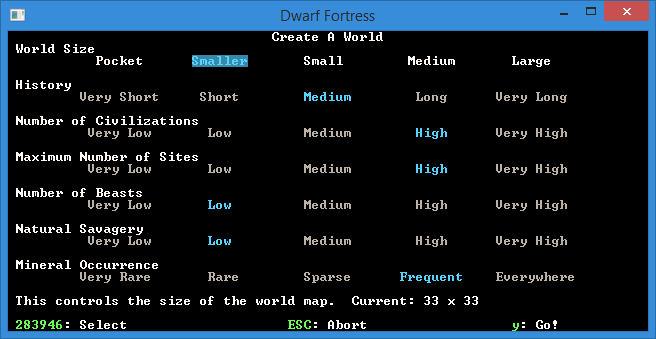
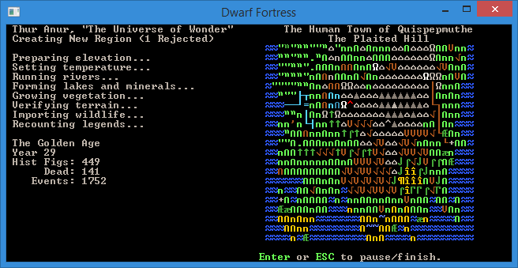
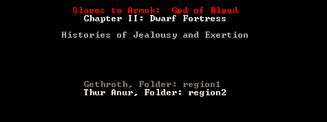
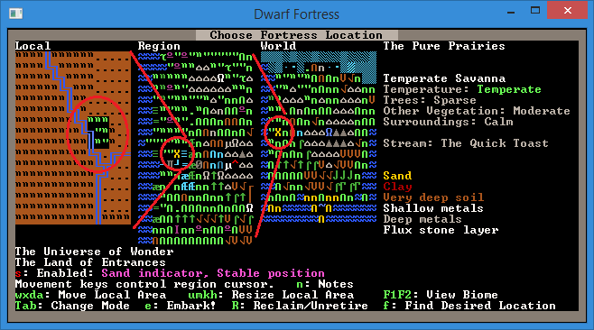
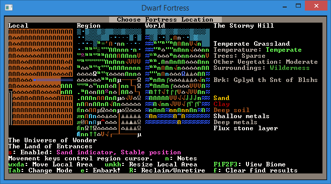
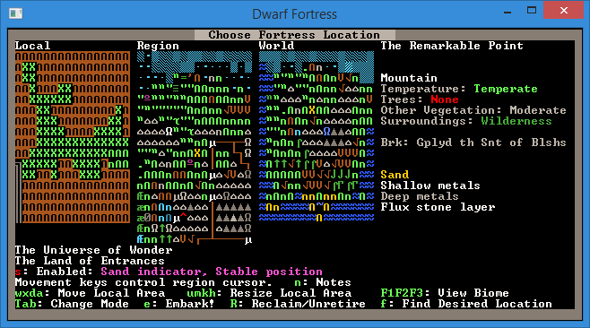
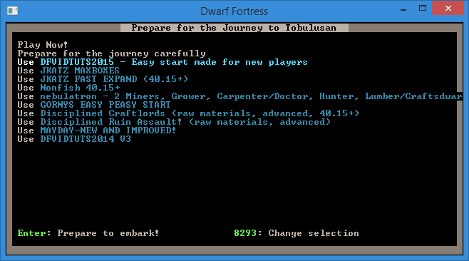

################
World Generation
################

Welcome to the tutorial on world building. If you’ve played along with
the walkthrough you may be itching to try out making your own world
and finding a new place to build your next dwarfy citadel (perfectly
laid out – as detailed on the notepaper you doodled on at work all
day). Well, you’re in luck, because that’s what we’re talking about
today!

Why World Build?
================
World building is a subtle and arcane art in Dwarf Fortress. You can
do it the easy way (default world generation), the slightly complex
way (custom parameter setting) or the really hard way (world gen file
manipulation). We’re going to be covering just the first way as the
others make my brain hurt and I’m not a masochist! If you are
interested in doing things the hard way you can head over to the wiki
and check out the guides to advanced world generation and
pre-generated worlds.

Er, where was I, why do we want to generate our own worlds? Well,
generally it is because we want to create a specific type of
environment (haunted glaciers with skeletal whales FTW!) or we want to
make sure we have an interesting and exciting place to build (build a
volcano inside a fortress inside a volcano!). Or perhaps you just want
to start a new game in a new land.

Making Worlds the Easy Way
==========================
Fire up Dwarf Fortress and from the start menu scroll down to
:guilabel:`Create New World!` and hit :kbd:`Enter`.  You'll see a
screen with a variety of basic options which can be selected with the
arrow keys.  I suggest the following settings, but by now you can
decide for yourself:

You you like the settings, hit :kbd:`y` and the world will start to
generate. You’ll get a lot of stuff happening on the screen as the
world is generated. Mountains will form and be eroded, forests will
spread, rivers will spawn, civilisations will rise and fall. It’s
pretty cool actually!

Here’s a shot of the world history being generated, which happens
after the geography is formed. Did you know you can actually go and
read all of this history in :guilabel:`Legends` mode? Yes, it’s all
there! Tons of history and mythology to soak in. We’ll have a look at
that later.

Once the world is created you’ll end up with a menu as well as a
little information, such as the name of your world. Mine,
:guilabel:`The Universe of Wonder` looks mountainous and pretty frozen
up North! (I swear, I got that name the first time!)  Use the arrow
keys to look around and get a rough idea for the kind of world
created. Hit :kbd:`Enter` to accept the world. The world is now being
stored and you will be taken back to the main menu. You can now chose
:guilabel:`Start Playing` and a new world will be there, probably the
attractively named :guilabel:`(untranslated name), Folder: Region 2`.

You’re a bloody legend, mate
============================
With your new region selected, hit “Enter” and you can see the three
game modes available. :guilabel:`Dwarf Fortress`, which you know well
by now, :guilabel:`Adventurer`, which you may have dipped into and
:guilabel:`Legends`. Select :guilabel:`Legends` and hit :kbd:`Enter`.
After some loading you’ll get a screen showing a list of histories to
read. Scroll around, hit :kbd:`Enter` to drill down and :kbd:`Esc` to
go back up a menu layer. The first history I read is about Sidya
Athetipyi, hag spouse of evil - born an elf, abducted at age four, and
transformed into a creature of the night by Momuz Shadeberry. She
later escaped and wandered for years, before being struck down at age
41 in the Pure Prairies.  There are happy stories too, I promise!

If the in-game interface for Legends mode isn't your cup of tea, don't
despair!  From the main legends screen, you can press :kbd:`x`,
:kbd:`p`, :kbd:`d` to export most of the information - or use the
DFHack command ``exportlegends all`` to do so automatically.  These
files are created in the ``Dwarf Fortress`` folder, and can be read
with Legends Viewer - which incorporates the maps, and adds everything
from hyperlinks to population statistics.

When you’re bored, :kbd:`Esc` back out to the main menu.

Play the Damn Game Already!
===========================
Head back in to “Start playing” and select your region and then “Dwarf
Fortress”. You’ll then get a screen somewhat like this. It is the
“settle” screen where you chose where you’re going to found your
fortress. I’ve scribbled on the picture below so as to give you a
better idea of what you’re looking at. The image below explains the
three map windows you can see:

On the right is more information and it relates entirely to what’s in
the embark box in the left window. Lets see what we can do about
navigating around! Start off by hitting the arrow keys a while. What
you’ll notice is that the arrow keys move the X on the region map.
Holding down an arrow key results in the local map zipping past, the
region map moving square by square and the world map X moving fairly
slowly. As you move the cursor around you should see the info on the
right change. Note, this info does NOT relate to the region window!
Instead, it relates to the local window, but as you’ve noticed by now
we don’t seem to have much control over the placement of that local
window box… or do we?

If you read the text on screen you’ll see you can move the local area
box around using :kbd:`w`, :kbd:`a`, :kbd:`x`, and :kbd:`d`. Try it
now! You’ll notice lots of information changing on the right. You can
also resize the local space using :kbd:`u`, :kbd:`h`, :kbd:`m`,
:kbd:`k`.  You probably want to leave the box at 3x3, but 4x4 will
give you more space when you’re playing. 5x5 should only be used by
those who like the game going particularly slowly as those sort of
sizes can become somewhat crippling for the CPU to keep up with. 1×1
micro-fortresses are also doable, if you want speed more than space.

Hit :kbd:`u` and make your space 3×5. Make it small again by :kbd:`m`.
Easy huh? But rather than just selecting some random area and hitting
:kbd:`e` for :guilabel:`Embark!`, lets use the :guilabel:`Find` system
to get us a nice site.

Finding somewhere to live
=========================
Follow along:

* Hit “f” for :guilabel:`Find`. A new menu will pop up with settings
  to fiddle with.
* Set :guilabel:`Savagery` and :guilabel:`Evil` to :guilabel:`Low`.
* Set :guilabel:`Flux Stone Layer` to :guilabel:`Yes`. Flux stone is
  one of the ingredients you need to make steel so we really do want it.
* Leave :guilabel:`Aquifer` as :guilabel:`N/A` - while they're a pain,
  you'll get a better site if you're willing to use the DFHack command
  ``drain-aquifer`` after you embark
* Set :guilabel:`River` to :guilabel:`Yes`.
* Set :guilabel:`Shallow Metal` and :guilabel:`Deep Metal` to
  :guilabel:`Multiple`.
* Set :guilabel:`Soil` to :guilabel:`< Deep`.
* Set :guilabel:`Clay` to :guilabel:`Yes`.
* Hit :kbd:`Enter` for :guilabel:`Do Search`.

DF will now look for a location matching your preferences. Now, I’ve
chosen the particular settings above to set up a fairly straight
forward fortress location. You can have a lot of fun by not going for
some of these settings, so don’t be afraid to experiment.

Once the search is run a suitable site will be found (hopefully) and
the local map will be centered on it. Hit :kbd:`Space` to back out of
the find menu. Here’s what I’ve found.

You can see the climate looks quite good. The temperature is warm,
it’s sparse trees (which is plenty). It’s wilderness, which will be
somewhat challenging and fun and there’s some sand too – always nice
if you want to make glass. However, one thing I don’t see is an
aquifer... or do I? Perhaps it’s in another biome? Biomes are how land
is divided up in DF. Plains will be one biome, a mountain range
another, a forest yet another. Clearly there’s a grassland biome here,
and there are three options next to :guilabel:`View Biome`; :kbd:`F1`,
:kbd:`F2`, and :kbd:`F3`. By default we’re viewing the biome that
dominates this space inside the local embark box and this is the
:kbd:`F1` biome. if I hit :kbd:`F2` I will switch to seeing what’s on
the other biome as well as what land it covers. The flashing Xs show
the boundary and I can hit :kbd:`F1` to see how it compares to the
other biome. Here’s what I see when I check the second biome. Note,
it’s possible to have one, two, four or even more biomes all
intersecting on the area you’re looking at!

I’m pretty pleased with that! A good sized area, a water source in the
corner, magma (deep down), sand, flux stone, lots of wood, perfect! Of
interest is that I have a brook instead of a full river (DF tells me
that in the info box to the right of the maps) which somewhat reduces
the difficulty of dealing with the challenges of plumbing!

I am now ready to embark!

Your Basic Embarking
====================
When you’re comfortable with your start zone hit :kbd:`e` for
“Embark”. You will get a confirmation dialog, hit :kbd:`Enter`. You
now have options that probably look something like this:

The best option, if you want to play straight away, is to select
:guilabel:`Use DFVIDTUTS2015` (the preset the walkthrough is based on)
and hit enter, you will now be taken to another menu which you want to
hit :kbd:`e` from. Voila! You’re in and playing! Alternately, you can
:guilabel:`Prepare for the journey carefully` and individually skill
and equip each dwarf - but that's another tutorial.

Righto, you should be able to do basic world construction to your
heart’s content now. World generation is as complex as you want it to
be and you can see some of those options under :guilabel:`Design New
World with Advanced Parameters` from the main menu. Don’t worry about
those unless you get super keen on custom building worlds to ensure
certain features, in which case, head off to the Bay12 forums already!
There are lots of useful threads there and links to map databases (and
info on how to use them). It’s a hobby in itself and people seem to
enjoy competing to create the most perfect starting location or the
most perfect micro-fortress.

