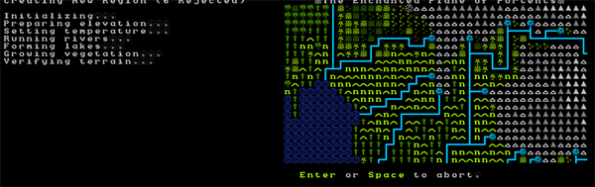
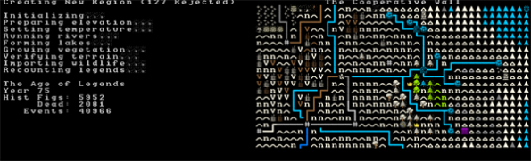
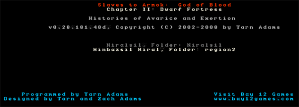
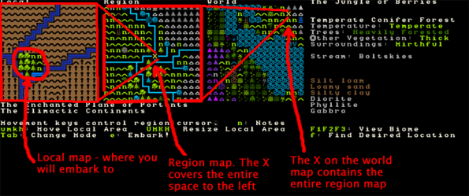
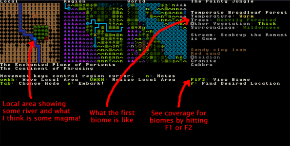
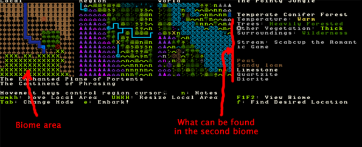
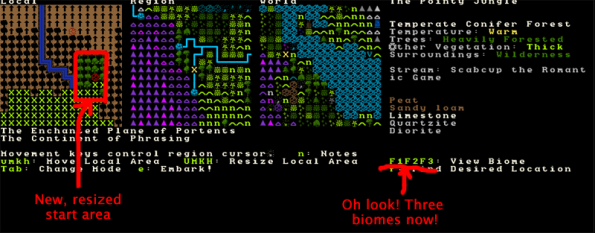
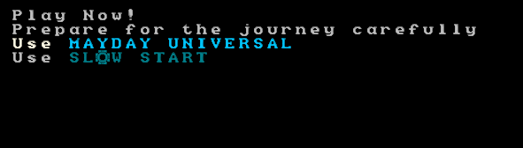

################
World Generation
################

Welcome to the tutorial on world building. If you’ve played along with the walkthrough you may be itching to try out making your own world and finding a new place to build your next dwarfy citadel (perfectly laid out – as detailed on the notepaper you doodled on at work all day). Well, you’re in luck, because that’s what we’re talking about today!

Why World Build?
================
World building is a subtle and arcane art in Dwarf Fortress. You can do it the easy way (default world generation), the slightly complex way (custom parameter setting) or the really hard way (world gen file manipulation). We’re going to be covering just the first way as the others make my brain hurt and I’m not a damn masochist! If you are interested in doing things the hard way you can head over to the wiki and check out the guides to advanced world generation and pre-generated worlds. Me, I got confused reading those so when I wanted something tricky done chose to whine on the Bay12 forums until someone helped me! Thanks forum geeks!

Er, where was I, perhaps I should answer the question in my title there! Why do we want to generate our own worlds? Well, generally it is because we want to create a specific type of environment (haunted glaciers with skeletal whales FTW!) or we want to make sure we have an interesting and exciting place to build (build a volcano inside a fortress inside a volcano!). Or perhaps you just want to start a new game in a new land.

Making Worlds the Easy Way
==========================
Fire up Dwarf Fortress and from the start menu scroll down and chose “Create World Now”. At the next screen hit “F9” as instructed and the world will start to generate. You’ll get a lot of stuff happening on the screen as the world is generated. Mountains will form and be eroded, forests will spread, rivers will spawn, civilisations will rise and fall. It’s pretty cool actually!

Here’s a shot of the world history being generated, which happens after the geography is formed. Did you know you can actually go and read all of this history in “Legends” mode? Yes, it’s all there! Tons of history and mythology to soak in. We’ll have a look at that later.

Once the world is created you’ll end up with a menu as well as a little information, such as the name of your world. Mine, the “Enchanted Plane of Portents” looks mountainous and pretty frozen! Neato! Use the arrow keys to look around and get a rough idea for the kind of world created. Hit “Enter” to accept the world. The world is now being stored and you will be taken back to the main menu. You can now chose “start playing” and a new world will be there, probably the attractively named “Region 2”.

You’re a bloody legend, mate
============================
With your new region selected, hit “Enter” and you can see the three game modes available. Dwarf Fortress, which you know well by now, Adventurer, which you may have dipped into and Legends. Select Legends with the arrow key and hit enter. After some loading you’ll get a screen showing a list of histories to read. Scroll around, hit enter to drill down and space to go back up a menu layer. The first history I read is about “Angot Torridbrand The Firey Wealths of Heat, a skeletal dragon”. Oh dear!

When you’re bored, space back out to the main menu.

Play the Damn Game Already!
===========================
Head back in to “Start playing” and select your region and then “Dwarf Fortress”. You’ll then get a screen somewhat like this. It is the “settle” screen where you chose where you’re going to found your fortress. I’ve scribbled on the picture below so as to give you a better idea of what you’re looking at. The image below explains the three map windows you can see:

On the right is more information and it relates entirely to what’s in the embark box in the left window. Lets see what we can do about navigating around! Start off by hitting the arrow keys a while. What you’ll notice is that the arrow keys move the X on the region map. Holding down an arrow key results in the local map zipping past, the region map moving square by square and the world map X moving fairly slowly. As you move the cursor around you should see the info on the right change. Note, this info does NOT relate to the region window! Instead, it relates to the local window, but as you’ve noticed by now we don’t seem to have much control over the placement of that local window box… or do we?

If you read the text on screen you’ll see you can move the local area box around using “u”, “m”, “k” and “h”. Try it now! You’ll notice lots of information changing on the right. You can also resize the local space using “shift” + “u”, “m”, “k” or “h”.  You probably want to leave the box at 4×4, but 5×5 will give you more space when you’re playing. 6×6 should only be used by those who like the game going particularly slowly as those sort of sizes can become somewhat crippling for the CPU to keep up with. 1×1 micro-fortresses are also doable, but check the forums for seeds and ideas.

Hit “shift”+”u” and make your space 4×5. Make it small again by “shift”+”m”. Easy huh? But rather than just selecting some random area and hitting “e” for “embark”, lets use the “Find” system to get us a nice site.

Finding somewhere to live
=========================
Follow along:

* Hit “f” for “Find”. A new window will pop up with settings to fiddle with.
* Use the arrow keys to scroll down to temperature and use the left and right arrows to set the temperature to “Medium”. Skip this step if you’re feeling brave!
* Set “Flux Stone” to “Yes”. Flux stone is one of the ingredients you need to make steel so we really do want it.
* Set “Aquifer” to “No” unless you want to play with pumps and like a challenge.
* Set “River” to “Yes”.
* Set “Magma Pipe” to “Yes”.
* You can try setting any of the three options below to “Yes” as well, but there might not be a site that matches, so for now, leave them and hit “Enter” for “do search”.
* DF will now look for a location matching your preferences.

Now, I’ve chosen the particular settings above to set up a fairly straight forward fortress location. You can have a lot of fun by not going for some of these settings, so don’t be afraid to experiment. Check the big comment at the bottom of the tutorial for more ideas on this by commenter Benkyo.

Once the search is run a suitable site will be found (hopefully) and the local map will be centered on it. Hit “space” to back out of the find menu. Here’s what I’ve found.

You can see the climate looks quite good. The temperature is warm, it’s got lots of wood. It’s wilderness, which will be somewhat challenging and fun and there’s some sand too – always nice if you want to make glass. However, one thing I don’t see is any flux stone…. or do I? Flux stone shows up white on the side info box normally, and you’ll recall I set the preferences to include it. Perhaps it’s in another biome? biomes are how land is divided up in DF. Plains will be one biome, a mountain range another, a forest yet another. Clearly there’s a forested biome here, and there are two options next to “View Biome”; “F1” and “F2”. By default we’re viewing the biome that dominates this space inside the local embark box and this is the “F1” biome. if I hit “F2” I will switch to seeing what’s on the other biome as well as what land it covers. The flashing Xs show the boundary and I can hit “F1” to see how it compares to the other biome. Here’s what I see when I check the second biome. Note, it’s possible to have three or even four biomes all intersecting on the area you’re looking at embarking to!

The sharp eyed among you may note that it looks like no green X is covering my start area. I think what’s happening is that the red magma bit isn’t flashing, although it should be as it’s part of the “F2” biome. Perhaps it was me fiddling with the ini file recently that made this so. Oh, also, when you go through the world generation process you may not actually see any indication on the map that there’s magma in your starting location. But if you’ve set Magma Pipe to “Yes” and “Find” has worked then you know it will be down there somewhere. There are ini edits which change how visible certain features are in the world creation screen, to go into more detail might offer spoilers so you can go research it yourself if you fancy!

Of interest is the Limestone found in this second biome. Great stuff! Just what we need. But if only one corner of the map I’m going to play on has Limestone I might end up not having much. To solve this problem I’m going to live life on the edge and increase the size my embark area to pick up more of that area outlined by green Xs. I hit “Shift”+”u” twice and now have a 4×6 sized start area, then using “m” I lower the start area a couple of spaces, and one over to the right, and here’s how my selected start zone looks now:

I’m pretty pleased with that! A good sized area, a water source in the corner (you need water), magma, sand, flux stone, lots of wood, perfect! Of interest is that I have a stream instead of a full river (DF tells me that in the info box to the right of the maps) which somewhat reduces the difficulty of dealing with the challenges of water pressure and carp!

I am now ready to embark!

Your Basic Embarking
====================
When you’re comfortable with your start zone hit “e” for “Embark”. You will get a confirmation dialog, hit “Enter”. You now have options that probably look something like this:

The best option, if you want to play straight away, is to select “Mayday Universal” and hit enter, you will now be taken to another menu which you want to hit “e” from. Voila! You’re in and playing! Alternately, you can “Prepare for the journey carefully” and individually skill and equip each dwarf. We’ll cover that some other time.

Righto, that’s all for now. You should be able to do basic world construction to your heart’s content now. World generation is as complex as you want it to be and you can see some of those options under “Design world with new parameters” from the main menu. Don’t worry about those unless you get super keen on custom building worlds to ensure certain features, in which case, head off to the Bay12 forums already! There are lots of useful threads there and links to map databases (and info on how to use them). It’s a hobby in itself and people seem to enjoy competing to create the most perfect starting location or the most perfect micro-fortress.

