##################
!!Fun with Magma!!
##################

This tutorial covers navigating the caverns, locating magma, and
raising it to the surface for use. It builds on the fort from the DF
Walkthrough Pack and picks up at the end of Chapter 9 of the DF
Walkthrough.

Note: Unless otherwise stated, this tutorial uses the Workflow utility
for building items. We will also use the Quickfort utility during the
pump stack construction process. All these utilities are bundled in
the latest :dffd:`Starter Pack <7622>` maintained by PeridexisErrant.

The save I used is :dffd:`11179`.

.. contents::

Delving for Magma
=================

Welcome to the magma tutorial! Magma is an incredibly useful - and
dangerous - substance in Dwarf Fortress. It eliminates much of the
:guilabel:`fuel` needed for smelting and smithing, allows for mass
production of steel, will burn your enemies to a crisp, and opens the
possibility of creating infinite quantities of glass and clay objects.
It also tends to light everything on :guilabel:`!!Fire!!`, melt
important parts of your fortress, and is usually located inaccessibly
deep underground. But if you put in the work and understand magma's
unique properties, you will discover how much fun magma adds to your
fortress.

First, we must locate magma on our map. Nearly all forts lack magma at
the surface and in only a lucky few is it found above z-level -50.
That means that we will have to dig deep to find it, through caverns
full of unknown horrors. Mitigation of the risk posed by the caverns
is essential, and the steps below outline important precautions to
take as you delve into the depths of the world.

* Start by digging a :guilabel:`Down Stair` adjacent to the lowest
  part of our staircase.
* Place a :guilabel:`Floor Hatch` (:kbd:`b`, :kbd:`H`) over the
  :guilabel:`Down Stair`.

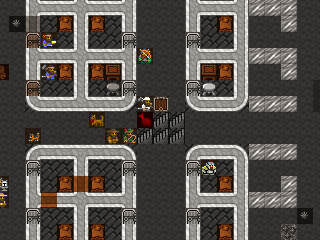

This small hatch will act as the final line of defense between
anything that comes up from the caverns and our fortress. It will stop
anything directly below it so long as we are able to
:guilabel:`Forbid` the hatch in time.

* Assign a war dog to each of our Miners. Hit :kbd:`u`, highlight the
  first :guilabel:`Miner`, and hit :kbd:`z` to :guilabel:`Go to Unit`.
  Hit :kbd:`p`, :kbd:`e` to bring up a list of work animals and hit
  :kbd:`Enter` to select a :guilabel:`Stay war dog`.
* Note: If you've pastured your war dogs in a spare room as I have (to
  save a few FPS), be sure to un-pasture them or else they will not join
  their new owners.
* It's a good idea to create a burrow at the :guilabel:`Hatch` in
  anticipation of stationing melee troops there. See DF Walkthrough
  Chapter 9.3 for instructions on using burrows to control troops.
* Speaking of melee troops, we have enough cannon fodder to fill the
  ranks of our two melee squads. Hit :kbd:`m` and top off the ranks with
  new draftees.
* Don't forget to ensure that we have enough arms and armor to issue
  to the troops. A full set of armor includes a :guilabel:`helm`,
  :guilabel:`mail shirt`, :guilabel:`breastplate`, :guilabel:`gauntlet`
  (each job makes a pair), :guilabel:`greaves` (each job makes a pair),
  :guilabel:`high boot` (each job makes a pair), and a :guilabel:`shield`.
* Take a second to edit the squads' schedules to respond to combat
  alert states with :guilabel:`10 minimum` soldiers. Hit :kbd:`m`,
  :kbd:`s`, select :guilabel:`Prim. Kllzn. Gallery` with
  :kbd:`/`:kbd:`*`, and hit :kbd:`e`, :kbd:`*`, :kbd:`Shift+Enter`. Then
  hit :kbd:`c` to :guilabel:`Copy orders` and :kbd:`p` to paste them in
  for every month in each squad. Do the same thing for the other alerts,
  cycling between them with :kbd:`/`:kbd:`*`.
* Finally, if you're up for it, create a military squad manned
  only by your Miners, assign as a uniform a metal helm and mail shirt,
  and keep their schedule on :guilabel:`Inactive`. This will cause the
  miners to don some protective gear to increase their chances of
  surviving unexpected encounters.

That's about all we can do to up the odds when dealing with the
caverns. It's time to delve for magma. Dig a :guilabel:`U/D Stair`
straight down from the :guilabel:`Hatch` as far as you can go, and see
what happens.

Welcome to the underworld.

* Make sure you keep the game paused for now. Hit :kbd:`Enter` to
  dismiss the first notification.

These popups notify you of two distinct underground features. The
first :guilabel:`expansive cavern deep underground` refers to this
cavern layer itself. A :guilabel:`downward passage` is a rift that
connects two or more cavern layers. The discovery of a downward
passage is not good news for us because it gives things from deep
below access to our fortress.

Let's assess the situation. Take a good look around the cavern using
:kbd:`k`. Note the underground lake with giant mushroom trees growing
in it, the muddy, farmable cavern floor, and the various wiggling
things moving around. Take a look at one of the wiggling :guilabel:`{`
things.

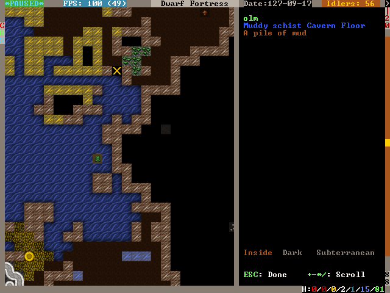

It's an olm, whatever that is. Notice that there's no option to press
:kbd:`Enter` to look closer at it like you could with, for example, a
dog. Furthermore, hitting :kbd:`u` and scrolling over to
:guilabel:`Others`, we see that there's no mention of any
:guilabel:`Olm`. We can't even hit :kbd:`s` and order a squad to
attack it on the map. We'll find the same thing to be true for the
frog-looking things in the water, called :guilabel:`cap hoppers`.

Breathe a sigh of relief; these are just harmless vermin. In fact,
looking at the :guilabel:`Others` tab on the :guilabel:`Units` screen,
we only see a :guilabel:`Tiercel Peregrine` on the surface and a
:guilabel:`Kea` that flew into a trap last season. Currently, there
are no known hostiles anywhere on the map.

Although we do not immediately see anything bent on our utter
destruction, we lack line of sight on all parts of the cavern, not to
mention whatever is at the bottom of the :guilabel:`downward passage`.
Consequently we must close off access to the cavern before anything
nasty shows up. Something unseen could be on its way up already,
having sensed the minute change in pressure as long-closed stillness
is disturbed by our miner's pick.

* Keeping the game paused, find the :guilabel:`Up/Down Stairway`
  that's been carved at the floor of the cavern.

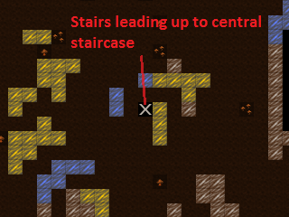

* Go up one z-level, :guilabel:`Mine` one tile north, then dig an
  :guilabel:`Up stair` on the tile north of that.
* Hit :kbd:`z` to :guilabel:`Remove Up Stairs/Ramps` on the existing
  :guilabel:`Up/Down Stair`.
* Connect our central staircase to the :guilabel:`Up stair`. Go up one
  z-level, hit :kbd:`d`, :kbd:`j`, and designate a :guilabel:`Down
  Stair` to be dug over the :guilabel:`Up stairs` below. Then, connect
  the :guilabel:`Down Stair` to your central staircase with a tunnel.

.. image:: images/Magma-Tut-1_6-Delving-for-Magma.png
   :align: center

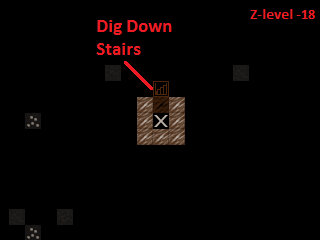

* Hit :kbd:`d`, :kbd:`x` and remove the dig up/down stair designation
  under the cavern floor. Leaving it there will cause a miner to merrily
  continue burrowing downward.
* Finally, amend the Inside burrow so dwarves don't enter the caverns.
  Hit :kbd:`w`, highlight the :guilabel:`Inside` burrow, hit
  :kbd:`Enter`, :kbd:`r` to change to :guilabel:`Currently erasing`, and
  erase the Inside burrow for all of z-level -20 as well as for any
  parts of the cavern visible on other z-levels.

The :guilabel:`Remove Up Stairs/Ramps` designation will leave us with
only a downward stairway into the caverns. We must cover that up with
a hatch and forbid it as quickly as possible to seal the cavern.
Alternatively, we could build a floor over it with the closest
available rock, so if you do not have a :guilabel:`Floor Hatch` on
hand, that's the best backup plan.

* Use :kbd:`.` to advance time tick by tick or unpause and repause in
  rapid succession. Advance time only long enough for the designations
  to be dug out.
* Hit :kbd:`b`, :kbd:`H` and place the :guilabel:`Floor Hatch` over
  the :guilabel:`Downward Stairway` leading to the caverns.
* Advance time only long enough for the hatch to be put in place, then
  immediately hit :kbd:`q`, :kbd:`l`, :kbd:`o` to :guilabel:`Forbid` it
  and set it to :guilabel:`Keep tightly closed`.

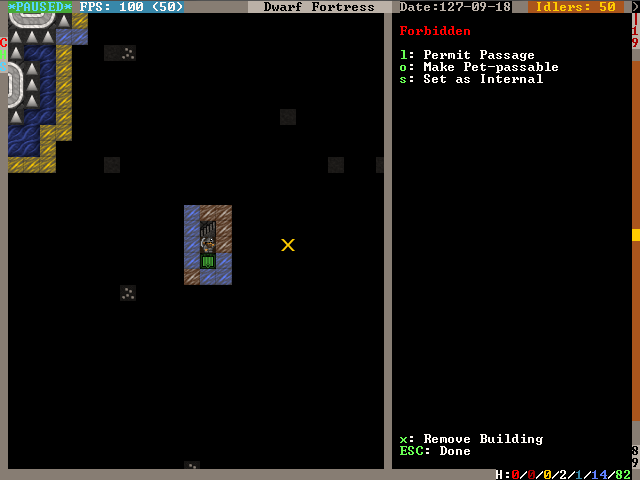

If nothing came up from below, exhale and toast the dwarf who affixed
that :guilabel:`Floor Hatch` because no creature can get through it so
long as it remains :guilabel:`Forbidden`.

The first cavern layer's muddy floor would make excellent underground
farms and there's probably exotic things to trap down there, but for
now we have to continue the magma hunt. Let's find a pillar thick
enough to run a stairwell bypass through and link it back up to the
main stairwell under the cavern floor. I see an appropriate one just
east of our main up/down stairwell.

* Designate an :guilabel:`U/D Stair` to be dug in the pillar west of
  the main up/down stairwell on the cavern layer, bypassing the cavern.

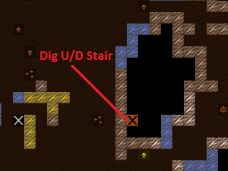

* Connect the bypass stairwell to our original Up/Down stairwell
  designation: go down one z-level and designate another :guilabel:`U/D
  Stair`, and under that, an :guilabel:`Up Stair`. Connect the
  :guilabel:`Up Stair` to the original Up/Down stairwell designation
  with a normal tunnel.
* Complete the connection by hitting :kbd:`d`, :kbd:`j` and
  re-designating the original Up/Down stairwell to be a :guilabel:`Down
  Stair`

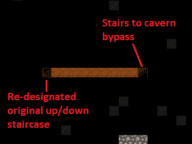

* Connect the bypass stairwell to the Up/Down stairwell leading to the
  fortress: go up one z-level from the bypass stairwell designation, hit
  :kbd:`d`, :kbd:`j`, and designate a :guilabel:`Down Stair`. Then
  :guilabel:`Mine` straight west to link back up with the main Up/Down
  stairwell.

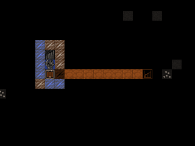

* After the digging is complete, put a :guilabel:`Floor Hatch` on
  every :guilabel:`Down Stairway` you can. These will act as additional
  buffers if something makes it in from below.

Unpause the game and allow your miners to dig deeper. We are only at
z-level -20; there's a very long way still to go.

We've hit a second cavern layer and another downward passage. Like
before, keep the game paused until you set up your dig designations to
secure the breach.

* Hit :kbd:`u` and scroll to :guilabel:`Others` to see if there's any
  immediate threats. Thankfully, nothing is immediately visible. There
  are lots of :guilabel:`bats`, though, which are icky. Better seal this
  up fast.
* Repeat the steps above to seal the stairwell. Remove the up stairs
  above the breached stairwell, dig upward stairs to reconnect with the
  stairwell, throw a hatch or floor over the breach, and bypass.
* Don't forget to delete the sections of the :guilabel:`Inside`
  burrow, remove the dig designation under the cavern floor, and cover
  all downward staircases with a floor hatch.

This time, I elect to construct a floor instead of installing a hatch
because the stone was readily available and the closest hatch was 152
tiles away.

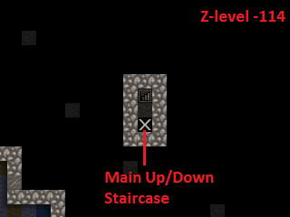

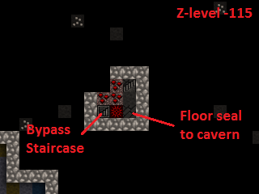

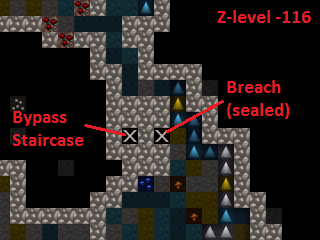

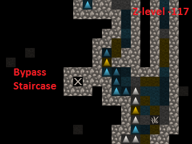

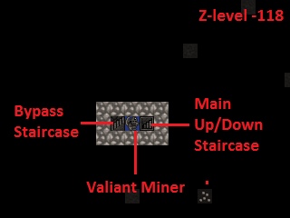

Nothing to do but continue to dig.

Not long after the second cavern, we stumble into a third. As usual,
hit :kbd:`u` and scroll over to :guilabel:`Others` to see if some
miners are about to meet a bloody end.

There's a new creature on the :guilabel:`Others` list, a
:guilabel:`Jabberer`. Hit :kbd:`v` to examine it.

  | :guilabel:`A huge monster that lurks in caverns deep under the earth.`
  | :guilabel:`It uses its wide beak to reach down and pluck up unsuspecting`
  | :guilabel:`intruders.`

Jabberers are terrifying. They are as big as elephants and much more
aggressive, making a beeline to any exposed dwarf to rip it apart.
Moreover, our military likely cannot take one down without suffering
many casualties.

Hit :kbd:`u` again, highlight the :guilabel:`Jabberer`, and hit
:kbd:`z` to locate it on the map.

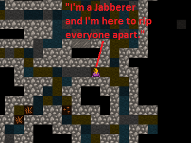

It's not far from the breach we made in the caverns, but it's our
lucky day - unlike the other breaches we made in the upper caverns
that led directly onto the cavern floor, this one is in a rock pillar
one z-level above the cavern floor. Unless the Jabberer can climb, it
cannot path into the fortress.

* Pray to Armok that this Jabberer hasn't been training its
  :guilabel:`climb` skill and make the usual designations to seal and
  bypass the cavern layer, remembering to place hatches and trim the
  :guilabel:`Inside` burrow.
* Keep an eye on the monster - place your cursor over it with :kbd:`v`
  and hit :kbd:`f` to :guilabel:`follow` it. If it starts moving toward
  the breach, we must immediately evacuate the up-down staircase and
  seal the floor hatches we've placed.

A Sea of Fire
=============

Let's push further downward and locate that elusive magma. So far
we've had no luck finding magma close to the surface, so we'll
continue mining down until we encounter signs of it.

* Reconnect the bypass staircase to the main up/down staircase,
  allowing your miners to continue downward.
* While we're down in the depths of the world, hit :kbd:`H`,
  :kbd:`F3`, :kbd:`z` to create a hotkey to take us straight down here.
  Give it a name with :kbd:`n` - in a fit of creativity, I called it
  :guilabel:`Basement`.

Bingo. The miners have stopped work because a tile designated to be
mined was found to be warm to the touch. That means there is magma on
the other side.

* Hit :kbd:`d` so you can see the flashing yellow :guilabel:`☼`
  signifying :guilabel:`warm stone` and find the tile where the dig job
  was cancelled.
* Hit :kbd:`x` and erase all remaining dig designations on that level
  and below it.
* Designate an up/down staircase on the cancelled tile. Let's get a
  look at that magma.

.. image:: images/Magma-Tut-3_2-A-Sea-of-Fire.png
   :align: center

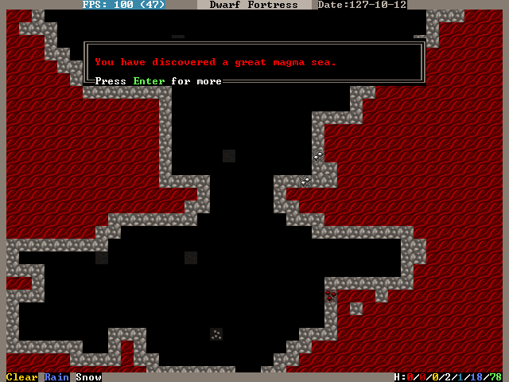

We've found what we've been looking for - the magma sea at the bottom
of the world.

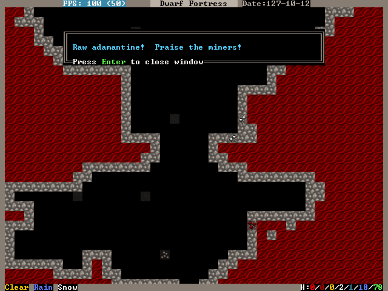

Actually, we've found quite a bit more than what we've been looking
for. :guilabel:`Adamantine` is the strongest, sharpest, and lightest
metal in existence, but it requires special precautions to exploit.
Adamantine is beyond the scope of this tutorial and can be very
dangerous, so we'll leave it alone and focus on working with magma.

The magma sea is full of nasty critters, just like the caverns, so
let's seal it off until we're prepared to deal with it on our own
terms.

* Follow the same procedure as before, removing the up stairs, fixing
  a floor hatch or building a floor, and rerouting back to the main
  up/down staircase.
* If you get a warm stone cancellation, verify that you're not digging
  into the magma sea itself and re-designate the tile to override it.

Take some time to get acquainted with the magma sea and its
inhabitants. Some parts are made of normal stone and others are
:guilabel:`Semi-molten Rock`, which cannot be mined through.
:guilabel:`Magma Crabs` are unpleasant crustaceans that spit fire,
setting your dwarves alight. :guilabel:`Fire snakes` are vermin that
normally keep to themselves but can cause problems if trapped - they
are hotter even than magma, so when a dwarf transports a caged one to
a stockpile, the cage burns away and looses the fire snake to ignite
everything as it wiggles around.

We didn't risk the fortress dodging Jabberers and other forgotten
horrors just to admire the view. The magma sea isn't much good to us
all the way down here. To harness magma's potential, we need to raise
it to the surface. We’ll do so by building a 'pump stack.'

A Well-Laid Foundation
======================

A pump stack is a series of pumps stacked directly on top of one
other, each alternating in orientation so that they pump liquid from
bottom to top. The pumps can be operated by dwarves, but the extreme
height of ours makes it more practical to use generated power. We must
also consider the temperature of magma when building the pump stack,
using only magma-safe materials whose melting point is higher than the
temperature of magma.

Before we start digging, it's a good idea to start building the
materials needed for a pump stack. A single :guilabel:`Screw Pump`
(:kbd:`b`, :kbd:`M`, :kbd:`s`), as the game calls it, is built with
one :guilabel:`Block`, one :guilabel:`Enormous Corkscrew`, and one
:guilabel:`Pipe Section`. Each of these must be made out of a
magma-safe material or else the pump will deconstruct when it touches
magma. Additionally, we will need a supply of magma-safe doors to seal
the pumps' output chambers.

The :guilabel:`Blocks` and :guilabel:`Doors` can be made out of some
kind of magma-safe rock, and I noticed that we have lots of
:guilabel:`quartzite` available on the upper levels of our fortress.

* Stick three or more Mason's Workshops in the quarry area at level
  -9. There is lots of quartzite already on the ground, but we probably
  will need to mine for more eventually.
* Streamline the production process by creating a quartzite-only
  stockpile around the Mason's Workshopes. Hit :kbd:`p`, :kbd:`t` to
  create a custom stockpile that only allows :guilabel:`quartzite`. It's
  found in the :guilabel:`Stone` -> :guilabel:`Other Stone` submenu.
* Hit :kbd:`q` over the quartzite stockpile, :kbd:`w`, and change the
  maximum wheelbarrows to 20.
* Speaking of which, hit :kbd:`j`, :kbd:`m`, :kbd:`q` and put in an
  order for 30 wooden wheelbarrows. Go to the Carpenter's Workshop and
  cancel some of the bucket orders to make room in the queue.
* Configure the quartzite stockpile to :guilabel:`give to` the three
  Mason's Workshops. Hit :kbd:`q` over the quartzite stockpile,
  :kbd:`g`, and :kbd:`Enter` over each Mason's Workshop you just built.
  This is what you should see:

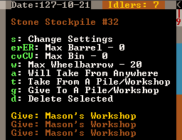

Now, the only source that these workshops will use when executing jobs
is the linked quartzite stockpile. This ensures that all products made
here will be magma safe.

* At the three mason's workshops, add orders for an additional 150
  :guilabel:`doors` and an additional 150 :guilabel:`blocks.` You will
  need to edit the current workflow ranges to accomplish this.
* Make sure to delete the orders for doors and blocks at the two
  Masons' Workshops on z-level -5. Otherwise we may fall short of our
  magma-safe door and block targets.

Magma-safe :guilabel:`Enormous Corkscrews` and :guilabel:`Pipe
Sections` are more difficult to produce. We have two options - forge
them from iron at a Metalsmith's Forge, or make them from glass at a
Glass Furnace. Although we have the infrastructure already in place to
start making iron components, we shouldn't expend our finite iron ore
reserves on corkscrews and pipe sections. Each corkscrew takes one bar
of iron to produce and each pipe section takes three, so making 127 of
each out of iron would take 508 iron bars total! Glassmaking requires
only sand, which is infinite, and 127 units of charcoal for fuel.
Therefore, the glass option is clearly the better course of action.

Let's beef up our glass production facilities. Yellow sand is
found on z-level -2, so that's where we will locate our Glass Furnaces.

* Build a set of three Glass Furnaces to pump out :guilabel:`Screw
  Pump` components and another five to run :guilabel:`Collect Sand` jobs
  so that we have a steady supply. Here is my setup:

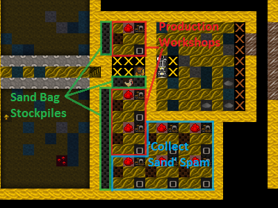

* Make sure to leave room for a :guilabel:`sand bag` stockpile near
  the producing Glass Furnaces. Sand bags are located at the bottom of
  the :guilabel:`Furniture/Siege Ammo` menu.
* On each of the three production Glass Furnaces, set up a production
  run of 150 :guilabel:`Make green glass tube` and :guilabel:`Make
  enormous green glass corkscrew`.
* On the five spare Glass Furnaces, order :guilabel:`Collect Sand` with
  a Workflow limit of 25-30 :guilabel:`powder of any sand`. It's
  important to keep sand bags available or glass production will cease.
* Sand collection and storage requires lots of bags, so increase the
  workflow limit for bags at the Clothier's Shop to 30-40.
* If the clothiers can't keep up, we'll have to resort to making
  leather bags and micromanaging the Farmer's Workshop to supply our
  clothesmaking industry. For this reason, it's also a good idea to
  clean out all traders of cloth and leather. Bags are critical to our
  magma ambitions!
* Hit :kbd:`i`, :kbd:`e`, fill the glass factory with a zone, and hit
  :kbd:`s` to designate the zone as a source of sand. The dwarves will
  now collect sand here.

Now to expand our charcoal production capacity. Each operation at the
Glass Furnaces burns a unit of fuel, and right now we have only a
single Wood Furnace supplying the fort. Let's build some more to keep
up with the demand for charcoal.

* Place four new Wood Furnaces in our stockpile room close to the
  wood. We have a large excess of space in our Armor and Ammo
  stockpiles, so cut into those to make room for the Wood Furnaces.
* Queue up a :guilabel:`Make Charcoal` job in each and change the
  Workflow limits to 55-60. There's currently plenty of excess wood
  laying around outside, but it never hurts to chop down more old growth
  forest. Wood stock is something we'll need to keep an eye on.

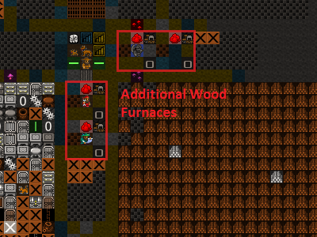

Let's do something to mitigate the extreme distances involved in
hauling the pump components. We'll make a large stockpile midway to
the magma sea to store our quartzite :guilabel:`doors`, quartzite
:guilabel:`blocks`, glass :guilabel:`tubes`, and glass
:guilabel:`enormous corkscrews`.

* Go down to z-level -60 and dig out three large rooms for our doors,
  tubes, and corkscrews, as well as some space for blocks which will be
  neatly packed into bins. We will need 150 of each, so size the rooms
  accordingly
* While you're down here, hit :kbd:`H` and make a hotkey for this spot.
* I accidentally carved my way into the caverns at this point. If that
  happens to you, immediately wall up the breach (:kbd:`b`, :kbd:`C`,
  :kbd:`w`) and modify the dig designation to leave at least a 1-tile
  wall between the caverns and fortress. Here's my setup:

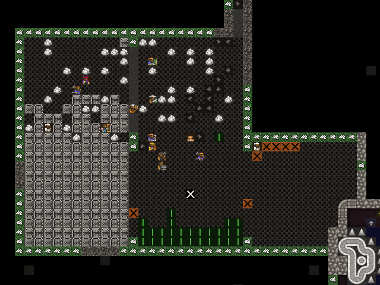

You'll end up with :guilabel:`marble`, :guilabel:`sphalerite`, and
other detritus strewn everywhere. We need that space for our
stockpiles, so let's clear it:

* Hit :kbd:`i` and designate a 1x1 tile zone in a corner of one of the
  rooms, :guilabel:`Place` it with :kbd:`Enter`.
* Hit :kbd:`d` to make it a garbage dump. Hit :kbd:`d`, :kbd:`b`,
  :kbd:`d` and mark everything you dug out to be dumped.

Let's set up our stockpiles, starting with the quartzite doors.

* Hit :kbd:`p`, :kbd:`t`, and use :kbd:`d` to disable everything in
  the first column. Everything should be dark gray.
* Navigate to :guilabel:`Furniture/Siege Ammo` and hit :kbd:`e`,
  :kbd:`b`. Move right to :guilabel:`Type` and press :kbd:`Enter` on
  :guilabel:`doors` so that it toggles to white.
* Move back to the middle column and navigate to
  :guilabel:`Stone/Clay`. Move to the right column and find
  :guilabel:`quartzite` (it helps to hit :kbd:`s` and start typing
  "quartzite"). Hit :kbd:`Enter` to toggle :guilabel:`quartzite` to white.
* We do not care about door quality, so navigate to the middle column,
  highlight :guilabel:`Core Quality`, and hit :kbd:`p` so that all core
  qualities are permitted in the stockpile. Do the same for
  :guilabel:`Total Quality` directly below.
* Your screen should look like this:

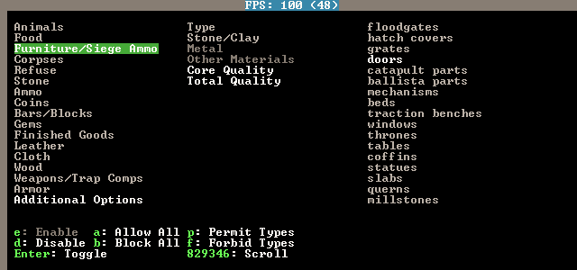

* Press :kbd:`Escape`. Now, we are designating a stockpile that will
  accept only :guilabel:`quartzite doors` of any quality. Place the
  stockpile in one of your 11x11 rooms.

In the same way, create stockpiles for quartzite blocks, glass
corkscrews, and glass tubes. Remember to start with everything
disabled when setting the parameters. If you prefer, instead of
starting with :kbd:`p`, :kbd:`t`, you can place the stockpiles first
and use :kbd:`q` to edit the options. Below are sets of keystrokes
certain to result in the proper stockpile in case you get lost, but
it's a good idea to figure it out on your own.

* Quartzite blocks: :kbd:`p`, :kbd:`t`, move to and hit :kbd:`d` on
  everything in the left column, move to :guilabel:`Bars/Blocks`,
  :kbd:`e`, :kbd:`b`, move to :guilabel:`Blocks: Stone/Clay`, move to
  :guilabel:`quartzite`, :kbd:`Enter`, :kbd:`Esc`, and place the
  stockpile.

* Glass corkscrews (located in :guilabel:`Trap Components`): :kbd:`p`,
  :kbd:`t`, disable everything with :kbd:`d`, move to
  :guilabel:`Weapons/Trap Comps`, :kbd:`e`, :kbd:`b`, move to
  :guilabel:`Trap Components`, move to :guilabel:`Enormous Corkscrews`,
  :kbd:`Enter`, move to :guilabel:`Other Materials`, move to
  :guilabel:`Green Glass`, :kbd:`Enter`, move to :guilabel:`Core
  Quality`, :kbd:`p`, move to :guilabel:`Total Quality`, :kbd:`p`,
  :kbd:`Escape`, and place the stockpile.

* Glass tubes (called :guilabel:`pipe sections` in
  :guilabel:`Furniture/Siege Ammo): :kbd:`p`, :kbd:`t`, disable
  everything with :kbd:`d`, move to :guilabel:`Furniture/Siege Ammo`,
  :kbd:`e`, :kbd:`b`, move to :guilabel:`Types`, move to :guilabel:`pipe
  section`, :kbd:`Enter`, move to :guilabel:`Other Materials`, move to
  :guilabel:`Green Glass`, :kbd:`Enter`, move to :guilabel:`Core
  Quality`, :kbd:`p`, move to :guilabel:`Total Quality`, :kbd:`p`,
  :kbd:`Escape`, and place the stockpile.

There's some housekeeping to do before we're done with stockpile
configuration. We have to disable quartzite doors, quartzite blocks,
glass tubes, and glass corkscrews from our other stockpiles or else
these products will wind up in our existing stockpiles instead of our
new ones.

* Go to our main stockpile level on z-level -4. Hit :kbd:`q` over
  :guilabel:`Furniture Stockpile #24`, then :kbd:`s` to bring up the
  settings. Disable :guilabel:`quartzite` in the :guilabel:`Stone/Clay`
  menu and :guilabel:`Green Glass` in the :guilabel:`Other Materials`
  menu.
* Hit :kbd:`q` over :guilabel:`Weapon Stockpile #18` to the west of
  the stairs. Hit :kbd:`s` and disable :guilabel:`green glass` in the
  :guilabel:`Other Materials` section.
* Go down one level and open the settings of :guilabel:`Furniture
  Stockpile #5` in the northeast. Disable :guilabel:`quartzite` in the
  :guilabel:`Stone/Clay` menu and :guilabel:`Green Glass` in the
  :guilabel:`Other Materials` menu.
* Staying on the same level, open the settings for
  :guilabel:`Bar/Block Stockpile #10` in the northwest. Disable
  :guilabel:`quartzite` in the :guilabel:`Blocks: Stone/Clay` menu. Now
  quartzite blocks will go only to the new block stockpiles on z-level
  -60.

Stacks on Stacks
================

Let's turn our attention to digging out the pump stack casing. First,
we should go over pump operation in order to understand what we're
doing. A pump lifts liquids - water or magma - from the level below it
up to its level. In the image below, water is pumped from the right to
the left and is retained on the pump's level.

.. image:: images/Magma-Tut-5_1-Stacks.png
   :align: center
   :target: http://dwarffortresswiki.org/Screw_pump

A pump is 2x1 tiles large and operates under dwarf or generated power.
One tile of the pump is impassible so as to retain the pumped liquid.
The other is passable to allow a dwarf access to the pump. If we build
a pump so that its passable tile rests not on a floor but atop the
impassible tile of a pump below, the upper pump will transmit power
downward to the lower pump. This power transmission property is the
key to the pump stack's utility because it allows us to stack an
infinite number on top of one another.

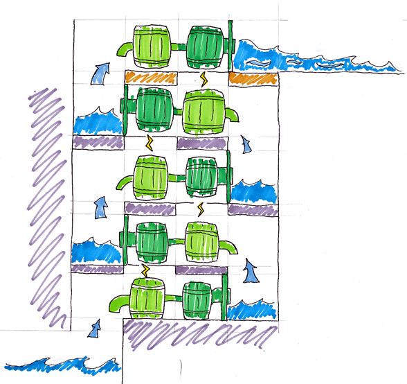

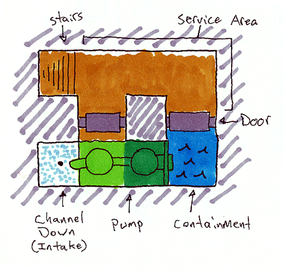

Orientation of pumps in a pump stack is critical. In the illustration
above, notice how the bottom pump draws water from the channeled out
tile adjacent to it, pumps it up to its level, and outputs the water
on the other side. Consequently, the next pump up must be rotated 180
degrees in order to draw from the output water of the first pump.

Therefore, when digging out the casing for our pump stack, we have to
ensure that:

* Each pump's intake tile has been channeled out to allow access to
  the magma beneath it,
* Each pump's passable tile has been channeled out to allow power
  transmission downward, and
* Dwarves can access the passable tile of the pump as well as the
  output tile for maintenance and installation.

It helps to visualize what we need to do. The animation below outlines
the pump stack construction process.

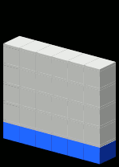

We'll use a modified design from the one above:

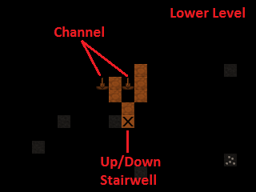

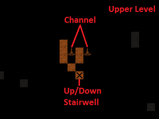

   Designated

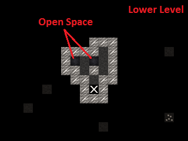

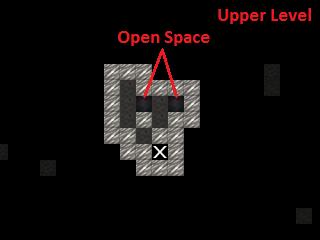

   Dug out

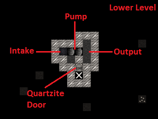

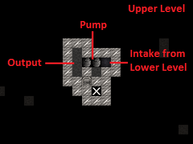

   Populated

Some notes about the design:

* Our design incorporates !!Science!! to mitigate framerate loss. Pump
  stacks are notorious for plunging the game's framerate into single
  digits, so we've used a 3x1 output zone for each pump instead of the
  previous illustrations' 1x1 zone.
* The quartzite door blocks access to the output zone of each pump.
  When built, each must be forbidden and made pet impassible to prevent
  magma leaks.
* Unlike the rest of the pumps, the bottom-most pump in the stack must
  be placed on solid ground or a constructed floor. All subsequent pumps
  are built on top of one another due to the channeled-out portion of
  the casing. This allows power to be transmitted from above, but the
  downside is that if one pump deconstructs, all will fall apart.

The first order of business is to locate a suitable vertical route for
our pump stack. Including the outer walls, we need 6x7 tiles of space
for our design. Let's look for a solid 6x7 column of rock that runs
from magma to open air.

* Hit :kbd:`F3` and go down the rest of the way to the very bottom of
  your pump stack. Start moving up and see if any routes stand out. It's
  best to keep the pump stack well away from the central staircase in
  order to dodge the upper levels' bedrooms, quarry, and stockpile rooms.
* After ten minutes of scrolling up and down the map, I found a
  suitable route to the north of the central stairwell. Run an up/down
  stairway from z-level -1 to z-level -126 through the location marked
  on the screen shot below:

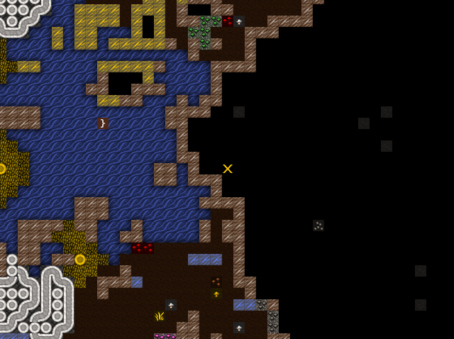

* Connect it to the stockpiles at z-level -60.
* Dig out the first two layers of the pump stack casing. Make sure to
  only channel out the intake tile of the bottom-most layer, not the
  tile under the pump itself.

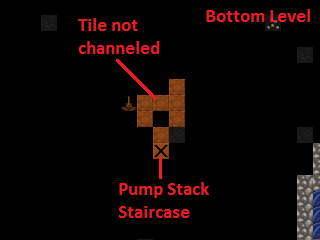

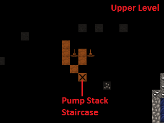

Now, let's dig out the magma intake pool below the bottom-most level
of the pump stack. We will use :guilabel:`Fortifications` to keep out
the magma creatures and channel from above to safely flood the intake
pool.

* Dig an up stair below the pump stack staircase and then mine out one
  of the flatter sections to the north, leaving a two-tile wide wall
  between you and the magma pool.
* When the job is completed, :guilabel:`Smooth Stone` on western walls
  with :kbd:`d`, :kbd:`s`, then :guilabel:`Carve Fortifications` with
  :kbd:`d`, :kbd:`F`. This is what it should look like completed:

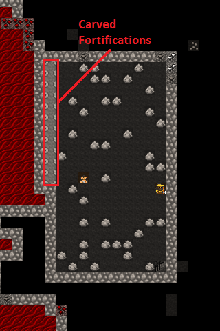

* We will flood the intake pool by channeling out its walls from
  above. Dig an access tunnel above the :guilabel:`Fortifications`.
* From the access tunnel level, channel out the tiles to the west of
  the :guilabel:`Fortifications`. Make sure not to channel out tiles
  that are not in front of fortifications or you'll expose the fortress
  to the magma sea and wind up with flaming crabs in your basement.

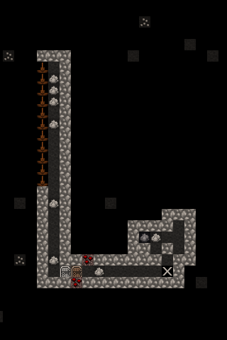

* The level below will flood with magma. Block off the access tunnel
  with a constructed wall to seal it.

Now, let's dig out the last 120 z-levels of the pump stack casing.

.. image:: images/Magma-Tut-5_16-Stacks.gif
   :align: center

Actually, let's not. This may be the most tedious, mind-numbing task
in any video game you'll ever play. Fortunately, we have the Quickfort
utility to do it all for us, and today is your lucky day - I've
committed our pump stack design to a series of blueprints using the
Picturefort utility so you don't have to!

* Extract Pump Stack - Quickfort - DF Magma Tutorial.xlsx to a
  convenient location. We will use this file as a blueprint to dig the
  casing and place the pumps and doors.
* Run the Quickfort utility from the DF Starter Pack window, found in
  the Utilities tab.
* Quickfort will now take over your :kbd:`Alt` key in Dwarf Fortress.
  You can toggle Quickfort on/off at any time with :kbd:`Shift+Alt+Z` or
  exit it entirely with :kbd:`Shift+Alt+X`.
* Go back to the Dwarf Fortress window. Hit :kbd:`d` and place your
  cursor on the :guilabel:`Up/Down Staircase` on z-level -124, directly
  above the first two levels of pump stack casing.
* Hit :kbd:`Alt+F` and open Pump Stack - Quickfort - DF Magma
  Tutorial.xlsx from the convenient location you extracted it to. Then
  select Pump Stack - Dig from the list on the left and click OK.
* Take a moment to read the Quickfort cursor tooltip, and then hit
  :kbd:`Alt+D` to execute the macro.

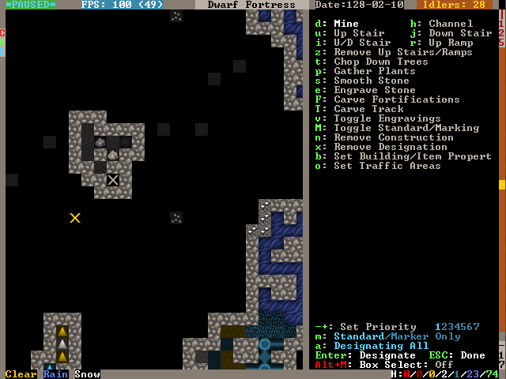

Quickfort's magic designates the dig squares for us automatically!
Take a moment to appreciate how the old-timer Urists had to designate
all this by hand. 'You kids have it too easy,' they'd tell ya, 'makes
ya soft and complacent!' But we digress - let's finish digging out the
pump stack casing.

Our macro has three steps - first it digs the 'Lower'-type pump stack,
then it moves up a level and digs the 'Upper'-type pump stack, and
finally moves up another level to be ready for the next operation. Our
job is to ensure that we start each operation on a fresh, undesignated
level. If we get the dig designations out of order, the pump stack
will not work.

* We've designated two levels to be dug out so far, so place the
  cursor on the :guilabel:`Up/Down Stair` above the top level
  designated: z-level -122.
* Hit :kbd:`d` to activate :guilabel:`Mine` mode, and hit
  :kbd:`Alt+D`. Quickfort will designate two levels to be dug out and
  spit the cursor out on the fresh layer above the top level designated.
* Ensure that the cursor is resting on the :guilabel:`Up/Down Stair`
  where Quickfort spit it out (just don't move it). Hit :kbd:`Alt+D`
  again to execute another two levels.
* Continue hitting :kbd:`Alt+D` in this manner until we end up on
  z-level -1. Then, remove the dig designation created by Quickfort on
  z-level -1. We will save this level for power-related mechanical
  linkages.
* Finally, go back through each level and ensure that we haven't made
  any mistakes. Check the dig designations against the patterns above.
  When you're satisfied, unpause and let the miners get to work.
* If you get spammed with :guilabel:`Urist McPickaxe, Miner, cancels
  Dig: Inappropriate dig square`, just ignore it. Our design does not
  require babying to be dug out correctly.
* Finish the process by hitting :kbd:`d`, :kbd:`b`, :kbd:`d`, and
  designating everything in the doorframes of the pump stack to be
  dumped. Loose stone in this area combined with the diagonal angles of
  our design can cause dwarves to suspend door construction.

Placement of the pumps can be the most time-consuming part of building
the pump stack. Each pump requires an Architect to 'design' it and
then a Mechanic to put it together. To mitigate this, let's install a
:guilabel:`Gear Assembly` above the top of the pump stack. This will
anchor it from above, allowing pumps to be built from above and below
simultaneously, thereby halving the time required to complete the
stack.

An added benefit of two anchor points is that if one pump deconstructs
due to, for example, accidentally being built from non-magma-safe
materials, the entire stack shouldn't also deconstruct for lack of a
foundation.

* On z-level -1, channel out the tile leading to where the impassible
  tile of the pump below will be.

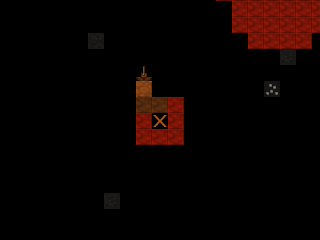

* Hit :kbd:`b`, :kbd:`M`, :kbd:`g` and build two :guilabel:`Gear
  Assemblies` - one on solid ground adjacent to the channel and the
  second hanging over the channel. The hanging gear assembly is anchored
  by the one on solid ground next to it and therefore provides a
  foundation for pumps built below it.

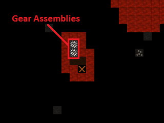

It's time to build the pumps and place the doors. We'll do the first
two levels manually to illustrate important considerations that need
be taken and then use Quickfort to finish the stack.

* Go to the bottom of the pump stack, z-level -122.
* Hit :kbd:`d`, :kbd:`M`, :kbd:`s` to bring up the :guilabel:`Screw
  Pump` build panel.

Recall that pumps have a passible tile and an impassible tile. The
pumped liquid is output on the far side of the impassible tile.
Therefore, each pump must be oriented so that the impassible tile
forms a seal on the 3x1 output chamber. Use
:kbd:`u`:kbd:`m`:kbd:`k`:kbd:`h` to orient the pump so that the dark
green impassible tile is adjacent to the 3x1 output chamber. It should
look like this:

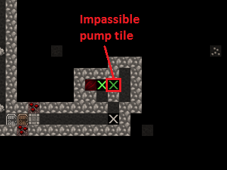

* Hit :kbd:`Enter`.
* Make absolutely sure you choose only magma-safe components made from
  magma-safe materials! Otherwise, the whole stack will fall apart the
  instant it's activated. Use only :guilabel:`quartzite blocks`,
  :guilabel:`enormous green glass corkscrews`, and :guilabel:`green
  glass tubes`.
* Finish it off by placing a :guilabel:`quartzite door` in the tile
  between the :guilabel:`Up/Down Staircase` and the 3x1 output chamber.
  When we turn on the stack, we will make sure these doors are locked
  tight.
* Go to the next level and build another setup in the same manner, but
  with the pump turned 180 degrees so that the impassible tile seals the
  3x1 output chamber.

Keep going if you want - it helps to do a few levels manually to
really understand why a pump stack works. When you're ready, let's
finish building with Quickfort.

First, delete the Workflow orders for glass tubes, corkscrews,
quartzite blocks, and quartzite doors. We don't want to keep producing
these as they are used to construct the pump stack, and the number of
items in the game impacts framerate.

Quickfort does not yet permit manual material selection - whatever is
first on the list is used when build orders are put in, and the
materials are sorted only by distance. That opens the possibility that
we could unknowingly use a non magma-safe door or block in our pump
stack. Therefore, we need to forbid all non-quartzite doors and blocks.

* Hit :kbd:`z` and select the :guilabel:`Stocks` panel. Go down to
  :guilabel:`doors`, move to the right section of the screen, and press
  :kbd:`f` on all non-quartzite doors listed.
* Do the same for blocks.
* We can check our success by starting to build a pump/door and
  verifying that quartzite is the only option for either.
* Build the pump stack using Quickfort. Ensure that you start on a
  'Lower'-type level with the 3x1 output chamber to the right.
* Hit :kbd:`Alt+F`, load Pump Stack - Quickfort - DF Magma
  Tutorial.xlsx, and select Pump Stack - Build from the menu on the left.
* Read the tooltip instructions, hit :kbd:`b`, :kbd:`o`, place the
  cursor on the pump stack's :guilabel:`Up/Down Staircase`, and hit
  :kbd:`Alt+D`.
* When the Quickfort macro spits us out on the next level after
  executing the build commands, hit :kbd:`Alt+D` again, and repeat until
  all pumps and doors are placed.
* Verify that the pumps and doors are placed correctly, then unpause
  and let the dwarves get to work.

Deus Ex Machina
===============

Now that everything is built, we must devise a way to power the pump
stacks. We have 124 pumps to drive, each using 10 power, for a total
of 1240 required power. Additionally, the mechanical linkages
necessary to transmit all that power push our power generation needs
well above 1500.

We'll use :guilabel:`Water Wheels` for power generation.
Unsurprisingly, these require flowing water. The only natural flowing
water on the map is the river in the northwest, which is exposed to
invaders. Another option is to create an artificial underground river
that empties into the caverns, but these only work well with low-flow
sources like aquifers (that's right - aquifers are useful!).
Unfortunately, the high flow rate of our river will overwhelm the game's
water flow model in an artificial channel, resulting in no power.

We will install about 30 :guilabel:`Water Wheels` (:kbd:`b`, :kbd:`M`,
:kbd:`w`) along the river. This almost certainly is overkill - 17
would probably be fine, but more power never hurts and we have tons of
wood.

* A water wheel requires a stable foundation adjacent to it, so first
  build a :guilabel:`Gear Assembly` on the river bank.
* Each water wheel can support additional ones constructed adjacent to
  it, so build more water wheels across the river. Construct floors as
  needed to reach these.
* Make three or four sets of water wheels.
* Connect the gear assemblies with :guilabel:`Horizontal Axles`
  (:kbd:`b`, :kbd:`M`, :kbd:`h`).

Here is what I came up with. It generates more than 3500 power, plenty
for our purposes!

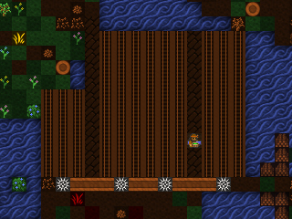

Let's transmit all this power to our pump stack by means of
:guilabel:`Horizontal Axles`, :guilabel:`Vertical Axles`, and
:guilabel:`Gear Assemblies`. Doing so means creating a permanent
opening in our fortress, so we'll have to build walls to deter invaders.

* Find the two gear assemblies at the top of the pump stack. Dig a
  tunnel ten or so tiles north, then dig an :guilabel:`Upward Ramp`
  (:kbd:`d`, :kbd:`r`).
* Remove the ramp when it's dug out. In its place, build a
  :guilabel:`Gear Assembly`.

We'll now have a hole in our fortress that we cannot plug - the space
will be occupied by a :guilabel:`Vertical Axle`. Let's build a small
tower around it to mitigate the danger. It's a great idea to add traps
as well. Here's a design I came up with (the access stairs will be
removed after axle and gear installation):

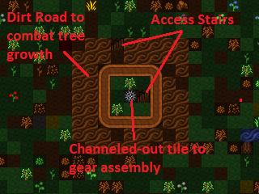

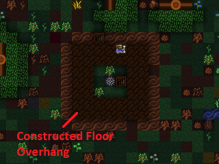

Let's build a series of axles and gear assemblies to transmit power to
the pump stack. Use :guilabel:`Gear Assemblies` for junctions,
:guilabel:`Horizontal Axles` to connect power on the same z-level, and
:guilabel:`Vertical Axles` to connect between the z-levels. Always
build from the bottom up, as well.

* Start by building a :guilabel:`Vertical Axle` over the channeled-out
  over the underground gear assembly in our tower.
* One z-level above that, build a :guilabel:`Gear Assembly`.
* Remember: build from bottom up - determine the path of the axle
  leading out over the tower, then build a :guilabel:`Gear Assembly` on
  the ground outside it to transmit the power over the walls.
* Go up a z-level and build a :guilabel:`Gear Assembly` on top of that one.
* Connect the two upper gear assemblies with a :guilabel:`Horizontal Axle`.
* Connect the :guilabel:`Gear Assembly` on the ground outside the
  tower to the water wheel power plant. Cut down any trees that stand in
  your way.
* When the machinery is completed, remove (:kbd:`d`, :kbd:`n`) the
  access stairs on the tower.

We must also devise a way to turn off power to the pump stack. Let's
connect a :guilabel:`Lever` to the :guilabel:`Gear Assembliy` below
the tower. Pulling it will disengage the gear assembly and break the
'chain' of power to the pumps. Just be sure not to hook the lever to
the supporting gear assembly to the south of the pump stack gear -
disconnecting that one may cause the pump stack to collapse for sudden
lack of a foundation.

* After connecting the lever to the gear assembly, :guilabel:`Pull the
  Lever` to disengage the gear. We don't want to pump magma before we
  decide where it will go!
* Complete the power linkage with a :guilabel:`Horizontal Axle`
  leading from the disengaged gear assembly to the gear assembly atop
  the pump stack.

Here is an overview of the setup I devised:

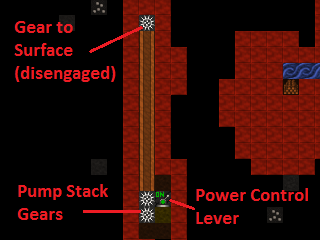

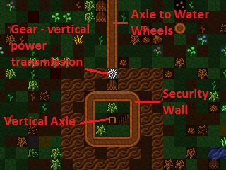

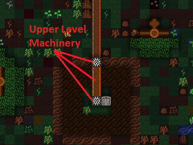

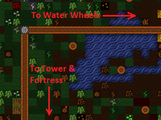

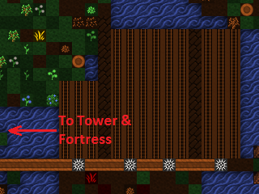

With power connected, the only thing we have left to do is dig tunnels
to direct the pumped magma and throw the master power lever.

Tower of Babel
==============

Magma has a wide range of applications, but for now, I've dug out a
massive magma-powered factory that will handle all smelting, forging,
glassmaking, and kiln operations of the fortress. The specific layout
of your magma infrastructure is completely up to you! Perhaps you'd
rather build a magma weapon?

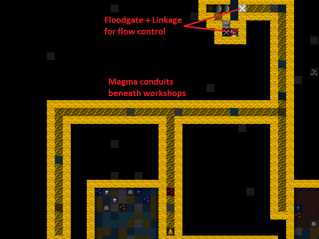

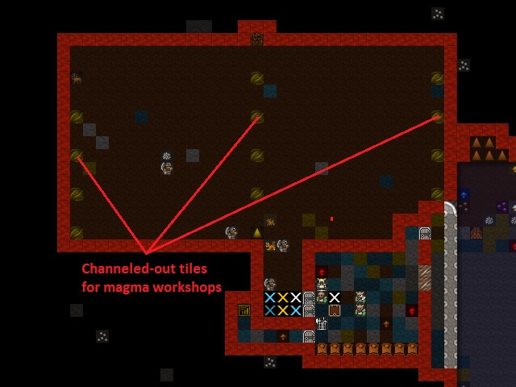

Before activating our pump stack, it's a good idea to
:guilabel:`Forbid` and :guilabel:`Keep Tightly Closed` the doors on
each level of the stack. Otherwise, a cat or child will open one and
run flaming throughout the fortress, igniting everything and
horrifying everyone.

With that done, it's time to turn it all on!

* Verify that no one is in the magma tubes. Pumps work fast and leave
  little time to get away. Use :kbd:`d`, :kbd:`o`, :kbd:`r` to restrict
  access if necessary.
* Throw the master power lever and cross your fingers!

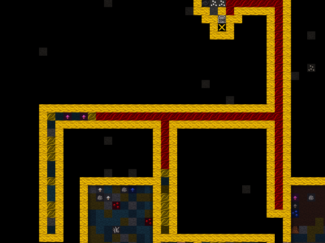

The magma flows! It's working! And our frames per second is in the
teens! Turn off the pumps to fix that, by the way.

Surface magma is the key to true mass production of steel, glass, and
clay products. We can also weaponize it to burn our enemies into
:guilabel:`Piles of Ash` (see :wiki:` magma mist <Magma_mist>`),
combine it with water to create :guilabel:`obsidian`, or make
an awesome magma moat. Let's start by relocating our smelting,
forging, glassmaking, and kilns to the magma factory floor and setting
up steel production.

* Hit :kbd:`b`, :kbd:`e` to find the :guilabel:`Magma Smelter`,
  :guilabel:`Magma Glass Furnace`, and :guilabel:`Magma Kiln`. The
  :guilabel:`Magma Forge` is built with :kbd:`b`, :kbd:`w`, :kbd:`v`.
* Create more magma-safe materials for these workshops if you run short.
* Each magma-powered workshop requires a channeled-out tile leading to
  the magma below. For maximum safety, plan out your channeling so that
  the workshops' impassible tiles cover the exposed magma.
* Delete the old smelters and forges - they are obsolete now.

Below is an example layout for steel production using magma-powered
workshops. I connected the various stockpiles to the appropriate
workshops, but that's not strictly necessary and may be more trouble
than it's worth. I also dug an additional magma tunnel to accommodate
a lower level dedicated to magma forges. The new magma tunnel doubles
as a trap, too!

This is just the beginning of magma's possibilities! I decided to
start converting my outdoor garden to a greenhouse with the addition
of a roof made from :guilabel:`Clear Glass` blocks. No more pesky
goblins digging in my potatoes!

.. image:: images/Magma-Tut-7_7-Tower-of-Babel.png
   :align: center

My steel production is coming along so well that I've had to clear cut
the entire map of trees, too. What fun! Once my squads are outfitted,
I plan on taking control of the caverns and maybe mining the
Adamantine pillar we found in the magma sea.

Good luck with your own magma-fueled adventures and congratulations on
completing this tutorial! If you have a chance, I hope you post your
volcanic contraptions and resulting Fun on the Bay 12 forums. Praise
Armok and strike the earth!
